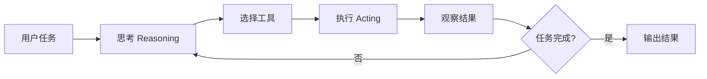
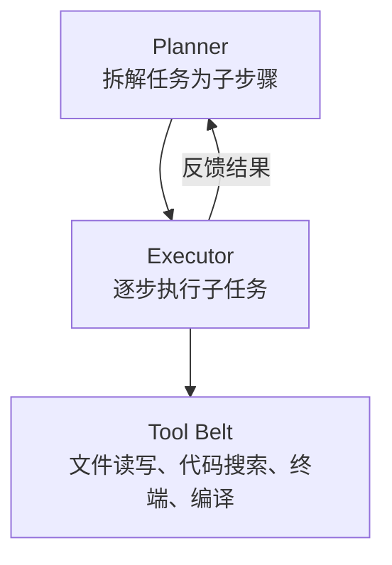
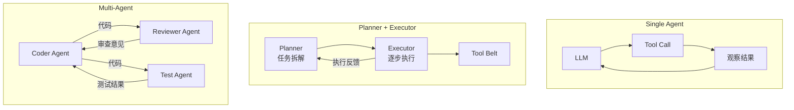
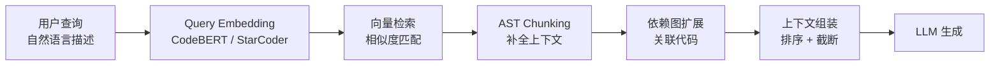
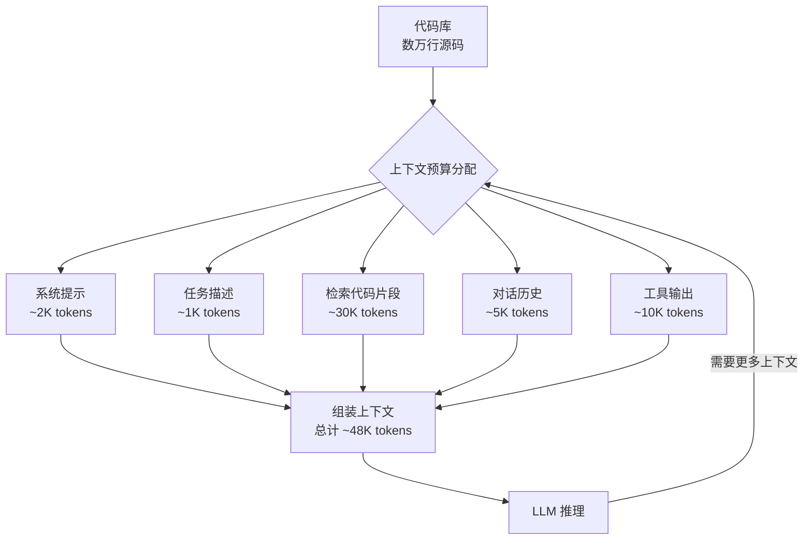
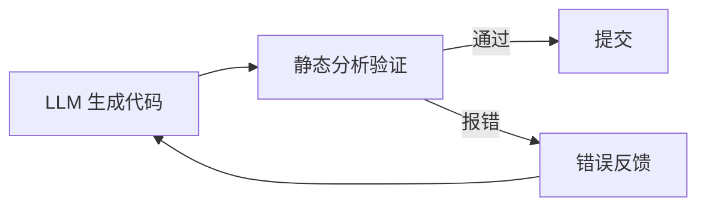

# Code Agent

## 什么是 Code Agent

基于 LLM 的智能编码代理，能够自主完成多步骤编码任务（读取代码、分析、修改、测试）。与传统的代码补全工具（如 GitHub Copilot）不同，Code Agent 具备自主规划、工具调用和迭代修复的能力，可以独立完成从理解需求到交付可运行代码的全流程。

> 类比：从"代码补全"（Copilot）进化到"自主编码助手"（Devin / Cursor Agent）。

## Agent 架构

### 基本模式：ReAct (Reasoning + Acting)

ReAct 是当前 Code Agent 最基础也最广泛使用的架构模式。其核心思想是将推理（Reasoning）和行动（Acting）交织进行：Agent 先思考当前状态和下一步行动，然后调用工具执行，再观察结果并继续推理，直到任务完成。



### 核心组件



### 工具 (Tools) 设计

工具是 Agent 与外部环境交互的桥梁，设计良好的工具集直接决定了 Agent 的能力上限。

| 工具 | 功能 | 实现方式 |
|------|------|----------|
| readFile | 读取源文件 | AST 或纯文本 |
| writeFile | 修改源文件 | 精确 diff 或全量替换 |
| search | 搜索代码 | grep / symbol index |
| runCommand | 执行命令 | shell wrapper |
| build | 编译项目 | Gradle / Maven 命令 |
| test | 运行测试 | Gradle / pytest 命令 |

:::tip
工具设计的关键原则：**原子性**（每个工具只做一件事）、**可观测性**（返回结构化结果）、**安全性**（沙箱隔离、权限控制）。
:::

## Agent 架构模式深入

随着 Code Agent 的发展，架构模式从简单的单 Agent 逐步演进到复杂的多 Agent 协作。

### Single Agent with Tools

最基础的模式，单个 Agent 通过 ReAct 循环调用工具完成任务。适合结构清晰、步骤明确的任务。

### Planner + Executor

将规划与执行分离：Planner 负责将复杂任务拆解为有序的子任务列表，Executor 逐步执行每个子任务并汇报结果。Planner 可以根据执行反馈动态调整计划。

### Multi-Agent

多个专业化 Agent 协作，每个 Agent 扮演特定角色（如 Coder Agent、Reviewer Agent、Test Agent），通过消息传递机制协调工作。



:::info
当前 SOTA (SWE-bench) 主要用 Planner + Executor 模式。SWE-bench 排行榜前列的系统（如 OpenDevin、SWE-agent）均采用这种架构，因为它在任务分解的灵活性和执行效率之间取得了较好的平衡。
:::

## SWE-bench 评估

### 什么是 SWE-bench

SWE-bench 是衡量 Code Agent 实际能力的最权威基准测试。它基于真实的 GitHub Issue 和对应的 Pull Request 构建，要求 Agent 在真实的项目代码库中定位并修复 Bug。每个任务都来自流行的开源 Python 项目（如 Django、Flask、Scikit-learn），涵盖从简单 Bug 修复到复杂功能实现的多种场景。

### 关键指标

- **Resolved Rate**：Agent 提交的 Patch 是否通过项目已有测试，这是最核心的指标
- **File-Level Accuracy**：Agent 修改的文件是否与真实 PR 修改的文件一致
- **Edit Precision**：修改内容的精确度，衡量 Agent 的改动是否冗余或遗漏

### 当前排行榜亮点

SWE-bench Verified（子集，经人工验证）的 Resolved Rate 已突破 50%，但完整 SWE-bench 的 Resolved Rate 仍然较低（约 30-40%），说明 Agent 在复杂代码库中的理解和修改能力仍有很大提升空间。

:::tip
SWE-bench 是衡量 Code Agent 实际能力的最权威基准。在评估不同框架和方案时，应优先参考 SWE-bench Verified 的结果，而非自建的 toy benchmark。
:::

## RAG for Code

在大型代码库中，Agent 不可能将所有源码加载到上下文窗口中。RAG (Retrieval-Augmented Generation) 技术为 Code Agent 提供了按需检索相关代码片段的能力。

### Code-Specific RAG 策略

与通用的文本 RAG 不同，代码 RAG 需要理解代码的结构化特征：

- **AST-based Chunking**：按语法结构（函数、类、模块）分块，而非简单的行数切分，保证语义完整性
- **Symbol-level Indexing**：对函数名、类名、变量名建立符号索引，支持精确的符号查找和跳转
- **Dependency Graph Traversal**：利用 import / call 关系构建依赖图，当检索到一个函数时，自动关联其调用者和被调用者

### 向量化方案

代码嵌入模型（如 CodeBERT、StarCoder Embeddings）能够捕捉代码的语义相似性，使 Agent 能够通过自然语言描述检索到对应的代码片段。



:::warning
代码 RAG 的效果严重依赖于 Chunking 策略和索引质量。简单的行数切分会破坏函数和类的完整性，导致检索到的上下文缺乏语义连贯性。建议始终使用 AST-based Chunking。
:::

## 上下文窗口管理

### 挑战

大型项目的源码总量通常远超 LLM 的上下文窗口限制（即使 128K token 的窗口也难以容纳整个项目）。如何在有限的窗口中装入最相关的信息，是 Code Agent 面临的核心挑战之一。

### 管理策略

- **Map-Reduce**：先对每个文件生成摘要，再在摘要层面进行综合分析，定位到具体文件后再加载详细内容
- **Sliding Window**：维护一个滑动窗口，根据当前任务动态替换上下文中的内容
- **Relevance Scoring**：为每个代码片段计算与当前任务的相关性分数，优先加载高分内容



:::tip
实际工程中，Map-Reduce 和 Relevance Scoring 通常结合使用：先用 Map-Reduce 快速缩小范围，再用 Relevance Scoring 精细排序。这种两阶段策略在 SWE-bench 上表现最好。
:::

## 静态分析集成

### 为什么需要静态分析

LLM 生成的代码在语义层面可能正确，但在语法层面经常出错（如类型不匹配、未使用的导入、格式问题）。纯 LLM 方案的可靠性不足以直接用于生产环境。

### 集成模式

将静态分析工具作为 Agent 工具链中的一环，形成"生成 - 验证 - 修复"的闭环：

1. LLM 生成代码修改
2. 静态分析工具（ktlint、detekt、pylint、mypy 等）验证
3. 将分析结果反馈给 LLM
4. LLM 修复问题
5. 重复直到通过所有检查



:::warning
静态分析工具的选择应与项目技术栈匹配。例如 Kotlin 项目应集成 ktlint + detekt，Python 项目应集成 ruff + mypy。错误的工具配置会产生大量误报，反而降低 Agent 效率。
:::

## 应用场景

### 1. 自动代码审查

```text
输入：PR diff
流程：
1. 解析变更文件和代码
2. 分析潜在问题（安全、性能、风格）
3. 对照编码规范检查
4. 生成审查报告
```

### 2. 单元测试生成

```text
输入：目标类/函数
流程：
1. 读取源代码，理解接口和逻辑
2. 分析依赖关系
3. 生成 Mock 和测试用例
4. 运行测试，修复失败用例
5. 输出测试文件
```

### 3. 代码重构

```text
输入：重构目标（如"将 Java 转换为 Kotlin"）
流程：
1. 扫描目标文件
2. 逐文件转换，保持语义一致
3. 编译验证
4. 运行测试验证
```

## 主流框架

| 框架 | 特点 |
|------|------|
| LangChain | 最流行，生态丰富，支持多种 LLM 后端 |
| AutoGen (Microsoft) | 多 Agent 协作，内置对话编排 |
| CrewAI | 角色化 Agent，适合团队协作场景 |
| Claude Agent SDK | Anthropic 官方，结构化工具调用，原生支持 ReAct 循环 |

## 质量保障

- **Sandbox 执行** -- Agent 在隔离环境（Docker 容器或虚拟机）中修改和运行代码，避免对宿主系统造成影响
- **Diff 审查** -- 人类审查 Agent 的修改，确认变更符合预期后再合并
- **测试门禁** -- 修改必须通过编译和全部测试用例，否则自动拒绝
- **回滚机制** -- 出错时自动 revert 到上一个稳定状态，通过 git 操作实现

## Android/Kotlin 领域的 LLM 幻觉模式

通用 LLM 在生成 Android/Kotlin 代码时有一致性的错误模式。了解这些模式，可以帮助你设计更有效的 Prompt 和 Code Agent 防护策略。

### 高频错误模式

| 错误模式 | 原因 | 后果 |
|---------|------|------|
| 使用 `GlobalScope.launch` | 训练数据早于结构化并发最佳实践 | 生命周期不受控，内存泄漏 |
| 使用 `findViewById` 而非 ViewBinding | 旧教程占训练数据主导 | 类型不安全，NullPointerException 风险 |
| 生成 RxJava 代码而非 Flow | 同上的时间偏差 | 技术栈不一致，增加维护成本 |
| 忘记 AndroidManifest.xml 声明 Activity | LLM 只生成 Activity 类代码 | 运行时崩溃 |
| 使用 `AsyncTask`、`LiveData` 转换 | 训练数据包含已废弃 API | 编译警告或运行时问题 |
| Composable 中直接执行副作用 | 不理解 Compose 重组语义 | 不可预测的行为 |

### 针对性对策

```text
在 System Prompt 或 Agent 规则中明确指定：

1. 技术栈约束：
   - 异步：只使用 Kotlin Coroutines + Flow，禁止 RxJava 和 AsyncTask
   - UI：Jetpack Compose，禁止 XML Layout 和 findViewById
   - 架构：MVVM + StateFlow，禁止 LiveData
   - 作用域：使用 viewModelScope/lifecycleScope，禁止 GlobalScope

2. 版本约束：
   - Target SDK 34+
   - Kotlin 1.9+
   - Compose BOM 2024+

3. 架构决策记录 (ADR) 作为上下文：
   将团队的架构决策（为什么选 Flow 不选 RxJava，为什么用 Compose 不用 XML）
   作为 Prompt 的一部分提供，让 LLM 理解约束背后的原因。
```

### 检测清单

Code Agent 生成代码后，自动执行以下检查：

```text
□ 是否包含 GlobalScope → 替换为 viewModelScope
□ 是否包含 findViewById → 替换为 ViewBinding
□ 是否包含 RxJava import → 替换为 Flow
□ Composable 中是否有非 Composable 函数调用 → 包裹在 LaunchedEffect
□ 新 Activity 是否在 Manifest 中声明
□ 是否使用了 @Deprecated API
```

:::tip
Vibe Coding（自然语言引导 AI）和 Agentic Coding（AI 自主规划执行）的区别在于：Vibe Coding 依赖人类实时审查每一步输出，Agentic Coding 依赖预设规则和自动化检查来保证质量。对于 Android 开发，由于上述幻觉模式的存在，Agentic Coding 需要更强的静态分析集成。（参考：[Vibe Coding vs Agentic Coding](https://arxiv.org/pdf/2505.19443)）
:::
