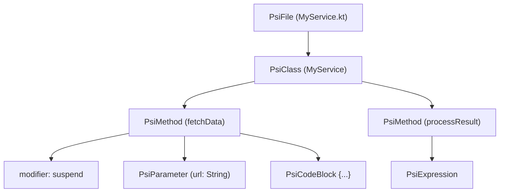
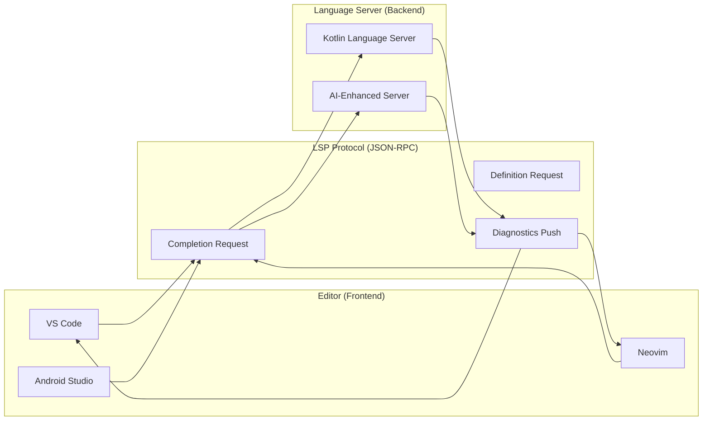

# IDE 插件开发基础

IDE 插件是连接 AI 能力与开发者日常工作流的关键桥梁。无论是 IntelliJ 系还是 VS Code 系，理解插件开发的核心概念，才能构建真正好用的 AI 编程辅助工具。

## IntelliJ Platform

Android Studio 基于 IntelliJ IDEA，插件开发使用 IntelliJ Platform SDK。IntelliJ Platform 提供了丰富的 API 来操作源代码、自定义编辑器行为和扩展 IDE 功能。

> 对后端开发者的类比：类似 VS Code Extension 开发，但用的是 JVM 生态。

## 技术栈

- **语言**：Kotlin（推荐）或 Java
- **构建**：Gradle + IntelliJ Platform Plugin
- **UI**：Swing / JCEF (Web) / Kotlin UI DSL

:::tip
Kotlin 是 IntelliJ 插件开发的首选语言，不仅因为它是 JetBrains 自家语言，还因为 Platform SDK 提供了大量 Kotlin 扩展函数，开发体验远优于 Java。
:::

## 插件项目结构

```
my-plugin/
├── build.gradle.kts
├── src/main/
│   ├── resources/
│   │   └── META-INF/
│   │       └── plugin.xml       # 插件描述文件
│   └── kotlin/
│       └── com/example/
│           └── MyPlugin.java
```

## plugin.xml 核心配置

`plugin.xml` 是插件的声明式配置中心，定义了插件 ID、依赖、扩展点和 Action 注册：

```xml
<idea-plugin>
    <id>com.example.myplugin</id>
    <name>My Plugin</name>
    <vendor>My Company</vendor>

    <!-- 声明依赖的模块 -->
    <depends>com.intellij.modules.platform</depends>
    <!-- 可选依赖，如需要 Java 支持时 -->
    <depends optional="true" config-file="java.xml">com.intellij.modules.java</depends>

    <extensions defaultExtensionNs="com.intellij">
        <!-- 注册扩展点 -->
    </extensions>

    <actions>
        <!-- 注册菜单/快捷键动作 -->
    </actions>
</idea-plugin>
```

## 常用扩展点

| 扩展点 | 用途 |
|--------|------|
| `AnAction` | 菜单项/快捷键动作 |
| `CompletionContributor` | 代码补全 |
| `Inspection` | 代码检查/警告 |
| `IntentionAction` | 快速修复 |
| `ToolWindowFactory` | 侧边栏工具窗口 |
| `FileType` | 自定义文件类型支持 |
| `PsiElementVisitor` | PSI 树遍历 |
| `DocumentationProvider` | 自定义文档提示 |

## 简单 Action 示例

```kotlin
class HelloAction : AnAction() {
    // 点击菜单或按下快捷键时触发
    override fun actionPerformed(e: AnActionEvent) {
        val project = e.project ?: return
        Notifications.Bus.notify(
            Notification(
                "MyPlugin",
                "Hello",
                "This is my first plugin!",
                NotificationType.INFORMATION
            )
        )
    }
}
```

## PSI (Program Structure Interface)

PSI 是 IntelliJ Platform 对源代码的 AST（抽象语法树）表示。每个源文件对应一棵 PSI 树，每个节点是一个 `PsiElement`。通过 PSI，插件可以解析、遍历和修改代码结构。

核心 PSI 类型层级：

- `PsiFile` — 一个源文件的根节点
- `PsiClass` — 类/接口声明
- `PsiMethod` — 方法声明
- `PsiExpression` — 表达式
- `PsiComment` — 注释

下面是一个 PSI 树的直观示例：



实际代码示例——查找文件中所有 `suspend` 函数：

```kotlin
import com.intellij.psi.PsiMethod
import com.intellij.psi.util.PsiTreeUtil

// 查找文件中所有 suspend 函数
fun findSuspendFunctions(psiFile: PsiFile): List<PsiMethod> {
    val allMethods = PsiTreeUtil.findChildrenOfType(psiFile, PsiMethod::class.java)
    return allMethods.filter { method ->
        // 检查修饰符中是否包含 suspend 关键字
        method.modifierList.hasModifierProperty("suspend")
    }
}
```

:::info
PSI 是 IntelliJ 插件开发的核心能力。对于 AI 功能来说，通过 PSI 提取函数签名、类结构和调用关系，可以为 LLM 提供精准的上下文信息，显著提升代码补全和生成的质量。
:::

## 与 AI Coding 的结合

### 1. Inline Completion Provider

接入 LLM API，实现类似 Copilot 的行内代码补全。关键挑战在于低延迟、上下文提取和缓存策略。

```kotlin
class AICompletionContributor : CompletionContributor() {
    override fun fillCompletionVariants(
        parameters: CompletionParameters,
        result: CompletionResultSet
    ) {
        // 从 PSI 提取当前文件上下文
        val context = buildContextFromPsi(parameters.position)
        // 调用 LLM API（必须在后台线程）
        val suggestion = callLLMInBackground(context) ?: return
        // 将结果添加到补全列表
        result.addElement(LookupElementBuilder.create(suggestion))
    }
}
```

### 2. Chat Tool Window

在 IDE 内嵌对话界面，支持代码上下文感知的问答和 `@file` 引用项目文件。通常使用 JCEF（内嵌 Chromium）渲染 Web 界面，通过 JS Bridge 实现双向通信。

### 3. Code Action (Quick Fix)

检测代码问题后提供 AI 驱动的修复建议。例如：检测到潜在内存泄漏后，AI 自动生成修复代码。

## LSP (Language Server Protocol)

LSP 是由微软提出的标准化协议，用于在 Language Server（后端）和 Editor（前端）之间通信。它将代码补全、跳转定义、诊断提示等语言感知功能抽象为 JSON-RPC 消息，使一份 Language Server 实现可以服务所有兼容 LSP 的编辑器。

LSP 的核心能力包括：

- **Text Document Completion** — 代码补全
- **Go to Definition** — 跳转到定义处
- **Diagnostics** — 实时错误和警告提示
- **Hover Information** — 悬停显示类型和文档
- **Code Actions** — 提供自动修复建议



:::info
LSP 是实现跨 IDE 语言支持的标准方案。对于 AI 功能来说，可以将 AI 补全和诊断构建在 LSP 之上，这样一套实现就能同时支持 VS Code、Neovim 和其他 LSP 兼容编辑器，大幅降低开发和维护成本。
:::

## VS Code Extension API 基础

除了 IntelliJ 插件，VS Code Extension 同样是 AI 编程工具的重要开发目标。VS Code 拥有更大的用户基数和更轻量的插件模型，值得了解其核心 API。

VS Code 插件的基本结构：

```
my-extension/
├── package.json          # 插件清单和命令注册
├── src/
│   └── extension.ts      # 入口文件，实现 activate/deactivate
└── tsconfig.json
```

核心 API 概览：

| API | 用途 |
|-----|------|
| `vscode.languages.registerCompletionItemProvider` | 注册代码补全 |
| `vscode.workspace` | 访问工作区文件和配置 |
| `vscode.window.createWebviewPanel` | 创建 Webview 面板 |
| `vscode.languages.registerCodeLensProvider` | 注册 Code Lens |
| `vscode.commands.registerCommand` | 注册命令 |

一个最小的行内补全 Provider 示例：

```typescript
import * as vscode from 'vscode';

// 实现行内补全提供者
export function activate(context: vscode.ExtensionContext) {
    const provider: vscode.InlineCompletionItemProvider = {
        async provideInlineCompletionItems(
            document: vscode.TextDocument,
            position: vscode.Position,
            context: vscode.InlineCompletionContext,
            token: vscode.CancellationToken
        ) {
            // 获取当前行前缀作为提示上下文
            const prefix = document.lineAt(position).text.substring(0, position.character);
            // 调用 AI 服务获取补全建议
            const suggestion = await fetchAISuggestion(prefix);
            if (!suggestion) {
                return undefined;
            }
            return new vscode.InlineCompletionList([
                new vscode.InlineCompletionItem(
                    suggestion,
                    new vscode.Range(position, position)
                )
            ]);
        }
    };

    // 注册补全提供者，支持所有文件类型
    context.subscriptions.push(
        vscode.languages.registerInlineCompletionItemProvider(
            { pattern: '**' },
            provider
        )
    );
}
```

:::info
VS Code 插件用 TypeScript，IntelliJ 插件用 Kotlin——两者都值得了解。掌握双平台的插件开发能力，可以让你构建的 AI 工具覆盖更广泛的开发者群体。
:::

## 插件性能优化

性能是插件被用户接受的关键因素。IntelliJ Platform 对性能有严格要求，违反规则可能导致 IDE 卡顿甚至无响应。

**核心原则：永远不要阻塞 EDT（Event Dispatch Thread）。** 所有耗时操作（网络请求、文件 I/O、LLM 调用）必须放在后台线程执行：

```kotlin
// 在后台线程执行耗时任务
ProgressManager.getInstance().run(
    Task.Backgroundable(project, "正在生成代码建议") {
        // 调用 LLM API 等耗时操作
        val suggestion = callLLM(context)
        // 切回 EDT 更新 UI
        ApplicationManager.getApplication().invokeLater {
            editor.document.insertString(offset, suggestion)
        }
    }
)
```

**Dumb Mode**：当 IDE 正在建立索引时（启动后或添加新依赖后），进入 "Dumb Mode"。此时 PSI 访问受限，插件需要通过 `DumbService.isDumb(project)` 检测状态并优雅降级。

:::warning
阻塞 EDT 会导致整个 IDE 卡死，这是插件被用户卸载的第一原因。务必使用 `Task.Backgroundable` 或 `ReadAction.nonBlocking()` 来执行所有耗时操作。
:::

## 插件测试

良好的测试覆盖是插件质量的基础。IntelliJ Platform 提供了专用的测试框架：

| 测试类 | 适用场景 |
|--------|----------|
| `LightPlatformTestCase` | 轻量级单元测试，启动快 |
| `HeavyPlatformTestCase` | 需要完整项目环境的集成测试 |
| `FixtureTestCase` | UI 相关测试，可模拟用户操作 |

测试策略建议：

1. **Mock PSI 元素** — 使用 `PsiElementFactory` 创建测试用的 PSI 节点
2. **测试 Action 可见性** — 验证 `AnAction.update()` 在不同上下文中的行为
3. **测试补全结果** — 通过 `CompletionTestFixture` 模拟补全并断言结果
4. **测试 Quick Fix** — 创建有问题的代码，验证修复后的输出

```kotlin
class MyPluginTest : LightPlatformTestCase() {
    // 测试 suspend 函数查找功能
    fun testFindSuspendFunctions() {
        val file = myFixture.addFileToProject(
            "Test.kt",
            "class Test { suspend fun doWork() {} fun normal() {} }"
        )
        val suspendFuns = findSuspendFunctions(file)
        assertEquals(1, suspendFuns.size)
        assertEquals("doWork", suspendFuns[0].name)
    }
}
```

:::tip
IntelliJ Platform 测试框架会启动一个轻量级 IDE 实例，首次运行较慢。建议在 CI 中缓存 `$GRADLE_USER_HOME` 和 `.gradle` 目录来加速后续构建。
:::

## 推荐资源

- [IntelliJ Platform SDK 文档](https://plugins.jetbrains.com/docs/intellij/) — 官方开发指南，涵盖从入门到发布全流程
- [JetBrains Marketplace](https://plugins.jetbrains.com/) — 插件发布和分发平台
- [VS Code Extension API](https://code.visualstudio.com/api) — VS Code 插件开发官方文档
- [LSP Specification](https://microsoft.github.io/language-server-protocol/specifications/lsp/3.17/specification/) — Language Server Protocol 规范
- 参考 Copilot、Codeium 等 AI 插件的实现思路和开源项目
