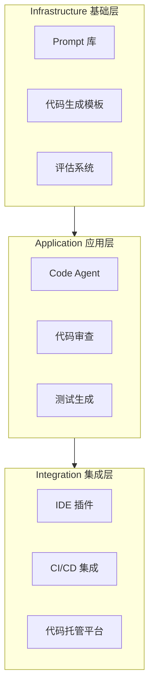

# AI Coding 学习路径

## AI Coding 岗位全景

AI Coding 岗位的职责不只是"用 AI 辅助写代码"，而是**构建 AI 编码工具本身**。整个岗位的技术体系可以分为三个层次：

- **基础层**：为团队维护高质量的编码 Prompt 集合，抽象通用代码模式形成模板，建立自动化评估体系以衡量生成质量。
- **应用层**：围绕 Code Agent 实现自动化代码审查、单元测试生成、代码重构等核心流程，是直接产生业务价值的一层。
- **集成层**：将 AI 编码能力嵌入开发者日常工具链，包括 IDE 插件、CI/CD Pipeline 以及 GitHub/GitLab 等代码托管平台。

:::tip 核心定位
AI Coding 岗位是**平台工程**与**AI 工程**的交叉点。你既需要理解开发者的工作流，也需要掌握 LLM 的调用与优化技巧。
:::

## 技术栈概览

| 方向 | 核心技术 |
|------|----------|
| Prompt Engineering | XML 结构化 Prompt, Few-shot, Context Engineering |
| Code Agent | ReAct 循环, RAG, SWE-bench |
| IDE 插件 | IntelliJ Platform SDK, VS Code Extension API, LSP |

:::info 技术选型建议
初期建议聚焦一个方向深入。Prompt Engineering 是所有方向的基础，应优先掌握。Code Agent 方向需要同时具备 LLM 工程和软件工程两方面知识，门槛较高但岗位需求增长最快。
:::

## 传统开发 vs AI 驱动开发的思维转换

| 维度 | 传统开发 | AI 驱动开发 | 说明 |
|------|---------|------------|------|
| 代码产出 | 人工编写每一行 | Prompt → 生成 → 审查 → 采纳 | 角色从「写代码」变成「审查代码 + 设计 Prompt」 |
| 质量保证 | 人工 Code Review | AI 自动审查 + 人工审核异常 | 审查效率大幅提升，但需要建立 Prompt 质量标准 |
| 测试 | 手动编写测试用例 | AI 生成测试 + 自动运行修复 | 测试覆盖率提升，但需要验证生成测试的有效性 |
| 重构 | 确定目标后手动执行 | 描述意图 → Agent 自动执行 | 重构规模从「函数级」扩展到「模块级」 |
| 知识管理 | 文档 + Wiki | Prompt 库 + 代码模板 | 知识载体从自然语言文档变为结构化 Prompt |
| 迭代速度 | 受限于开发者数量 | 受限于 Prompt 质量和审查速度 | 瓶颈从「写代码」转移到「设计 Prompt 和审查」 |

:::tip
传统开发中，开发者的核心竞争力是「写代码的速度和质量」。AI Coding 时代，核心竞争力变为「设计高质量 Prompt 的能力」和「审查 AI 产出物的判断力」。工具在变，但软件工程的核心——系统设计、问题分解、质量把控——不会变。
:::

## 学习顺序

1. **Prompt Engineering** -- [prompt-engineering.md](./prompt-engineering)
   学习如何设计结构化 Prompt、管理 Context、构建评估基准。这是所有 AI Coding 工作的底层能力。

2. **Code Agent** -- [code-agent.md](./code-agent)
   掌握 Agent 框架的设计模式（ReAct、Plan-and-Execute），理解如何让 LLM 在真实代码仓库中自主完成编码任务。

3. **IDE 插件开发** -- [ide-plugin.md](./ide-plugin)
   学习如何将 AI 能力集成到开发者最常使用的工具中，涉及 Language Server Protocol、插件架构设计等。

:::warning 注意
学习顺序并非严格线性。建议在完成 Prompt Engineering 基础部分后，就可以并行探索 Code Agent 和 IDE 插件开发，在实践中交叉学习效果更好。
:::

## 推荐资源

- [Prompt Engineering Guide](https://www.promptingguide.ai/) -- 系统、全面的 Prompt Engineering 入门教程
- [LangChain 文档](https://docs.langchain.com/) -- 构建 LLM 应用和 Agent 的主流框架
- [Anthropic Prompt Engineering](https://docs.anthropic.com/claude/docs/prompt-engineering) -- Anthropic 官方的 Prompt 设计最佳实践
- [Anthropic Building Effective Agents](https://docs.anthropic.com/en/docs/build-with-claude/agent-patterns) -- Agent 设计模式的权威参考，涵盖从简单到复杂的多种 Agent 架构
- [SWE-bench](https://www.swebench.com/) -- 衡量 AI 编码能力的基准测试，理解这个 benchmark 有助于把握 Code Agent 的技术前沿
- [awesome-cursorrules](https://github.com/PatrickJS/awesome-cursorrules) -- 社区维护的 Cursor 规则集，适合学习如何为 IDE 中的 AI 编码助手编写高质量规则

:::tip 下一步
完成 AI Coding 学习后，了解 [KMP 跨平台](/kmp/) 基础概念（优先级 P3）。
:::
