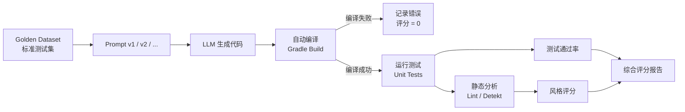

# Prompt Engineering

## 核心原则

### 1. 明确性 (Clarity)

Prompt 越精确，LLM 输出越可靠。明确性要求你把模糊的意图转化为可执行的指令，包括目标语言、输入输出类型、约束条件和风格偏好。

```text
# 差
帮我写一个函数

# 好
用 Kotlin 写一个函数，输入 List<Int>，返回其中所有偶数的平方和。
要求：使用函数式风格，添加文档注释。
```

### 2. 提供上下文 (Context)

LLM 没有项目背景知识，你需要主动提供相关信息：技术栈版本、架构模式、已知约束、错误日志等。

```text
# 差
这个代码有 bug，帮我修

# 好
以下 Android Kotlin 代码在屏幕旋转后丢失数据：
[code]
我怀疑是因为 ViewModel 使用方式不对。
请分析原因并提供修复方案，解释为什么修复有效。
```

### 3. 分步引导 (Chain of Thought)

让 LLM 按步骤思考，可以显著提高推理质量，尤其在调试和架构设计等复杂任务中效果明显。

```text
请按以下步骤分析：
1. 首先解释当前代码的问题
2. 然后给出修复思路
3. 最后提供完整的修复代码
```

## 代码生成 Prompt 模式

### 模板生成

适用于重复性的代码创建场景，例如新建 Activity、ViewModel、Repository 等。

```text
你是一个 Android 开发专家。
根据以下模板生成代码：

模板名称：${template_name}
语言：Kotlin
框架：Jetpack Compose
要求：
- 遵循 MVVM 架构
- 使用 StateFlow 管理 UI 状态
- 添加错误处理

输入参数：
${parameters}
```

### 代码审查

让 LLM 扮演 Reviewer 角色，从多个维度检查代码质量。

```text
请审查以下 Kotlin/Android 代码，关注：
1. 空安全问题
2. 内存泄漏风险（特别是 Activity/Fragment 引用）
3. 主线程阻塞风险
4. 协程使用是否正确
5. 代码风格是否符合 Kotlin 惯用写法

代码：
${code}
```

### 单元测试生成

通过明确测试框架和覆盖要求，让 LLM 生成可用的测试代码。

```text
为以下函数生成单元测试：
- 使用 JUnit 5 + MockK
- 覆盖正常路径和边界情况
- 包含 null/空输入的测试
- Mock 所有外部依赖

函数：
${function_code}
```

## Prompt 库设计思路

### 分类

将 Prompt 按用途分类管理，方便检索和复用。

| 类别 | 示例 |
|------|------|
| 代码生成 | 新建 Activity/Fragment/ViewModel |
| 代码审查 | 安全审查、性能审查、风格审查 |
| 测试生成 | 单元测试、UI 测试 |
| 重构 | 提取方法、模式转换 |
| 文档 | 生成 KDoc、README |
| Debug | 错误分析、日志分析 |

### 变量化

将 Prompt 中的可变部分模板化，实现参数化复用：

- `${language}` — 编程语言
- `${framework}` — 目标框架
- `${code}` — 输入代码
- `${requirements}` — 具体需求
- `${style_guide}` — 代码风格要求

:::tip
将 Prompt 模板存储为 `.md` 或 `.yaml` 文件，结合 CI 脚本可以批量调用 LLM 生成代码，实现半自动化工作流。
:::

## Context Engineering

Context Engineering 是 Prompt Engineering 的自然演进——关注的不再是怎么问，而是给什么信息。

### 超越 Prompt：管理上下文窗口

LLM 的推理质量高度依赖上下文窗口中的内容。即使 Prompt 写得再好，如果缺少关键信息，输出也会偏离预期。Context Engineering 的核心在于**选择性地将最相关的信息注入上下文窗口**。

### RAG for Code：检索增强生成

在代码生成场景中，RAG (Retrieval Augmented Generation) 技术可以自动检索与当前任务相关的代码片段并注入 Prompt。具体做法：

1. 将代码库切分为函数/类级别的片段
2. 对每个片段生成 embedding 向量
3. 根据当前任务描述检索最相关的 Top-K 片段
4. 将检索结果作为 `<context>` 块拼接到 Prompt 中

这种方式让 LLM 能"看到"项目中的现有模式、命名约定和工具类，生成更贴合项目的代码。

### 上下文窗口预算

LLM 的 context window 有上限（如 128K tokens），需要像管理内存一样管理上下文预算：

| 优先级 | 内容类型 | 典型占比 |
|--------|----------|----------|
| 高 | 当前任务直接相关的代码/文件 | 50-60% |
| 高 | 明确的指令和约束 | 10-15% |
| 中 | 相关接口定义、类型声明 | 15-20% |
| 低 | 项目规范、风格指南摘要 | 5-10% |

:::tip
Context engineering 是 Prompt engineering 的下一代——不是怎么问，而是给什么信息。在大型项目中，一个带有 RAG 检索的简单 Prompt，往往比一个精心措辞但没有上下文的 Prompt 效果好得多。
:::

## XML 结构化 Prompt

### 为什么用 XML 而不是 JSON

LLM 的训练数据中包含大量 XML/HTML，XML 标签天然具有语义分隔能力。相比 JSON：

- **Token 效率更高**：XML 标签 `<context>` 通常比 JSON key `"context":` 消耗更少的 token
- **嵌套结构更清晰**：标签的打开/关闭机制让层级关系一目了然
- **支持混合内容**：标签内可以直接放多行代码、Markdown 等，不需要转义
- **LLM 解析更可靠**：主流 LLM 对 XML 的遵循度高于 JSON

### 结构化模板示例

以下是一个面向 Android 代码生成的 XML 结构化 Prompt 模板：

```xml
<context>
  项目是一个 Android 应用，使用 Kotlin + Jetpack Compose。
  架构模式为 MVVM，状态管理使用 StateFlow。
  最低 SDK 版本：26，目标 SDK 版本：34。
</context>

<instructions>
  请根据以下需求生成一个 Composable 函数。
  遵循项目现有的命名约定和代码风格。
</instructions>

<examples>
  <example>
    <input>显示一个用户头像列表</input>
    <output>
@Composable
fun UserAvatarList(users: List<User>) {
    LazyRow(horizontalArrangement = Arrangement.spacedBy(8.dp)) {
        items(users, key = { it.id }) { user ->
            AsyncImage(
                model = user.avatarUrl,
                contentDescription = "${user.name} 的头像",
                modifier = Modifier.size(40.dp)
            )
        }
    }
}
    </output>
  </example>
</examples>

<output_format>
  返回完整的 Kotlin 代码，包含必要的 import 语句。
  在代码前用简短的中文说明设计思路。
</output_format>

<task>
  ${task_description}
</task>
```

:::info
`<examples>` 标签中可以放 0 到 N 个示例。当任务复杂度高时，增加示例数量；当指令足够清晰时，可以省略示例以节省 token。
:::

## Few-shot Prompting

### 基本原理

Few-shot Prompting 通过在 Prompt 中提供 2-3 个输入输出示例，让 LLM 从模式中学习期望的转换规则，而不是仅依赖自然语言指令。这在代码转换、风格迁移等难以精确描述的任务中特别有效。

### 代码示例：Kotlin View → Compose 转换

```text
请将以下 Kotlin View 代码转换为 Jetpack Compose 代码。

# 示例 1
输入：
val textView = TextView(context).apply {
    text = "Hello"
    textSize = 16f
    setTextColor(Color.BLACK)
}

输出：
Text(
    text = "Hello",
    fontSize = 16.sp,
    color = Color.Black
)

# 示例 2
输入：
val button = Button(context).apply {
    text = "Submit"
    setOnClickListener { onSubmit() }
}

输出：
Button(onClick = { onSubmit() }) {
    Text("Submit")
}

# 现在请转换
输入：
${input_code}
```

### 适用场景

- **复杂代码转换**：迁移到新框架、新语言版本
- **风格敏感任务**：需要遵循特定的编码风格或模式
- **指令难以描述的任务**："照着这个风格来"比精确描述更直观

:::warning
Few-shot examples 会消耗大量 token，优先用 clear instructions + 1 个 example。仅当单个示例不足以传达模式时，才增加到 2-3 个示例。每个示例都会占用上下文窗口的预算，影响留给实际任务的空间。
:::

## Prompt 版本管理

### 把 Prompt 当作代码

Prompt 是 AI 工作流中的核心资产，应该像源代码一样纳入版本管理。每一次 Prompt 的修改都可能影响输出质量，需要可追溯、可回滚。

### Git-based Prompt Registry

推荐的项目目录结构：

```text
prompts/
├── code-generation/
│   ├── v1_activity.md          # 版本化存储
│   ├── v2_activity.md
│   └── latest_activity.md      # 指向当前最佳版本
├── code-review/
│   └── security_audit.md
├── tests/
│   └── unit_test_gen.md
└── README.md                   # 记录各 Prompt 的适用场景和评分
```

### 版本管理实践

- **语义化版本号**：`v1.0.0` 表示稳定版本，小改动递增 patch 号，重大调整递增 major 号
- **变更日志**：每次修改记录动机、修改内容和效果对比
- **A/B 测试**：对新旧版本用相同输入集生成输出，人工或自动评分后决定是否升级
- **回归测试**：维护一组 golden cases，确保新版本不会在已覆盖场景上退化

:::info
在团队协作中，Prompt 的变更应该经过 Code Review 流程。一个人的"优化"可能对另一个人的场景造成负面影响。
:::

## 评估 Prompt 质量

### 评估指标体系

量化 Prompt 质量需要从多个维度衡量：

| 指标 | 说明 | 度量方式 |
|------|------|----------|
| 任务完成率 | 输出是否满足需求 | 人工判定 / LLM-as-judge |
| 代码正确性 | 是否能编译并通过测试 | 自动化编译 + 测试运行 |
| 风格一致性 | 是否符合项目规范 | Linter 规则匹配率 |
| 可读性 | 代码是否易于理解 | 人工评分 (1-5) |
| Token 效率 | 输出 token 数 / 有效信息量 | 人工评估冗余比例 |

### 自动化评估流水线

将 Prompt 评估集成到 CI/CD 中，实现持续监控。



### 评估实施建议

1. **构建 Golden Dataset**：收集 20-50 个代表性任务，包含输入描述和期望输出
2. **自动化评分**：编译成功率权重 40%，测试通过率权重 40%，风格匹配率权重 20%
3. **定期评估**：每次 Prompt 变更后自动跑评估流水线，结果记录到版本历史
4. **人工抽检**：对高分输出进行抽检，验证自动化指标的有效性

:::tip
初期不需要追求完美的评估体系。从 10 个 golden cases + 编译检查开始，逐步扩充数据集和评分维度。评估体系的精度会随着迭代持续提升。
:::
