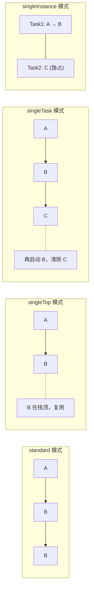
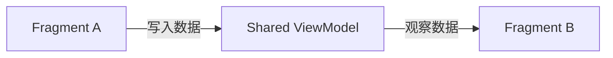
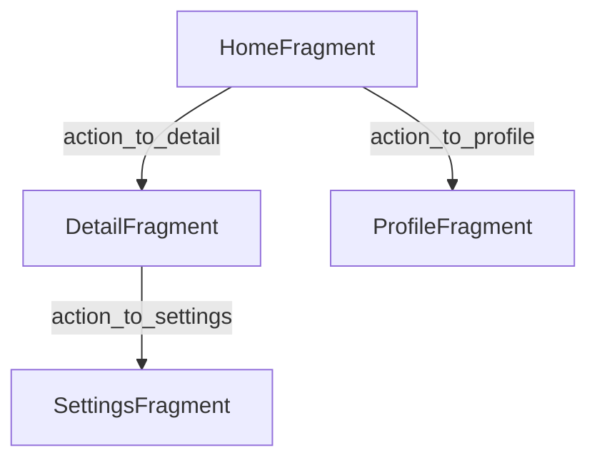
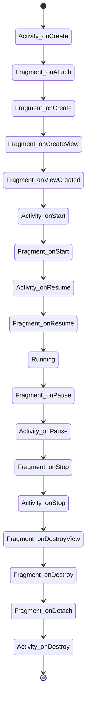
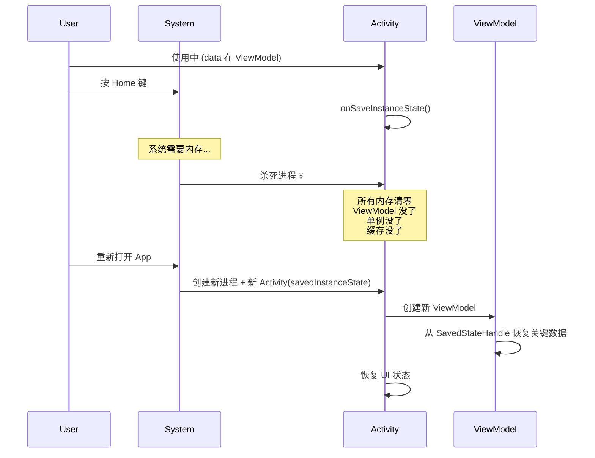

# 四大组件 & 生命周期

## 四大组件

### 1. Activity

用户看到的每一个屏幕就是一个 Activity。它是最核心的 UI 组件，负责展示界面并处理用户交互。

```text
onCreate → onStart → onResume → [可见可交互]
                                ↓
              onPause → onStop → onDestroy
```

- `onCreate()`：初始化布局和数据，只调用一次
- `onResume()`：获得焦点，可交互
- `onPause()`：失去焦点（如弹出对话框）
- `onStop()`：不可见（如切到其他 App）
- `onDestroy()`：销毁前释放资源

:::tip 关键理解
Activity 随时可能被系统销毁重建（如屏幕旋转），所以状态不能只存在 Activity 中，应使用 ViewModel 或 SavedStateHandle 持久化关键数据。
:::

#### Activity LaunchMode

Activity 的启动模式决定了实例在 Task 栈中的创建和复用行为。Android 提供了四种启动模式：

| 模式 | 行为说明 |
|------|----------|
| `standard`（默认） | 每次启动都创建新实例，允许多个相同 Activity 共存于同一 Task |
| `singleTop` | 若目标 Activity 已在栈顶，则复用该实例并回调 `onNewIntent()`，否则创建新实例 |
| `singleTask` | 系统在新的 Task 中创建 Activity，若已存在则复用并清除其上方所有 Activity |
| `singleInstance` | 类似 singleTask，但整个系统仅保留唯一实例，独占一个 Task |



**AndroidManifest.xml 声明方式：**

```xml
<!-- 在 AndroidManifest.xml 中声明 launchMode -->
<activity
    android:name=".DetailActivity"
    android:launchMode="singleTop" />
```

**Intent Flags 方式：**

```kotlin
// 使用 Intent Flag 动态设置启动模式
val intent = Intent(this, DetailActivity::class.java)
// 在新 Task 中启动，等效于 singleTask
intent.addFlags(Intent.FLAG_ACTIVITY_NEW_TASK)
// 若目标已存在，清除其上方 Activity 并复用
intent.addFlags(Intent.FLAG_ACTIVITY_CLEAR_TOP)
startActivity(intent)
```

:::warning
singleTask 和 singleInstance 在复杂场景中需谨慎使用。它们会改变 Task 栈结构，容易导致返回栈行为不符合预期，尤其是在多 Task 切换和 Deep Link 场景下可能引发难以调试的问题。
:::

### 2. Fragment

Activity 的模块化片段，一个 Activity 可以包含多个 Fragment。Fragment 有自己的生命周期和布局，但依赖于宿主 Activity。

```kotlin
class MyFragment : Fragment(R.layout.my_fragment) {
    override fun onViewCreated(view: View, savedInstanceState: Bundle?) {
        // 初始化 UI，类似 Activity 的 onCreate
    }
}
```

- 有自己的生命周期，但依赖宿主 Activity
- Fragment 间通过 FragmentManager 管理切换
- 现代 Android 推荐单 Activity + 多 Fragment 架构

#### Fragment 间通信

Fragment 之间不应直接引用彼此，而应通过以下三种推荐方式通信：



**方式一：共享 ViewModel（推荐）**

```kotlin
// 两个 Fragment 共享宿主 Activity 的 ViewModel
class SharedViewModel : ViewModel() {
    // 使用 MutableLiveData 或 StateFlow 持有共享数据
    val selectedItem = MutableStateFlow<String>("")
}

// Fragment A 中写入数据
class FragmentA : Fragment() {
    private val viewModel: SharedViewModel by activityViewModels()

    override fun onViewCreated(view: View, savedInstanceState: Bundle?) {
        viewModel.selectedItem.value = "hello"
    }
}

// Fragment B 中观察数据
class FragmentB : Fragment() {
    private val viewModel: SharedViewModel by activityViewModels()

    override fun onViewCreated(view: View, savedInstanceState: Bundle?) {
        viewLifecycleOwner.lifecycleScope.launch {
            viewModel.selectedItem.collect { value ->
                // 收到 Fragment A 发送的数据
            }
        }
    }
}
```

**方式二：setFragmentResult API**

```kotlin
// Fragment A 发送结果
button.setOnClickListener {
    val result = Bundle().apply { putString("key", "value") }
    // 向父 FragmentManager 发送结果
    parentFragmentManager.setFragmentResult("requestKey", result)
}

// Fragment B 接收结果
parentFragmentManager.setFragmentResultListener("requestKey", viewLifecycleOwner) { _, bundle ->
    val value = bundle.getString("key")
}
```

**方式三：Navigation Component + SafeArgs**

```kotlin
// 通过 NavController 携带类型安全参数跳转
val action = FragmentADirections.actionToFragmentB(userName = "Alice", userId = 42)
findNavController().navigate(action)

// 目标 Fragment 中通过 SafeArgs 接收参数
val args by navArgs<FragmentBArgs>()
val name = args.userName  // 类型安全
```

### 3. Service

后台运行，没有 UI。Service 适合执行不需要用户界面的长时间操作。

```kotlin
class MyService : Service() {
    override fun onBind(intent: Intent): IBinder? = null

    override fun onStartCommand(intent: Intent, flags: Int, startId: Int): Int {
        // 处理后台任务
        return START_NOT_STICKY
    }
}
```

- 注意：Service 默认运行在**主线程**，耗时操作必须在子线程中执行
- 长时间后台任务建议用 `WorkManager`
- Android 8.0+ 对后台 Service 有严格限制
- 前台 Service 需要显示通知并请求 `FOREGROUND_SERVICE` 权限

### 4. BroadcastReceiver

监听系统或应用广播事件，适合响应跨组件或跨应用的通信。

```kotlin
// 动态注册
val receiver = object : BroadcastReceiver() {
    override fun onReceive(context: Context, intent: Intent) {
        when (intent.action) {
            Intent.ACTION_BATTERY_LOW -> { /* 电量低 */ }
        }
    }
}
registerReceiver(receiver, IntentFilter(Intent.ACTION_BATTERY_LOW))
```

:::warning
Android 8.0+ 限制了大部分隐式广播的静态注册，推荐使用动态注册或 `ContextCompat.registerReceiver()`。
:::

## ContentProvider — 跨应用数据共享

ContentProvider 是 Android 提供的标准化的跨进程数据共享机制。它为不同应用之间的数据访问提供了统一的 URI 接口，底层通常基于 SQLite 或文件存储。

```kotlin
// 最小化 ContentProvider 示例
class MyProvider : ContentProvider() {

    override fun onCreate(): Boolean {
        // 初始化数据库连接等
        return true
    }

    override fun query(
        uri: Uri, projection: Array<String>?,
        selection: String?, selectionArgs: Array<String>?,
        sortOrder: String?
    ): Cursor? {
        // 执行查询，返回 Cursor
        return null
    }

    override fun insert(uri: Uri, values: ContentValues?): Uri? {
        // 插入数据，返回新行的 URI
        return null
    }

    override fun update(
        uri: Uri, values: ContentValues?,
        selection: String?, selectionArgs: Array<String>?
    ): Int {
        // 更新数据，返回受影响的行数
        return 0
    }

    override fun delete(
        uri: Uri, selection: String?, selectionArgs: Array<String>?
    ): Int {
        // 删除数据，返回受影响的行数
        return 0
    }

    override fun getType(uri: Uri): String? {
        // 返回 MIME 类型
        return null
    }
}
```

**真实场景示例：**

- **Contacts Provider**：通过 `ContactsContract` 读取和操作通讯录
- **MediaStore**：查询设备上的图片、视频、音频等媒体文件
- **Calendar Provider**：读写日历事件

:::info
ContentProvider 在现代开发中使用频率降低，但对理解系统架构和面试很重要。许多场景已被 Room + Repository 模式替代，但系统级 Provider（如 MediaStore）仍然广泛使用。
:::

## Intent — 组件间通信

Intent 是 Android 组件间通信的核心机制，分为显式和隐式两种。

```kotlin
// 显式 Intent（跳转已知目标）
val intent = Intent(this, DetailActivity::class.java)
intent.putExtra("id", 123)
startActivity(intent)

// 隐式 Intent（让系统匹配）
val intent = Intent(Intent.ACTION_VIEW, Uri.parse("https://example.com"))
startActivity(intent)
```

| 类型 | 使用场景 | 特点 |
|------|----------|------|
| 显式 Intent | 应用内组件跳转 | 直接指定目标 Class，确定性高 |
| 隐式 Intent | 调用系统功能或其他应用 | 通过 action + data 匹配，需处理无匹配的情况 |

## Context

Android 中最核心的对象之一，几乎所有操作都需要它。

| 类型 | 说明 | 生命周期 |
|------|------|----------|
| Application Context | 全局单例 | 应用进程存活期间 |
| Activity Context | 绑定 Activity | Activity 生命周期 |

> **规则**：生命周期长的对象用 Application Context，避免用 Activity Context 导致内存泄漏。启动 Activity 和显示 Dialog 必须使用 Activity Context。

## Jetpack Navigation 组件

Navigation Component 是 Jetpack 提供的导航框架，用于管理 Fragment 之间的跳转和参数传递。它通过导航图（NavGraph）以可视化方式定义应用内的导航逻辑。



**nav_graph.xml 定义：**

```xml
<!-- res/navigation/nav_graph.xml -->
<navigation xmlns:android="http://schemas.android.com/apk/res/android"
    xmlns:app="http://schemas.android.com/apk/res-auto"
    app:startDestination="@id/homeFragment">

    <fragment
        android:id="@+id/homeFragment"
        android:name="com.example.HomeFragment"
        android:label="Home">
        <action
            android:id="@+id/action_to_detail"
            app:destination="@id/detailFragment">
            <argument
                android:name="itemId"
                app:type="integer" />
        </action>
    </fragment>

    <fragment
        android:id="@+id/detailFragment"
        android:name="com.example.DetailFragment"
        android:label="Detail" />

</navigation>
```

**NavController 使用：**

```kotlin
// 在 Fragment 或 Activity 中使用 NavController
val navController = findNavController(R.id.nav_host_fragment)

// 通过 action ID 导航
navController.navigate(R.id.action_to_detail)

// 使用 SafeArgs 传递类型安全参数
val directions = HomeFragmentDirections.actionToDetail(itemId = 42)
navController.navigate(directions)
```

**SafeArgs 的优势：** 编译期类型检查，避免字符串硬编码导致的运行时错误。

## 生命周期详解

### Activity 与 Fragment 生命周期交织

Fragment 的生命周期回调与宿主 Activity 的生命周期紧密关联，理解它们的交织关系对于避免状态丢失至关重要。



:::tip
注意 Fragment 的 `onStart` 和 `onResume` 在 Activity 对应回调**之后**调用，而 `onPause` 和 `onStop` 在 Activity 对应回调**之前**调用。这意味着 Fragment 的销毁先于 Activity。
:::

## 关键生命周期场景

| 场景 | 触发的回调 |
|------|-----------|
| 打开 App | onCreate → onStart → onResume |
| 按 Home 键 | onPause → onStop |
| 回到 App | onRestart → onStart → onResume |
| 旋转屏幕 | onPause → onStop → onDestroy → onCreate → onStart → onResume |
| 通话来电 | onPause → (通话结束) → onResume |
| 打开新 Activity | 当前 Activity: onPause → onStop |
| 对话框覆盖 | onPause → (对话框关闭) → onResume |

## 进程死亡：Android 架构存在的根本原因

上面讲的生命周期只是冰山一角。Android 开发中最重要的概念，也是后端开发者最难理解的，是**进程死亡 (Process Death)**。

### 什么是进程死亡？

当你按 Home 键把 App 切到后台，Android 系统可能在任何时候——不需要你同意——直接**杀掉整个进程**来回收内存。你的所有变量、单例、内存缓存全部清零。

当你重新打开 App 时，Android 会尝试恢复到你离开时的状态：重建 Activity，传入之前保存的 `savedInstanceState`。



### 这解释了整个 Android 架构为什么存在

| 组件 | 存在的原因 |
|------|-----------|
| ViewModel | 配置变更（屏幕旋转）时不丢失数据，但**进程死亡时也会被清空** |
| SavedStateHandle | 进程死亡后，从 savedInstanceState 恢复关键数据 |
| Room / DataStore | 数据持久化到磁盘，不依赖进程存活 |
| Repository 模式 | 为 ViewModel 提供数据，不关心数据来自内存缓存、数据库还是网络 |

:::warning 后端开发者的最大认知差异
服务器进程一旦启动就持续运行，直到你主动重启。但 Android 进程随时可能被系统杀掉——你的 App 必须能在"从零开始"的状态下恢复到用户上次看到的界面。这不是边缘情况，这是 Android 的日常。
:::

### 实践中的建议

- **关键数据必须持久化**: 用户正在编辑的表单、当前浏览位置等，不要只放内存
- **SavedStateHandle 存最小数据**: 只存恢复 UI 需要的最小信息（如 ID），不要存大对象
- **Repository 不要只靠内存缓存**: 数据库或网络才是 Single Source of Truth
- **测试进程死亡**: 开发者选项 → "不保留活动"，可以模拟每次离开 Activity 都被销毁的场景

## 常见的坑

:::warning launchMode 导致重复 Activity
使用 `standard` 模式时，快速连续点击按钮可能创建多个相同的 Activity 实例。解决方案是在 `onResume` 中添加点击防抖，或使用 `singleTop` 模式配合 `onNewIntent()` 处理。
:::

:::warning Fragment 状态丢失
在 `onSaveInstanceState()` 之后调用 `FragmentTransaction.commit()` 会抛出 IllegalStateException。虽然 `commitAllowingStateLoss()` 可以绕过这个检查，但它只是掩盖了问题，可能导致 UI 状态不一致。正确做法是在生命周期安全的位置提交事务，或使用 `commitNowAllowingStateLoss()`。
:::

:::warning ContentProvider 阻塞启动
ContentProvider 的 `onCreate()` 在 Application 的 `onCreate()` 之前被调用。如果在 ContentProvider 中执行耗时初始化操作，会直接阻塞应用的启动速度，造成 ANR。应将耗时操作延迟到 `query()`/`insert()` 等方法首次被调用时再执行，或使用懒加载模式。
:::
