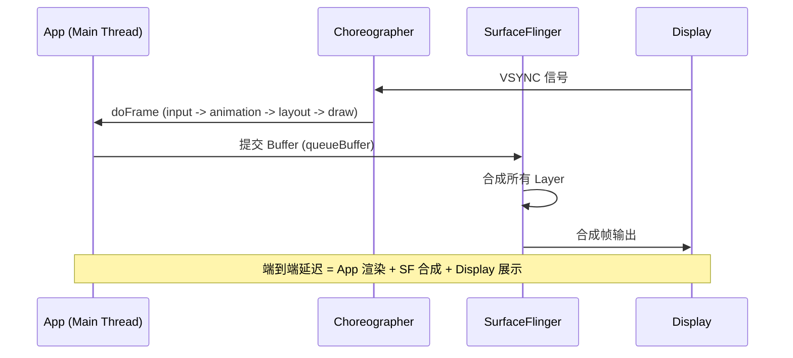
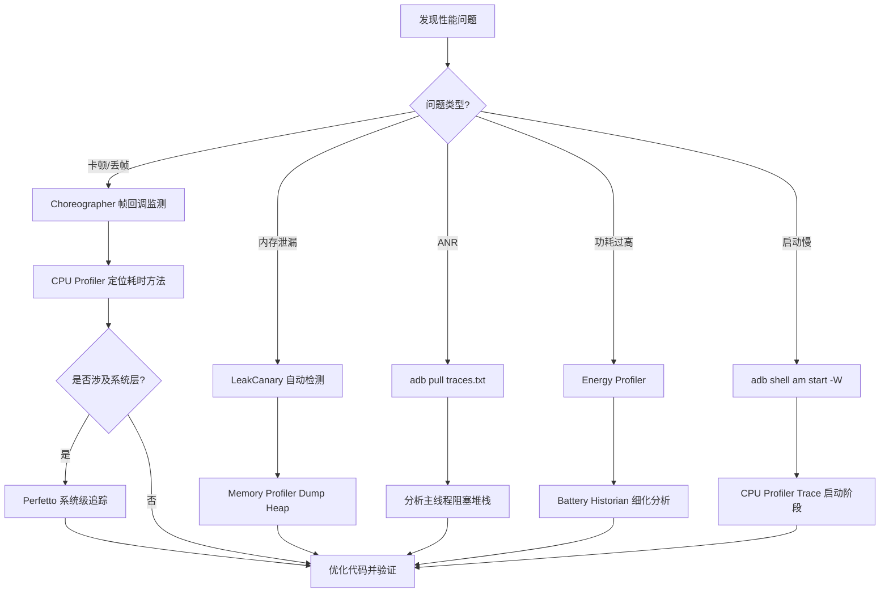

# 调试 & Profiler

Android 应用的调试与性能优化是一项系统性工程，需要掌握从日志分析、运行时检测到系统级追踪的完整工具链。本文涵盖日常开发中最常用的调试手段与性能分析工具。

## Android Studio Profiler

Android Studio 内置的 Profiler 是端侧性能优化的核心工具，提供 CPU、Memory、Network、Energy 四个维度的实时分析能力。打开方式：View -> Tool Windows -> Profiler，或将设备连接后直接点击底部 Profiler 标签页。

### CPU Profiler

- 查看方法耗时、调用栈，定位耗时瓶颈
- 支持 Sample (采样，开销低) 和 Trace (全量插桩，数据精确) 两种模式
- 用于定位卡顿、ANR 的根因，Call Chart 和 Flame Chart 两种视图可切换

### Memory Profiler

- 查看内存分配、GC 情况，实时监控内存水位
- 检测内存泄漏 (Activity/Fragment 未释放)
- Dump Java Heap 后可分析对象引用链，配合 `LeakCanary` 效果更佳

### Network Profiler

- 查看网络请求的时间线、大小和响应内容
- 检查请求/响应 header 和 body，排查接口问题

### Energy Profiler

- 分析 CPU、网络、GPS 传感器对功耗的影响
- 视频播放、后台定位等场景重点关注功耗指标

## 常用调试工具

### Logcat

`Logcat` 是最基础的调试手段，支持按标签、级别、正则表达式过滤日志。

```kotlin
// 基本日志输出
Log.d("MainActivity", "debug message")
Log.e("NetworkService", "error message", exception)

// 使用 BuildConfig 控制日志输出，避免 release 构建泄漏日志
if (BuildConfig.DEBUG) {
    Log.d("TAG", "仅在 debug 构建中输出的日志")
}
```

:::tip
在 `release` 构建中应移除或禁用 `Log.d` / `Log.v` 级别日志，可通过 Timber 等库统一管理日志树 (Tree) 的植人与移除。
:::

### Layout Inspector

- 检查视图层级结构，排查嵌套过深导致的性能问题
- 查看每个 View 的属性、位置、大小
- 支持实时 3D 视图，直观展示 View 重叠关系

### ADB (Android Debug Bridge)

`ADB` 是与 Android 设备通信的核心命令行工具，以下是性能调试中最高频使用的命令。

```bash
# 设备管理
adb devices                              # 列出已连接设备
adb install app.apk                      # 安装 APK

# 日志与内存
adb logcat                               # 查看实时日志
adb logcat --pid=$(adb shell pidof com.example.app)  # 按进程过滤日志
adb shell dumpsys meminfo <pkg>          # 查看内存使用详情
adb shell dumpsys gfxinfo <pkg>          # 查看 GPU 渲染帧耗时

# 性能分析
adb shell am start -W <pkg>/<activity>   # 测量启动耗时
adb shell dumpsys cpuinfo                # 查看 CPU 使用率
adb pull /data/anr/traces.txt            # 拉取 ANR 堆栈文件
```

## 性能分析常用指标

| 指标 | 工具 | 说明 |
|------|------|------|
| FPS | GPU 分析 / `adb shell dumpsys gfxinfo` | 每秒帧数，60fps 为流畅，120fps 为高端目标 |
| 启动时间 | CPU Profiler / `adb shell am start -W` | 冷启动/热启动/温启动耗时 |
| 内存 | Memory Profiler / `dumpsys meminfo` | 内存占用和泄漏检测 |
| 功耗 | Energy Profiler / Battery Historian | 电池消耗分析 |
| ANR | `adb pull /data/anr/traces.txt` | 应用无响应堆栈，超过 5 秒触发 |
| Crash | Logcat / Crash 平台 | 崩溃日志收集与分析 |

## LeakCanary (内存泄漏检测)

`LeakCanary` 是 Square 开源的自动内存泄漏检测库，在 debug 构建中自动监听 Activity/Fragment 的生命周期，发现泄漏后生成引用链分析报告。

```kotlin
// build.gradle.kts 添加依赖
dependencies {
    debugImplementation("com.squareup.leakcanary:leakcanary-android:2.12")
}

// Application 中可选配置（不配置也能自动工作）
class MyApp : Application() {
    override fun onCreate() {
        super.onCreate()
        // 自定义泄漏监听器，例如上报到监控平台
        LeakCanary.config = LeakCanary.config.copy(
            onHeapAnalyzedListener = DefaultOnHeapAnalyzedListener.create(this)
        )
    }
}
```

- Debug 构建自动检测 Activity/Fragment/ViewModel 泄漏
- 显示泄漏对象的完整引用链，精准定位 GC Root
- 无需手动触发，安装即可使用

## Perfetto 系统级追踪

`Perfetto` 是 Android 10 及以上版本中 Systrace 的继任者，用于系统级性能追踪。它可以同时捕获 CPU 调度、GPU 合成、SurfaceFlinger、应用主线程等多维度的 trace 数据，是分析端到端渲染延迟的终极工具。

### 采集方式

```bash
# 方式一：通过 adb 命令采集 10 秒系统 trace
adb shell perfetto -o /data/misc/perfetto-traces/trace.pb -t 10s \
  sched freq idle am wm view gfx input dalvik camera hal res

# 拉取 trace 文件到本地
adb pull /data/misc/perfetto-traces/trace.pb

# 方式二：通过 Android Studio -> Profiler -> CPU -> System Trace 录制
```

采集完成后，将 `.pb` 文件拖入 [ui.perfetto.dev](https://ui.perfetto.dev) 即可在浏览器中分析。

### 如何阅读 Perfetto Trace

1. **识别主线程阻塞**：在 Main Thread 轨道中，查看每一帧的执行耗时，橙色色块表示 `doFrame` 处理时间过长
2. **GPU 合成延迟**：查看 GPU 轨道中是否出现 composition 堆积，判断 GPU 是否成为瓶颈
3. **VSYNC 间隙**：如果帧之间出现明显的空白间隙，说明应用未能在 16ms 内完成渲染，导致丢帧

### 渲染管线可视化



:::info
`Perfetto` 的 trace 数据量通常较大 (几十 MB)，建议采集时长控制在 10-20 秒以内，聚焦于问题复现的关键时间段。
:::

## Choreographer 帧回调分析

Android 的渲染管线由 VSYNC 信号驱动。每当屏幕准备刷新时，系统发送 VSYNC 信号，`Choreographer` 收到后依次执行 `doFrame` 流程：input -> animation -> layout -> draw。如果 `doFrame` 执行超过 16ms (60fps) 或 8ms (120fps)，就会产生丢帧。

通过 `Choreographer` 的帧回调，可以在运行时监测每一帧的实际渲染间隔，从而量化卡顿。

```kotlin
class FrameMonitor : Choreographer.FrameCallback {
    private var lastFrameTimeNanos: Long = 0

    fun start() {
        // 注册帧回调，每帧都会触发
        Choreographer.getInstance().postFrameCallback(this)
    }

    override fun doFrame(frameTimeNanos: Long) {
        if (lastFrameTimeNanos > 0) {
            // 计算帧间隔（纳秒转毫秒）
            val intervalMs = (frameTimeNanos - lastFrameTimeNanos) / 1_000_000.0
            if (intervalMs > 16.67f) {
                // 帧间隔超过 16.67ms，说明发生了丢帧
                val droppedFrames = (intervalMs / 16.67f).toInt()
                Log.w("FrameMonitor", "检测到卡顿: 丢帧 ${droppedFrames} 帧, 耗时 ${intervalMs}ms")
            }
        }
        lastFrameTimeNanos = frameTimeNanos
        // 继续注册下一帧回调
        Choreographer.getInstance().postFrameCallback(this)
    }
}
```

:::tip
`Choreographer` 的 `doFrame` 回调中计算帧间隔是检测卡顿最直接的方式。线上环境可结合采样策略（如每秒只监测 2 秒）降低开销。
:::

## StrictMode 配置

`StrictMode` 是 Android 提供的运行时检测工具，能够在开发阶段自动发现主线程 IO 操作、内存泄漏等常见问题。它分为 Thread Policy (线程策略) 和 VM Policy (虚拟机策略) 两部分。

```kotlin
class MyApp : Application() {
    override fun onCreate() {
        super.onCreate()
        if (BuildConfig.DEBUG) {
            // 线程策略：检测主线程上的磁盘读写和网络操作
            StrictMode.setThreadPolicy(
                StrictMode.ThreadPolicy.Builder()
                    .detectDiskReads()       // 检测主线程磁盘读
                    .detectDiskWrites()      // 检测主线程磁盘写
                    .detectNetwork()         // 检测主线程网络请求
                    .penaltyLog()            // 违规时输出日志
                    .penaltyFlashScreen()    // 违规时屏幕闪烁提示
                    .build()
            )

            // 虚拟机策略：检测 Activity 泄漏、Closeable 未关闭等
            StrictMode.setVmPolicy(
                StrictMode.VmPolicy.Builder()
                    .detectActivityLeaks()            // 检测 Activity 泄漏
                    .detectLeakedClosableObjects()    // 检测未关闭的 Closeable 对象
                    .detectLeakedSqlLiteObjects()     // 检测未关闭的 SQLite 对象
                    .penaltyLog()
                    .build()
            )
        }
    }
}
```

:::info
`StrictMode` 只应在 debug 构建中启用，release 构建必须关闭。因为它会增加运行时开销，并可能产生误报。
:::

## BlockCanary 卡顿检测

`BlockCanary` 是一个非侵入式的卡顿检测工具，其原理是在主线程 `Looper` 的消息分发前后插入时间检测：如果一条消息的处理时间超过设定的阈值 (默认 1000ms)，则认为发生了卡顿，并采集当时的 CPU 和主线程堆栈信息。

```kotlin
// build.gradle.kts 添加依赖
dependencies {
    debugImplementation("com.github.markzhai:blockcanary-android:1.5.0")
}

// Application 中配置
class MyApp : Application() {
    override fun onCreate() {
        super.onCreate()
        if (BuildConfig.DEBUG) {
            // 自定义卡顿阈值，单位毫秒
            BlockCanary.install(this, AppBlockCanaryContext()).start()
        }
    }
}

// 自定义配置
class AppBlockCanaryContext : BlockCanaryContext() {
    override fun provideBlockThreshold(): Int {
        // 卡顿阈值设为 500ms
        return 500
    }

    override fun isNeedDisplay(): Boolean {
        // 是否在通知栏显示卡顿信息
        return BuildConfig.DEBUG
    }
}
```

`BlockCanary` 的优势在于它不需要修改业务代码，能够在线下测试阶段自动捕获卡顿现场，输出包含主线程堆栈、CPU 使用率等信息的报告，方便开发者快速定位问题。

## 调试工作流实战

面对一个性能问题，建议遵循系统化的调试流程，而不是凭直觉猜测原因。以下是推荐的调试工作流。

### 调试步骤

1. **复现问题**：确定问题的复现路径和触发条件，记录必现步骤
2. **采集日志**：通过 `Logcat` 过滤关键日志，初步定位异常发生的时机
3. **CPU / Memory Profile**：使用 Android Studio Profiler 分析资源消耗热点
4. **系统级追踪**：如果涉及帧率问题或跨进程交互，使用 `Perfetto` 采集系统 trace
5. **代码验证**：定位到具体方法后，通过 `Choreographer` 帧回调或 `StrictMode` 进一步确认

### 调试工作流决策树



:::tip
先复现、再测量、最后优化——永远不要凭直觉优化。每一次优化都应该有明确的数据支撑 (优化前后的对比指标)，避免无效的代码改动。
:::
