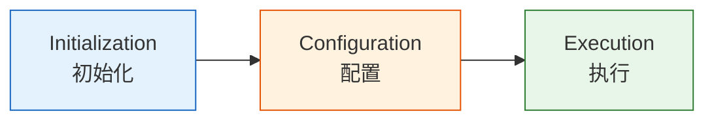

# Gradle 构建系统

## 概述

Android 使用 Gradle + Android Gradle Plugin (AGP) 作为构建系统。AGP 在 Gradle 基础上扩展了 Android 特有的构建逻辑，包括资源合并、清单文件处理、DEX 编译、代码签名与混淆等功能。

> 对后端开发者的类比：类似 Maven/Gradle 构建 Java 项目，但 Android 的构建流程更加复杂，需要处理资源打包、多 ABI 支持、APK 签名、ProGuard/R8 混淆等步骤。

:::tip
Gradle 与 Maven 的核心区别在于灵活性。Maven 使用固定生命周期（lifecycle），而 Gradle 采用任务（Task）图模型，任务之间通过依赖关系自动编排执行顺序，这使得自定义构建逻辑更加自然。
:::

## 项目结构

```text
my-app/
├── build.gradle.kts       # 根项目配置
├── settings.gradle.kts    # 模块声明
├── gradle.properties      # Gradle 属性
├── gradle/
│   ├── wrapper/           # Gradle Wrapper 文件
│   │   ├── gradle-wrapper.jar
│   │   └── gradle-wrapper.properties
│   └── libs.versions.toml # Version Catalog
├── app/
│   ├── build.gradle.kts   # app 模块配置
│   └── src/
│       ├── main/
│       │   ├── AndroidManifest.xml
│       │   ├── java/
│       │   └── res/
│       ├── debug/         # debug 构建变体
│       └── release/       # release 构建变体
└── library/
    ├── build.gradle.kts   # 库模块配置
    └── ...
```

## Gradle Wrapper 机制

Gradle Wrapper 是项目中自带的 Gradle 启动脚本，开发者无需在系统中预先安装 Gradle。项目中的 `gradlew`（Linux/macOS）和 `gradlew.bat`（Windows）脚本会自动下载 `gradle-wrapper.properties` 中指定的 Gradle 版本，然后使用该版本执行构建。

```properties
# gradle/wrapper/gradle-wrapper.properties
distributionBase=GRADLE_USER_HOME
distributionPath=wrapper/dists
distributionUrl=https\://services.gradle.org/distributions/gradle-8.5-bin.zip
zipStoreBase=GRADLE_USER_HOME
zipStorePath=wrapper/dists
```

:::info
Wrapper 的核心价值是**统一团队构建环境**。所有开发者执行 `./gradlew assembleDebug` 时，使用的是完全相同的 Gradle 版本，避免了"在我机器上能构建"的问题。CI/CD 环境同样依赖 Wrapper，确保构建一致性。
:::

升级 Wrapper 版本只需一条命令：

```bash
# 将项目 Gradle 版本升级到 8.5
./gradlew wrapper --gradle-version=8.5
```

## build.gradle.kts 典型配置

```kotlin
plugins {
    id("com.android.application")
    id("org.jetbrains.kotlin.android")
}

android {
    namespace = "com.example.myapp"
    compileSdk = 34

    defaultConfig {
        applicationId = "com.example.myapp"
        minSdk = 24
        targetSdk = 34
        versionCode = 1
        versionName = "1.0"
    }

    buildTypes {
        release {
            isMinifyEnabled = true  // 启用 R8 代码混淆与压缩
            proguardFiles(getDefaultProguardFile("proguard-android-optimize.txt"))
        }
    }

    compileOptions {
        sourceCompatibility = JavaVersion.VERSION_17
        targetCompatibility = JavaVersion.VERSION_17
    }

    kotlinOptions {
        jvmTarget = "17"
    }
}

dependencies {
    implementation("androidx.core:core-ktx:1.12.0")
    implementation("androidx.appcompat:appcompat:1.6.1")
    implementation("com.google.android.material:material:1.11.0")
    testImplementation("junit:junit:4.13.2")
}
```

## 关键概念

### Build Variants（构建变体）

- Build Type: `debug` / `release`
- Product Flavor: `free` / `paid`（可选，用于多版本分发）
- 组合后形成 Build Variant: `freeDebug`, `paidRelease` 等

### 依赖管理

不同依赖配置项决定了依赖的可见范围与传递行为：

```kotlin
implementation("group:artifact:version")    // 编译+运行时，不传递给上游模块
api("group:artifact:version")               // 编译+运行时，传递给上游模块
compileOnly("group:artifact:version")       // 仅编译时，不打包进最终产物
testImplementation("group:artifact:version") // 仅测试源码集可见
```

:::warning
`api` 会将依赖暴露给当前模块的所有上游模块，可能导致依赖传递范围过大、编译速度变慢。优先使用 `implementation`，仅在模块接口类型直接引用该依赖时才使用 `api`。
:::

### Version Catalog（现代方式）

Version Catalog 使用 TOML 文件集中管理所有依赖版本，取代传统的 `buildSrc` 或 `ext` 变量方案：

`gradle/libs.versions.toml`:

```toml
[versions]
kotlin = "1.9.22"
agp = "8.2.0"

[libraries]
kotlin-stdlib = { module = "org.jetbrains.kotlin:kotlin-stdlib", version.ref = "kotlin" }
core-ktx = { module = "androidx.core:core-ktx", version = "1.12.0" }

[plugins]
android-application = { id = "com.android.application", version.ref = "agp" }
```

在 `build.gradle.kts` 中通过 `libs` 访问：

```kotlin
dependencies {
    implementation(libs.kotlin.stdlib)
    implementation(libs.core.ktx)
}
```

## Signing Config 实战

Android 要求所有 APK 在安装前必须经过数字签名。Debug 构建使用 Android SDK 自动生成的 debug keystore，而 Release 构建必须使用开发者自行创建的 keystore。

```kotlin
android {
    signingConfigs {
        create("release") {
            // 从 local.properties 或环境变量读取敏感信息
            storeFile = file(System.getenv("KEYSTORE_PATH") ?: "release.keystore")
            storePassword = System.getenv("KEYSTORE_PASSWORD") ?: ""
            keyAlias = System.getenv("KEY_ALIAS") ?: "release"
            keyPassword = System.getenv("KEY_PASSWORD") ?: ""
        }
    }

    buildTypes {
        release {
            signingConfig = signingConfigs.getByName("release")
            isMinifyEnabled = true
        }
    }
}
```

:::warning
**keystore 文件丢失意味着无法更新已发布的 App。** Google Play 和其他应用商店通过签名校验 App 的身份，丢失 keystore 后只能以新的包名重新发布。务必将 keystore 文件和密码妥善备份到安全的存储位置。
:::

:::tip
最佳实践是将签名密码存储在 `local.properties` 文件中（该文件已加入 `.gitignore`），或者使用 CI/CD 环境变量注入，避免将密码提交到版本控制系统。
:::

## 构建缓存与加速

Gradle 构建过程分为三个阶段，理解这些阶段有助于针对性优化构建速度：



- **Initialization**：确定参与构建的项目（多模块场景）
- **Configuration**：执行所有 `build.gradle.kts` 脚本，构建 Task 图
- **Execution**：按依赖顺序执行实际 Task

以下是在 `gradle.properties` 中常用的优化配置：

```properties
# gradle.properties 构建加速配置

# 启用并行构建（多模块项目收益明显）
org.gradle.parallel=true

# 启用构建缓存，复用其他构建的输出
org.gradle.caching=true

# Configuration Cache：缓存配置阶段结果，避免重复执行构建脚本
org.gradle.configuration-cache=true

# 增大 Gradle Daemon JVM 堆内存
org.gradle.jvmargs=-Xmx4g -XX:+HeapDumpOnOutOfMemoryError -Dfile.encoding=UTF-8

# 启用 Kotlin 增量编译
kotlin.incremental=true
```

```bash
# 命令行也可临时启用加速选项
./gradlew assembleDebug --parallel --build-cache
```

:::info
Configuration Cache 是 Gradle 6.6+ 引入的重要特性，它将配置阶段的执行结果缓存到磁盘，后续构建如果构建脚本未变化则直接跳过配置阶段，显著减少构建时间。但部分插件尚未完全兼容，遇到问题可先关闭此选项。
:::

## 构建速度即生产力

构建速度优化不只是技术问题——它直接影响开发者的产出和团队的成本。

### 量化影响

| 优化手段 | 典型效果 | 适用场景 |
|---------|---------|---------|
| buildSrc → Convention Plugins | 增量构建快 30-50% | 多模块项目 |
| Configuration Cache | 配置阶段从 15s 降到 2s | 10+ 模块项目 |
| `--parallel` | 全量构建快 20-40% | 多核开发机 |
| Version Catalog 替代 buildSrc | 改依赖版本不再触发全量重编译 | 所有项目 |

### Convention Plugin 实战

Google 官方推荐项目（Now in Android）使用 `build-logic/` 目录存放 Convention Plugins：

```
build-logic/
├── build.gradle.kts           # 构建逻辑本身的构建文件
├── settings.gradle.kts
└── convention/
    ├── src/main/kotlin/
    │   ├── AndroidApplicationConventionPlugin.kt
    │   ├── AndroidLibraryConventionPlugin.kt
    │   ├── AndroidComposeConventionPlugin.kt
    │   └── AndroidHiltConventionPlugin.kt
    └── build.gradle.kts
```

在 `settings.gradle.kts` 中引入：

```kotlin
pluginManagement {
    includeBuild("build-logic")
}
```

然后在 app 模块的 `build.gradle.kts` 中只需一行：

```kotlin
plugins {
    id("nowinandroid.android.application")
    id("nowinandroid.android.application.compose")
    id("nowinandroid.android.hilt")
}
```

所有通用配置（compileSdk、默认依赖、Compose 配置、Hilt 配置）都集中在 Convention Plugin 中管理。

:::tip
从 buildSrc 迁移到 Convention Plugins 最常见的失败原因是 classpath 配置错误。确保 `build-logic/build.gradle.kts` 中正确声明了 `implementation(files(libs.javaClass.superclass.protectionDomain.codeSource.location))` 来引用 Version Catalog。
:::

### CI 成本关联

构建速度的 ROI 可以量化：

- 假设每次 PR 触发 10 分钟的 CI 构建
- 团队每天合并 20 个 PR
- 每天 CI 时间 = 200 分钟 × 单价
- 将构建优化到 5 分钟 = 每天节省 100 分钟 CI 时间 = 每月节省 ~2000 分钟

构建优化投入的工程时间，通常在 1-2 个月内就能通过 CI 成本节省收回。

## 实战：多模块 build.gradle.kts

以下是一个包含 Product Flavors、Build Config 字段和自定义 Source Set 的完整示例：

```kotlin
// app/build.gradle.kts
plugins {
    id("com.android.application")
    id("org.jetbrains.kotlin.android")
}

android {
    namespace = "com.example.myapp"
    compileSdk = 34

    defaultConfig {
        applicationId = "com.example.myapp"
        minSdk = 24
        targetSdk = 34
        versionCode = 1
        versionName = "1.0"
    }

    // 启用 BuildConfig 生成（AGP 8.x 需要显式开启）
    buildFeatures {
        buildConfig = true
    }

    signingConfigs {
        create("release") {
            storeFile = file(System.getenv("KEYSTORE_PATH") ?: "release.keystore")
            storePassword = System.getenv("KEYSTORE_PASSWORD") ?: ""
            keyAlias = System.getenv("KEY_ALIAS") ?: "release"
            keyPassword = System.getenv("KEY_PASSWORD") ?: ""
        }
    }

    buildTypes {
        debug {
            isMinifyEnabled = false
            // debug 构建使用测试服务器地址
            buildConfigField("String", "API_URL", "\"https://staging.api.example.com\"")
        }
        release {
            isMinifyEnabled = true
            signingConfig = signingConfigs.getByName("release")
            // release 构建使用正式服务器地址
            buildConfigField("String", "API_URL", "\"https://api.example.com\"")
            proguardFiles(getDefaultProguardFile("proguard-android-optimize.txt"))
        }
    }

    // 定义产品风味维度和具体风味
    flavorDimensions += listOf("tier")

    productFlavors {
        create("free") {
            dimension = "tier"
            applicationIdSuffix = ".free"
            // 免费版标记
            buildConfigField("boolean", "IS_PAID", "false")
        }
        create("paid") {
            dimension = "tier"
            applicationIdSuffix = ".paid"
            // 付费版标记
            buildConfigField("boolean", "IS_PAID", "true")
        }
    }

    // 自定义 Source Set：不同风味使用不同的资源目录
    sourceSets {
        getByName("free") {
            res.srcDirs("src/free/res")
        }
        getByName("paid") {
            res.srcDirs("src/paid/res")
        }
    }

    compileOptions {
        sourceCompatibility = JavaVersion.VERSION_17
        targetCompatibility = JavaVersion.VERSION_17
    }

    kotlinOptions {
        jvmTarget = "17"
    }
}

dependencies {
    implementation(libs.core.ktx)
    implementation(libs.appcompat)
    implementation(libs.material)
    testImplementation("junit:junit:4.13.2")
}
```

上述配置会生成 4 个 Build Variant：`freeDebug`、`freeRelease`、`paidDebug`、`paidRelease`，每个变体拥有独立的 Application ID 和资源目录。

### Convention Plugins（共享构建逻辑）

在多模块项目中，各模块的 `build.gradle.kts` 往往包含大量重复配置。Convention Plugins 将公共构建逻辑抽取到独立插件中，实现一次编写、多处复用：

```kotlin
// build-logic/convention/src/main/kotlin/AndroidLibraryConventionPlugin.kt
class AndroidLibraryConventionPlugin : Plugin<Project> {
    override fun apply(target: Project) {
        with(target) {
            with(pluginManager) {
                apply("com.android.library")
                apply("org.jetbrains.kotlin.android")
            }
            // 统一配置所有 Library 模块的公共属性
            extensions.configure<com.android.build.api.LibraryExtension> {
                compileSdk = 34
                defaultConfig.minSdk = 24
            }
        }
    }
}
```

在子模块中直接使用该 Convention Plugin：

```kotlin
// library/ui/build.gradle.kts
plugins {
    id("android.library.convention")  // 使用自定义 Convention Plugin
}

dependencies {
    implementation(libs.core.ktx)
}
```

:::tip
Now in Android 和 Android 官方架构模板均采用 Convention Plugins 组织构建逻辑。将公共配置集中管理后，单个模块的 `build.gradle.kts` 通常不超过 20 行，极大降低了维护成本。
:::

## 常用命令

```bash
./gradlew assembleDebug       # 构建 debug APK
./gradlew assembleRelease     # 构建 release APK
./gradlew installDebug        # 构建 debug APK 并安装到设备
./gradlew :app:dependencies   # 查看 app 模块依赖树
./gradlew clean               # 清理构建产物
./gradlew tasks --all         # 列出所有可用 Task
```
