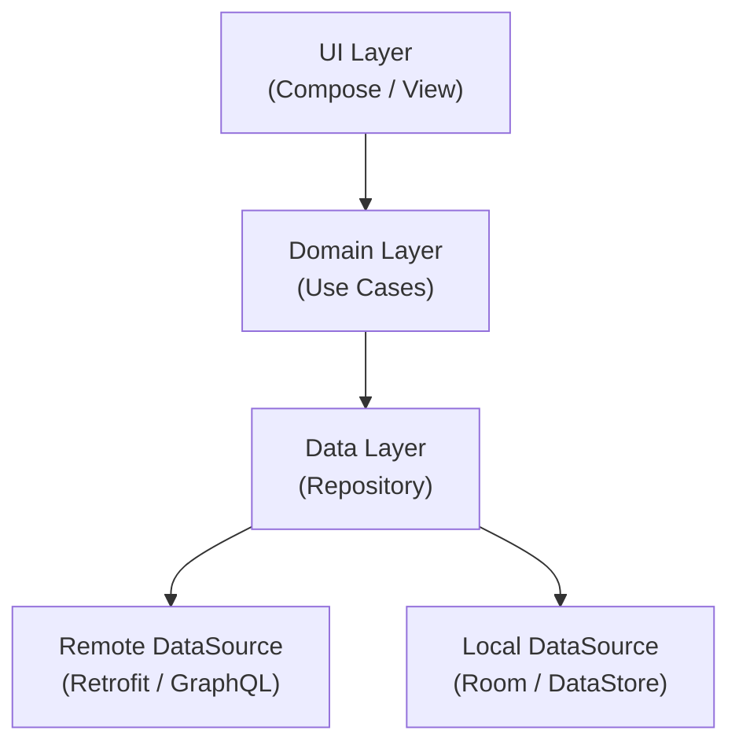

# Android 学习路径

## Android 系统架构概览

Android 采用分层架构，每一层为上层提供服务抽象。理解分层有助于定位问题和选择正确的 API。

```mermaid
block-beta
  columns 1
  block:apps["System Apps"]:::layer
  end
  block:framework["Java API Framework"]:::layer
  end
  block:native["Native Libraries & ART"]:::layer
  end
  block:hal["Hardware Abstraction Layer (HAL)"]:::layer
  end
  block:kernel["Linux Kernel"]:::layer
  end

  classDef layer fill:#e3f2fd,stroke:#1565c0,strokeWidth:1px
```

- **Linux Kernel** — 提供底层驱动、电源管理和进程隔离，是整个系统的基石。
- **HAL (Hardware Abstraction Layer)** — 为上层屏蔽硬件差异，定义标准接口供 Framework 调用。
- **Android Runtime (ART) & Native Libraries** — ART 替代早期 Dalvik，采用 AOT/JIT 混合编译；Native Libraries 提供 SQLite、OpenGL、WebKit 等核心 C/C++ 库。
- **Java API Framework** — 提供 Activity Manager、Content Provider、View System 等 API，是开发者日常接触最频繁的层。
- **System Apps** — 系统预装应用（设置、电话、浏览器等），普通应用通过 Intent 与之交互。

:::tip
大部分应用开发只需要关注 Java API Framework 层。当你遇到性能瓶颈或需要跨平台复用 C/C++ 代码时，才会涉及 Native 层。
:::

## Android 版本演进速查

以下是近几个主要版本中与开发者密切相关的变更：

| 版本 | API Level | 关键变更 |
|------|-----------|----------|
| Android 10 | 29 | Scoped Storage 分区存储；暗色模式系统级支持 |
| Android 11 | 30 | 包可见性 (Package Visibility) 需声明 `<queries>`；一次性权限 |
| Android 12 | 31 | SplashScreen API 统一启动画面；Exact alarm 权限限制 |
| Android 13 | 33 | Photo Picker 选择器；通知权限 `POST_NOTIFICATIONS` 运行时申请 |
| Android 14 | 34 | Predictive Back Gesture 预测返回；前台服务类型强制声明 |
| Android 15 | 35 | Edge-to-edge 全面强制执行；Private Space 私密空间 |
| Android 16 | 36 | Live Updates 通知增强；更严格的后台限制 |

:::warning
Scoped Storage 和 Package Visibility 是迁移旧项目时最容易踩坑的两个变更，务必在升级 `targetSdkVersion` 前逐项排查。
:::

## 推荐项目架构

Google 推荐的 App 架构分为三层，各层职责清晰、单向依赖：



- **UI Layer** — 负责渲染界面和接收用户交互，使用 ViewModel 持有 UI 状态。
- **Domain Layer** — 封装业务规则和 Use Cases，保持纯 Kotlin 逻辑，不依赖 Android 框架类。
- **Data Layer** — 通过 Repository 模式统一管理远程数据源和本地数据源，对上层暴露 Flow。

:::info
参考项目 [Now in Android](https://github.com/android/nowinandroid) 使用了上述架构，并展示了 Compose、Hilt、Room 等最新实践，是学习现代 Android 开发的首选示例。
:::

## 后端开发者的思维转换

从后端转向 Android，最大的挑战不是语言，而是平台思维的根本差异：

| 后端 | Android | 说明 |
|------|---------|------|
| 请求-响应模型 | 生命周期驱动的 UI 模型 | 没有显式的"请求结束"，Activity 随时可能被销毁重建 |
| 服务端持有状态 | 客户端状态受生命周期影响 | 屏幕旋转、后台回收都会导致状态丢失，需要 ViewModel/SavedState 持久化 |
| 数据库操作 | Room + DataStore + SharedPrefs | 本地存储是主要数据来源，网络只是同步手段 |
| 无 UI | UI 是核心，主线程不能做耗时操作 | 主线程 (Main Thread) 超时 5 秒触发 ANR，耗时操作必须切到协程或工作线程 |
| 部署在服务器 | APK 安装在设备上 | 设备有严格的功耗和内存约束，无法水平扩展 |
| 线程池处理并发 | 协程 (Coroutine) + 主线程 | Kotlin 协程是 Android 并发的首选方案，结构化并发自动取消 |
| CI/CD 持续部署 | 应用商店审核发布 | 发版周期长，需要做好版本兼容和灰度策略 |
| Spring Guice / 手动 DI | Hilt / Koin | 依赖注入在 Android 中还需考虑生命周期作用域 (Scope) |
| Maven / Gradle (服务端) | Gradle (Android Plugin) | AGP 插件引入 Build Variant、Product Flavor 等移动端特有的构建概念 |

:::tip
如果你熟悉 Spring Boot，可以把 ViewModel 理解为 @RequestScope 的 Controller，把 Repository 理解为 @Singleton 的 Service。区别在于 Android 的"请求"就是用户看到的屏幕，而且这个"请求"随时可能被系统打断。
:::

## 学习顺序

以下顺序遵循"先理解平台约束，再掌握开发工具"的原则：

1. **四大组件 & 生命周期** → [components.md](./components)
   必须最先学习，因为 Android 的所有开发都建立在组件生命周期之上。不理解生命周期，后续的 UI、数据存储、网络请求都会写出 Bug。

2. **UI 体系** → [ui-system.md](./ui-system)
   在理解生命周期之后学习 UI，因为 Compose / View 的状态管理直接依赖生命周期。建议优先学习 Jetpack Compose，View 体系作为维护旧项目时了解即可。

3. **Gradle 构建系统** → [gradle.md](./gradle)
   掌握基本 UI 后再学习构建系统，因为你需要理解 Build Variant、依赖管理和签名配置，才能将应用打包发布。

4. **调试 & Profiler** → [debugging.md](./debugging)
   放在最后，因为调试工具需要在有实际代码可调试时才能发挥价值。学会使用 Layout Inspector、Memory Profiler 和 Network Profiler 能显著提升排查问题的效率。

## 技术趋势与职业视角 (2025-2026)

了解技术趋势有助于做出正确的学习投资——把时间花在上升中的技术上，而不是正在被淘汰的。

### 正在被淘汰的技术

| 技术 | 状态 | 替代方案 |
|------|------|---------|
| AsyncTask | 已废弃 (API 30) | 协程 + `viewModelScope` |
| RxJava | 维护模式 | Kotlin Flow |
| LiveData | 不再推荐 | StateFlow / SharedFlow |
| XML Layout | 新项目不再首选 | Jetpack Compose |
| Synthesize (kotlin-android-extensions) | 已移除 | ViewBinding |
| Intent 传大对象 | 不推荐 | SavedStateHandle / 数据库 |

### 三个高价值方向

1. **端侧 AI**: Google 推动端侧 ML (ML Kit, Gemini Nano)，App 内直接运行 AI 模型，无需网络
2. **Android Automotive**: 车载 Android 系统快速增长，需求量大且竞争者少
3. **Compose 全平台**: Compose for Android/iOS/Desktop/Wasm，一套 UI 代码覆盖多端

### 后端开发者的独特优势

从后端转到客户端，你并不是从零开始：

| 后端能力 | 在客户端的价值 |
|---------|-------------|
| 架构思维 (分层、DI、Clean Architecture) | Android 同样需要 MVVM/MVI + Clean Architecture |
| 性能分析 (APM、火焰图、P99) | 端侧性能分析的方法论完全相同 |
| 数据库设计 (SQL、ORM) | Room 就是 Android 的 ORM，SQL 知识直接迁移 |
| 网络协议 (HTTP、REST、gRPC) | Retrofit/OkHttp 的使用和理解有天然优势 |
| CI/CD 经验 | Gradle 构建优化、自动化测试思路通用 |

:::tip
技术趋势参考：[腾讯云 2025 客户端技术盘点](https://cloud.tencent.com/developer/article/2636143)、[2025 Android 开发趋势全景解读](https://cloud.tencent.com/developer/article/2493146)
:::

## 推荐资源

- [Android 开发者文档](https://developer.android.com/) — 官方文档，优先查阅
- [Android Basics in Kotlin](https://developer.android.com/courses/android-basics-kotlin/course) — Google 官方入门课程
- [Now in Android](https://github.com/android/nowinandroid) — Google 官方示例项目，展示现代 Android 最佳实践
- [Android Developer Roadmap by skydoves](https://github.com/skydoves/android-developer-roadmap) — 社区维护的学习路线图，覆盖面广，适合查漏补缺
- [AndroidPerformance.com](https://androidperformance.com/) — 深度性能优化专题博客，涵盖启动优化、内存优化、渲染优化等

:::tip 下一步
完成 Android 基础学习后，继续 [性能优化](/performance/) → 掌握端侧性能指标体系与优化手段。
:::
