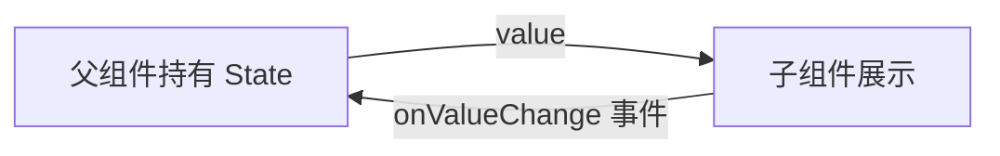

# UI 体系

Android 有两套 UI 体系：传统 View 体系和现代 Jetpack Compose。理解两者的差异和各自的使用场景，是 Android 开发者的必修课。

## 传统 View 体系

传统 View 体系采用命令式编程范式：开发者通过 XML 定义布局结构，再在 Kotlin/Java 代码中通过 `findViewById` 或 View Binding 获取控件引用，手动操作 UI。

### 布局文件 (XML)

```xml
<!-- res/layout/activity_main.xml -->
<LinearLayout
    android:layout_width="match_parent"
    android:layout_height="match_parent"
    android:orientation="vertical">

    <TextView
        android:id="@+id/title"
        android:text="Hello"
        android:layout_width="wrap_content"
        android:layout_height="wrap_content" />

    <Button
        android:id="@+id/button"
        android:text="Click me"
        android:layout_width="wrap_content"
        android:layout_height="wrap_content" />
</LinearLayout>
```

### 在代码中引用

```kotlin
override fun onCreate(savedInstanceState: Bundle?) {
    super.onCreate(savedInstanceState)
    setContentView(R.layout.activity_main)

    // 通过 id 查找视图并修改属性
    val title = findViewById<TextView>(R.id.title)
    title.text = "Hello Android"

    val button = findViewById<Button>(R.id.button)
    button.setOnClickListener {
        // 命令式地更新 UI
        title.text = "Clicked!"
    }
}
```

:::tip
生产环境中推荐使用 **View Binding** 或 **Data Binding** 替代 `findViewById`，前者在编译期生成类型安全的绑定类，后者还支持在 XML 中绑定数据表达式，减少模板代码。
:::

### 常用布局

| 布局 | 说明 |
|------|------|
| LinearLayout | 线性排列（水平/垂直） |
| FrameLayout | 层叠 |
| RelativeLayout | 相对定位 |
| ConstraintLayout | 约束布局（现代推荐，性能好） |
| RecyclerView | 列表（复用 item view，类似 iOS 的 UITableView） |

## Jetpack Compose（现代）

Jetpack Compose 是 Android 官方推出的声明式 UI 框架，思路与 React、SwiftUI 一致：开发者描述 UI "应该是什么样子"，框架负责将描述高效地渲染到屏幕上。

```kotlin
@Composable
fun Greeting(name: String) {
    // remember + mutableStateOf 类似 React 的 useState
    var count by remember { mutableStateOf(0) }

    Column {
        Text(text = "Hello, $name! Count: $count")
        Button(onClick = { count++ }) {
            Text("Click me")
        }
    }
}
```

### 核心概念

- **@Composable** -- 标记可组合函数（类似 React 组件函数），Compose 编译器会对其进行特殊处理
- **remember** -- 在重组中保持状态（类似 React 的 `useState`），避免每次重组都重新初始化
- **mutableStateOf** -- 响应式状态容器，值改变时自动触发依赖它的 Composable 重组
- **重组 (Recomposition)** -- 状态变化时，Compose 编译器自动重新执行受影响的 Composable 函数，生成新的 UI 描述并高效更新屏幕

:::info
Compose 的重组是**智能的**：框架只会重组那些读取了变化状态的 Composable，而非整棵树。这与 React 的虚拟 DOM diff 机制有异曲同工之妙。
:::

### 常用组件

```kotlin
Column { }           // 垂直布局（类似 LinearLayout vertical）
Row { }              // 水平布局（类似 LinearLayout horizontal）
Box { }              // 层叠布局（类似 FrameLayout）
LazyColumn { }       // 惰性列表（类似 RecyclerView，只渲染可见项）
```

### 导航

Compose 使用 `NavHost` 进行页面导航，概念上等同于 React Router。

```kotlin
NavHost(navController, startDestination = "home") {
    composable("home") { HomeScreen() }
    composable("detail/{id}") { backStackEntry ->
        // 从路由参数中提取 id
        DetailScreen(backStackEntry.arguments?.getString("id"))
    }
}
```

## Compose 状态提升 (State Hoisting)

状态提升是 Compose 组件设计的核心模式：将状态从子组件移到父组件，子组件通过参数接收当前值，通过回调函数通知父组件状态变更。这与 React 中将 state 提升到共同父组件的模式完全一致。

### 提升前：状态内聚

```kotlin
@Composable
fun InputField() {
    // 状态困在组件内部，外部无法读取或控制
    var text by remember { mutableStateOf("") }
    OutlinedTextField(
        value = text,
        onValueChange = { text = it },
        label = { Text("请输入") }
    )
}
```

### 提升后：状态由调用方管理

```kotlin
@Composable
fun InputField(
    value: String,                   // 由父组件传入当前值
    onValueChange: (String) -> Unit  // 通知父组件值变更
) {
    OutlinedTextField(
        value = value,
        onValueChange = onValueChange,
        label = { Text("请输入") }
    )
}

// 父组件持有状态
@Composable
fun FormScreen() {
    var name by remember { mutableStateOf("") }
    Column {
        InputField(value = name, onValueChange = { name = it })
        Text("当前输入: $name")
    }
}
```

状态提升的数据流如下所示：



:::tip
状态提升是 Compose 可复用组件设计的核心模式。遵循此模式可以让组件变为**无状态 (stateless)**，提高可测试性和可复用性。一个设计良好的 Composable 应该只依赖参数输入和回调输出。
:::

## Compose 副作用 (Side Effects)

Composable 函数本身应该是**无副作用的纯函数**，但实际开发中不可避免地需要执行网络请求、注册监听器、操作数据库等副作用。Compose 提供了一组专门的 API 来安全地处理这些场景。

:::warning
副作用是 Compose 最容易踩坑的地方。Composable 可能被任意次数、任意顺序地重组，在 Composable 函数体中直接执行副作用会导致不可预期的行为（重复请求、内存泄漏等）。
:::

### LaunchedEffect

当 key 值变化时启动协程，适合执行网络请求等一次性异步操作（类似 React 的 `useEffect` 传入依赖数组）。

```kotlin
@Composable
fun UserProfile(userId: String) {
    var user by remember { mutableStateOf<User?>(null) }

    // 当 userId 变化时重新加载数据
    LaunchedEffect(userId) {
        user = userRepository.fetchUser(userId)
    }

    if (user != null) {
        Text("用户: ${user!!.name}")
    } else {
        CircularProgressIndicator()
    }
}
```

### DisposableEffect

需要清理副作用的场景（类似 React 的 `useEffect` 返回清理函数）。

```kotlin
@Composable
fun LocationTracker() {
    DisposableEffect(Unit) {
        // 注册监听器
        val listener = LocationListener { location ->
            // 处理位置更新
        }
        locationManager.addListener(listener)

        // key 变化或离开组合时执行清理
        onDispose {
            locationManager.removeListener(listener)
        }
    }
}
```

### SideEffect

在每次成功重组后同步执行，用于将 Compose 状态同步到非 Compose 体系（如日志、分析 SDK）。

### rememberCoroutineScope

获取一个与 Composable 生命周期绑定的 `CoroutineScope`，用于在事件回调（非 `@Composable` 上下文）中启动协程。

```kotlin
@Composable
fun MyScreen() {
    val scope = rememberCoroutineScope()
    var data by remember { mutableStateOf("") }

    Button(onClick = {
        // 在点击回调中使用 scope 启动协程
        scope.launch {
            data = repository.loadData()
        }
    }) {
        Text("加载数据")
    }
}
```

## 自定义 Composable

通过组合现有 Composable，可以封装出高复用的自定义组件。遵循 **Modifier 模式**是关键：将 `modifier: Modifier = Modifier` 作为第一个可选参数，让调用方可以灵活控制布局样式。

```kotlin
@Composable
fun LoadingCard(
    title: String,
    isLoading: Boolean,
    modifier: Modifier = Modifier,
    content: @Composable ColumnScope.() -> Unit
) {
    Card(
        modifier = modifier
            .fillMaxWidth()
            .padding(16.dp),
        elevation = CardDefaults.cardElevation(defaultElevation = 4.dp)
    ) {
        Column(modifier = Modifier.padding(16.dp)) {
            Text(
                text = title,
                style = MaterialTheme.typography.titleLarge
            )
            Spacer(modifier = Modifier.height(8.dp))
            if (isLoading) {
                CircularProgressIndicator(
                    modifier = Modifier.align(Alignment.CenterHorizontally)
                )
            } else {
                content()
            }
        }
    }
}

// 使用示例
LoadingCard(
    title = "用户信息",
    isLoading = false,
    modifier = Modifier.padding(horizontal = 16.dp)
) {
    Text("这里是卡片内容")
}
```

## 主题与样式系统

Compose 通过 `MaterialTheme` 统一管理颜色、字体和形状，概念上等同于 Web 的 CSS 变量 / Design Token 体系。

```kotlin
// 自定义主题定义
@Composable
fun MyTheme(
    darkTheme: Boolean = isSystemInDarkTheme(),
    content: @Composable () -> Unit
) {
    // 根据深色模式选择配色方案
    val colorScheme = if (darkTheme) {
        darkColorScheme(
            primary = Color(0xFFBB86FC),
            secondary = Color(0xFF03DAC6),
            background = Color(0xFF121212)
        )
    } else {
        lightColorScheme(
            primary = Color(0xFF6200EE),
            secondary = Color(0xFF03DAC6),
            background = Color(0xFFFFFBFE)
        )
    }

    MaterialTheme(
        colorScheme = colorScheme,
        typography = Typography(          // 自定义字体排版
            titleLarge = TextStyle(fontSize = 22.sp, fontWeight = FontWeight.Bold),
            bodyMedium = TextStyle(fontSize = 14.sp)
        ),
        shapes = Shapes(                  // 自定义圆角等形状
            small = RoundedCornerShape(4.dp),
            medium = RoundedCornerShape(8.dp)
        ),
        content = content
    )
}
```

在任何被 `MyTheme` 包裹的 Composable 中，都可以通过 `MaterialTheme.colorScheme.primary` 访问主题值：

```kotlin
@Composable
fun ThemedButton() {
    Button(
        colors = ButtonDefaults.buttonColors(
            containerColor = MaterialTheme.colorScheme.primary
        ),
        onClick = { /* ... */ }
    ) {
        Text(
            text = "主题按钮",
            color = MaterialTheme.colorScheme.onPrimary
        )
    }
}
```

## 动画入门

Compose 提供了从简单到复杂的多层动画 API，覆盖绝大多数动画需求。

### animate\*AsState

最简单的值动画，在状态变化时自动执行过渡（类似 CSS `transition`）。

```kotlin
@Composable
fun AnimatedColorButton() {
    var pressed by remember { mutableStateOf(false) }
    // 颜色会在变化时自动动画过渡
    val bgColor by animateColorAsState(
        targetValue = if (pressed) Color.Red else Color.Blue,
        animationSpec = tween(durationMillis = 300)
    )

    Button(
        onClick = { pressed = !pressed },
        colors = ButtonDefaults.buttonColors(containerColor = bgColor)
    ) {
        Text(if (pressed) "已按下" else "点击我")
    }
}
```

### AnimatedVisibility

控制子组件的显示/隐藏，自带淡入淡出、滑动等过渡动画。

```kotlin
@Composable
fun TogglePanel() {
    var visible by remember { mutableStateOf(true) }
    Column {
        Button(onClick = { visible = !visible }) {
            Text("切换面板")
        }
        AnimatedVisibility(visible = visible) {
            Card { Text("这段内容有动画地出现和消失") }
        }
    }
}
```

### updateTransition

需要对多个属性进行协调动画时使用，类似于 React Spring 的多值 spring 配置。

## Compose 性能要点

不合理的写法会导致大量不必要的重组，拖慢 UI 响应速度。以下是几个关键优化手段。

```kotlin
@Composable
fun OptimizedList(items: List<Item>) {
    // derivedStateOf: 仅当计算结果真正变化时才触发重组
    val filteredItems by remember {
        derivedStateOf { items.filter { it.isActive } }
    }

    LazyColumn {
        items(
            count = filteredItems.size,
            key = { index -> filteredItems[index].id }  // key 指定稳定标识
        ) { index ->
            val item = filteredItems[index]
            // remember 避免每次重组都重新创建对象
            val subtitle = remember(item) { item.formatSubtitle() }
            Text(text = "${item.title} - $subtitle")
        }
    }
}
```

:::tip
不必要的重组是 Compose 性能问题的根源。善用 `remember`、`derivedStateOf`、`key()` 这三个工具，配合 Compose 编译器的 **skip 优化**（稳定参数未变时跳过重组），可以让 UI 保持流畅。
:::

### 重组调试实战

知道了 `remember` 和 `derivedStateOf` 的原理，但生产中真正的问题是如何**找到**不必要的重组。

#### 1. 开启 Compose Compiler Reports

在 `build.gradle.kts` 中配置：

```kotlin
kotlinOptions {
    freeCompilerArgs += listOf(
        "-P",
        "plugin:androidx.compose.compiler.plugins.kotlin:reportsDestination=" +
            project.buildDir.absolutePath + "/compose_metrics"
    )
}
```

构建后会在 `build/compose_metrics/` 生成报告，告诉你哪些 Composable 是 unstable 的，以及重组次数统计。

#### 2. `List<T>` 参数导致的不必要重组

这是最常见的 Compose 性能坑之一：

```kotlin
// 问题：List<T> 不是 @Stable 类型
@Composable
fun ItemList(items: List<String>) {
    // 即使 items 内容没变，父组件重组时 items 引用可能变了
    // → 这个 Composable 也会跟着重组
}

// 修复：用 @Immutable 包装
@Immutable
data class ItemListState(val items: List<String>)

@Composable
fun ItemList(state: ItemListState) {
    // Compose 编译器知道只有 items 真正变化时才需要重组
}
```

#### 3. LazyColumn + 全局 StateFlow 的经典坑

```kotlin
// 错误：每个 item 都读取同一个 StateFlow
@Composable
fun VideoList(viewModel: VideoViewModel) {
    val selectedId by viewModel.selectedId.collectAsState()

    LazyColumn {
        items(videos, key = { it.id }) { video ->
            val isSelected = video.id == selectedId // toggle 一个 → 全部重组
            VideoItem(video, isSelected)
        }
    }
}

// 修复：每个 item 独立订阅自己的状态
@Composable
fun VideoList(viewModel: VideoViewModel) {
    LazyColumn {
        items(videos, key = { it.id }) { video ->
            val isSelected by viewModel.isSelected(video.id).collectAsState()
            VideoItem(video, isSelected)
        }
    }
}
```

:::tip
Compose 性能问题的 90% 来自不必要的重组。先用 Compiler Reports 定位哪些 Composable 重组最频繁，再用 `remember`、`derivedStateOf`、`key()`、`@Immutable` 逐一修复。
:::

## View 体系 vs Compose

| 维度 | View | Compose |
|------|------|---------|
| 范式 | 命令式（手动操作 UI 节点） | 声明式（描述 UI 与状态的映射） |
| 布局 | XML 文件 | Kotlin 代码 |
| 状态管理 | 手动同步（findViewById + setText） | 自动重组（mutableStateOf 驱动） |
| 复用 | 自定义 View / Fragment | 自定义 Composable 函数 |
| 学习曲线 | 较低 | 中等（需要思维转换） |
| 生态 | 成熟，大量存量代码 | 快速成长中，Google 官方主推 |
| 性能优化 | 减少 layout pass、view hierarchy | 减少不必要的重组 |

> **建议**：先理解 View 体系的基本概念（因为大量存量代码和文档还在用 View），重点学习 Compose（新项目首选）。对于后端开发者而言，Compose 的声明式范式与 React 高度相似，上手成本较低。
