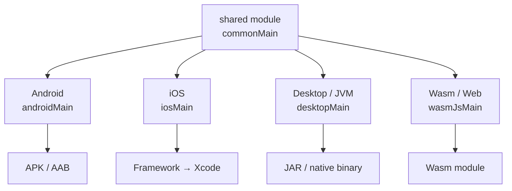
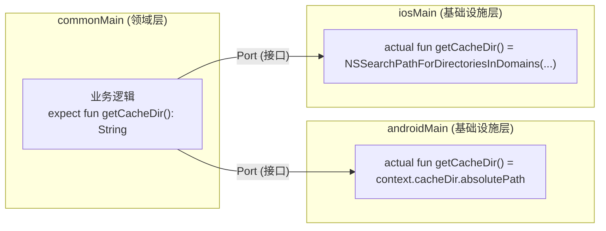
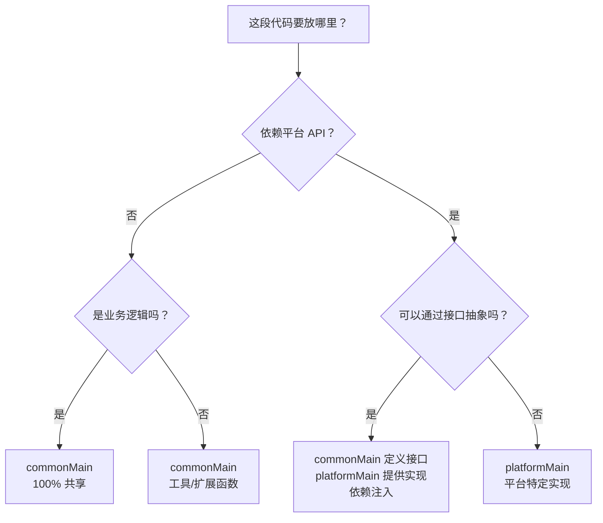
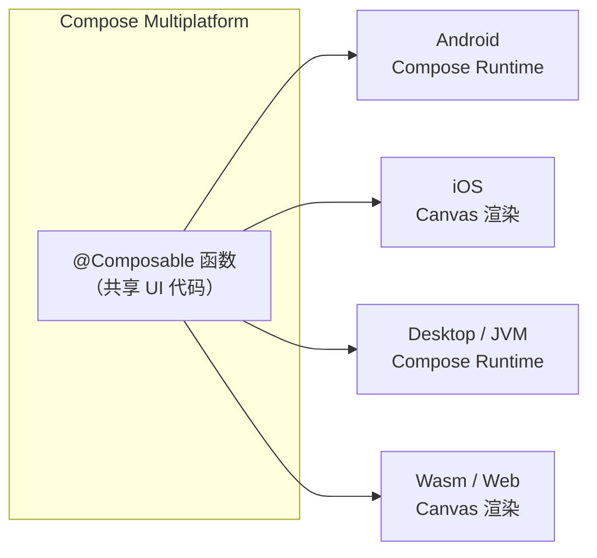

# Kotlin Multiplatform 基础概念

## 核心思路

Kotlin Multiplatform (KMP) 的核心思想是：**一次编写业务逻辑，多端复用**。通过 Kotlin 编译器将共享代码编译为各平台原生产物，而非在运行时通过解释器或虚拟机执行。



- **commonMain** -- 平台无关的共享代码（业务逻辑、数据层）
- **platformMain** -- 平台特定的实现（UI、平台 API 调用）
- 通过 `expect/actual` 机制处理平台差异，编译器保证每个 `expect` 声明在所有目标平台都有对应的 `actual` 实现

:::info
KMP 不是框架，而是 Kotlin 语言本身的能力。它不取代任何平台的原生开发，而是在原生开发的基础上提供跨平台共享逻辑的途径。
:::

## expect/actual 机制

`expect/actual` 是 KMP 处理平台差异的核心手段。在 `commonMain` 中用 `expect` 声明一个"期望存在"的函数或类，然后在每个平台的 `platformMain` 中提供 `actual` 实现。编译器会检查所有目标平台是否都提供了完整的 `actual`，否则编译失败。

```kotlin
// commonMain — 声明期望
expect fun getPlatformName(): String

// androidMain — Android 实现
actual fun getPlatformName(): String = "Android"

// iosMain — iOS 实现
actual fun getPlatformName(): String = "iOS"
```

### expect/actual 深入

`expect/actual` 有三种声明形式，各自适用于不同场景：

| 声明形式 | 适用场景 | 示例 |
|----------|----------|------|
| `expect fun` | 简单的平台差异行为 | 获取平台名称、文件路径拼接 |
| `expect class` | 需要维护状态的平台组件 | 日志器、平台特定的 Service |
| `expect object` | 无状态的工具集或单例 | 平台配置常量 |

以下是一个更完整的 `expect class` 示例：

```kotlin
// commonMain — 声明期望的类
expect class PlatformLogger() {
    fun log(tag: String, message: String)
    fun logError(tag: String, message: String, throwable: Throwable?)
}

// androidMain — 使用 Android 的 Log
actual class PlatformLogger {
    actual fun log(tag: String, message: String) {
        android.util.Log.d(tag, message)
    }
    actual fun logError(tag: String, message: String, throwable: Throwable?) {
        android.util.Log.e(tag, message, throwable)
    }
}

// iosMain — 使用 iOS 的 NSLog
actual class PlatformLogger {
    actual fun log(tag: String, message: String) {
        platform.Foundation.NSLog("[$tag] $message")
    }
    actual fun logError(tag: String, message: String, throwable: Throwable?) {
        platform.Foundation.NSLog("[$tag] ERROR: $message ${throwable?.messageOrNull() ?: ""}")
    }
}
```

在 `commonMain` 中可以像普通类一样使用 `PlatformLogger`，无需关心底层调用了 `Log.d` 还是 `NSLog`：

```kotlin
// commonMain — 无需感知平台差异
class UserRepository(
    private val logger: PlatformLogger
) {
    fun getUser(id: String): User {
        logger.log("UserRepository", "正在获取用户: $id")
        // ... 业务逻辑
    }
}
```

:::tip
`expect/actual` 是 KMP 处理平台差异的核心机制，类似 C 的 `#ifdef` 但类型安全。编译器在编译期就会检查所有目标平台的 `actual` 是否完整，避免了运行时才发现缺少实现的隐患。
:::

### expect/actual 的架构本质

理解了 expect/actual 的语法后，值得从架构视角看看它本质上是什么。

**expect/actual 是六边形架构 (Hexagonal Architecture / Ports & Adapters) 在语言层面的实现。**



#### 你其实已经用过这个模式

如果你在 Android 项目中用了 Clean Architecture，你每天都在做类似的事：

```kotlin
// Domain 层定义接口 (Port)
interface UserRepository {
    suspend fun getUser(id: String): User
}

// Data 层提供实现 (Adapter)
class UserRepositoryImpl @Inject constructor(
    private val api: UserApi,
    private val dao: UserDao
) : UserRepository {
    override suspend fun getUser(id: String) = ...
}
```

**expect/actual 做的事情完全一样**，只不过：
- 普通接口 + DI → 运行时选择实现（在同一个进程内）
- expect/actual → 编译时选择实现（在不同平台上）

#### 何时用 expect/actual vs 普通接口 + DI

| 场景 | 推荐方式 | 原因 |
|------|---------|------|
| 文件系统路径、线程模型差异 | `expect/actual` | 平台 API 差异根本性不同 |
| 不同 HTTP 客户端 (Ktor vs URLSession) | `expect/actual` | 需要在编译时确定 |
| 不同数据库实现 (Room vs SQLDelight) | 接口 + DI | API 相似，可以抽象 |
| 日志、分析 SDK | 接口 + DI | 行为统一，只是底层调用不同 |

:::tip
设计 KMP 共享代码时，先用普通接口抽象。只有当接口在某个平台无法统一实现时，才引入 expect/actual。这保持了最大的灵活性。（参考：[Booking.com KMP 生产实践](https://medium.com/booking-com-development/kotlin-multiplatform-in-production-two-real-world-use-cases-from-booking-com-46ffe13a773d)）
:::

## 共享什么、不共享什么

| 层级 | 共享策略 | 说明 |
|------|----------|------|
| 数据层 (Repository/DataSource) | 共享 | 核心数据操作逻辑跨平台一致 |
| 业务逻辑 (UseCase/Domain) | 共享 | 领域模型不依赖平台 |
| 网络层 (Ktor) | 共享 | HTTP 客户端在各端复用 |
| 数据库 (SQLDelight) | 共享 | SQL 逻辑统一，驱动各平台实现 |
| UI (Compose Multiplatform) | 部分共享 | 正在成熟，可选择性共享 |
| 平台特定 API | 不共享 | 用 expect/actual 封装 |

## 项目结构

```
shared/
├── build.gradle.kts          # 多平台构建配置
└── src/
    ├── commonMain/kotlin/     # 共享代码（业务逻辑、数据层）
    ├── commonTest/kotlin/     # 共享测试
    ├── androidMain/kotlin/    # Android 特定实现
    ├── androidInstrumentedTest/
    ├── iosMain/kotlin/        # iOS 特定实现
    └── desktopMain/kotlin/    # Desktop 特定实现
```

:::info
每个 `platformMain` 可以依赖 `commonMain`，但各 `platformMain` 之间不能互相依赖。`commonTest` 可以测试 `commonMain` 中的共享代码，同一套测试在所有平台上运行。
:::

## 共享策略决策树

在实际项目中，判断某段代码应该放在 `commonMain` 还是 `platformMain` 并非总是非此即彼。以下决策树提供了一个实用的判断框架：



按架构分层来看：

- **Domain 层**：100% 共享。领域模型 (Entity)、业务规则 (UseCase) 不依赖任何平台 API，放在 `commonMain`。
- **Data 层**：约 80% 共享。Repository 接口和大部分实现共享，仅 DataSource 的平台特定部分（如文件系统访问）通过 `expect/actual` 或接口注入处理。
- **UI 层**：视项目策略而定。使用 Compose Multiplatform 可以共享大部分 UI；追求原生体验则各端分别实现。

:::tip
经验法则：网络请求、缓存策略、业务逻辑、数据验证 -- 这些尽量共享；UI 动画、平台特有组件（如 iOS 的 UIKit 桥接）、硬件访问 -- 这些放在平台侧。
:::

## Compose Multiplatform

Compose Multiplatform 是基于 Kotlin Multiplatform 的声明式 UI 框架，可以理解为 KMP 的 UI 层解决方案。它源自 Android 的 Jetpack Compose，由 JetBrains 将其扩展到 iOS、Desktop 和 Web 平台。



当前各平台的成熟度：

| 平台 | 状态 | 渲染方式 |
|------|------|----------|
| Android | Stable | 原生 Compose Runtime |
| Desktop (JVM) | Stable | Compose Runtime |
| iOS | Beta | Skia Canvas 渲染 |
| Web (Wasm) | Alpha | Canvas / DOM |

一个共享的 `@Composable` 函数示例：

```kotlin
// commonMain — 共享 UI 组件
@Composable
fun Greeting(name: String) {
    // 这个函数在 Android、iOS、Desktop 上都能运行
    Column(
        modifier = Modifier.padding(16.dp),
        horizontalAlignment = Alignment.CenterHorizontally
    ) {
        Text(
            text = "你好, $name!",
            style = MaterialTheme.typography.headlineMedium
        )
        Spacer(modifier = Modifier.height(8.dp))
        Button(onClick = { /* 处理点击 */ }) {
            Text("点击我")
        }
    }
}
```

这段代码无需修改即可在 Android 和 iOS 上运行，Compose Multiplatform 会自动处理底层渲染的差异。

:::warning
Compose Multiplatform for iOS 仍在 Beta 阶段，生产项目需评估稳定性。建议在非核心页面先行试水，密切关注 [Compose Multiplatform 官方更新](https://www.jetbrains.com/lp/compose-multiplatform/)。
:::

## 依赖管理 (KotlinX)

KMP 项目的依赖管理与普通 Kotlin/Android 项目类似，但需要在 `build.gradle.kts` 中按 `sourceSets` 分别声明。JetBrains 提供了一系列 KotlinX 多平台库，它们本身就是 KMP 库，在各平台上都有对应的实现：

| 库 | 用途 | artifact |
|----|------|----------|
| kotlinx-coroutines | 异步协程 | `org.jetbrains.kotlinx:kotlinx-coroutines-core` |
| kotlinx-serialization | JSON/Proto 序列化 | `org.jetbrains.kotlinx:kotlinx-serialization-json` |
| Ktor | HTTP 网络请求 | `io.ktor:ktor-client-core` |
| SQLDelight | 类型安全 SQL | `app.cash.sqldelight:sqlite-driver` |

在 `build.gradle.kts` 中的典型配置：

```kotlin
kotlin {
    // 声明目标平台
    androidTarget()
    iosX64(); iosArm64(); iosSimulatorArm64()
    jvm("desktop")

    sourceSets {
        commonMain.dependencies {
            // 协程
            implementation("org.jetbrains.kotlinx:kotlinx-coroutines-core:1.9.0")
            // 序列化
            implementation("org.jetbrains.kotlinx:kotlinx-serialization-json:1.7.3")
            // 网络请求
            implementation("io.ktor:ktor-client-core:3.0.0")
            implementation("io.ktor:ktor-client-content-negotiation:3.0.0")
        }
        androidMain.dependencies {
            implementation("io.ktor:ktor-client-okhttp:3.0.0")
        }
        iosMain.dependencies {
            implementation("io.ktor:ktor-client-darwin:3.0.0")
        }
    }
}
```

:::warning
KotlinX 库之间以及与 Kotlin 版本存在对应关系，升级时需注意版本对齐。建议使用 Version Catalog (`libs.versions.toml`) 统一管理版本号，避免版本不一致导致的编译错误。
:::

## 与其他跨平台方案对比

| 方案 | 语言 | UI 方案 | 共享范围 | 适用场景 |
|------|------|---------|----------|----------|
| KMP | Kotlin | 原生 / Compose Multiplatform | 逻辑层 + 部分 UI | Android 团队扩展到多端 |
| Flutter | Dart | 自绘引擎 (Skia/Impeller) | 逻辑 + UI 全部 | UI 高度一致的跨平台 |
| React Native | JS/TS | 原生组件 | 逻辑 + UI 全部 | Web 开发者做移动端 |
| .NET MAUI | C# | 原生控件映射 | 逻辑 + UI 全部 | .NET 生态企业应用 |

> KMP 的核心优势：Android 团队天然熟悉 Kotlin，可以渐进式引入 -- 先共享网络层和数据层，再逐步扩展到业务逻辑甚至 UI。不需要一次性重写，可以与现有原生代码共存。
