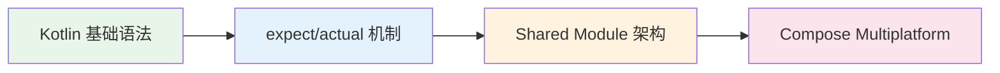

# KMP 学习路径

## KMP 生态现状

Kotlin Multiplatform (KMP) 已进入生产可用阶段。在逻辑层，KMP 的 shared module 机制成熟稳定，网络请求、数据持久化、业务逻辑等模块可以安全地跨平台复用。在 UI 层，Compose Multiplatform 基于 Jetpack Compose，已逐步趋近稳定，可用于 Android、iOS、Desktop 和 Web 端的界面共享。

:::tip
自 2024 年起，Google 已正式宣布支持 KMP，并将其纳入 Android 官方开发推荐体系。KMP 不再只是实验性方案，而是具有长期战略意义的跨平台技术选型。
:::

:::warning
Compose Multiplatform 的 iOS 端仍处于 Beta 阶段，生产环境中建议评估稳定性后再决定是否大规模采用 UI 层共享策略。
:::

## 学习路线图

建议按照以下顺序逐步学习，每个阶段依赖前一阶段的知识基础：

| 阶段 | 核心内容 | 入口 |
|------|---------|------|
| Kotlin 基础 | 协程、扩展函数、密封类 | [basics.md](./basics) |
| expect/actual | 平台声明与实际实现的桥接机制 | [basics.md](./basics) |
| Shared Architecture | 分层设计、依赖注入、模块通信 | 待补充 |
| Compose Multiplatform | 声明式 UI 跨平台渲染 | 待补充 |

## 原生开发 vs 跨平台的思维转换

| 维度 | 纯原生开发 | KMP 跨平台 | 说明 |
|------|-----------|-----------|------|
| 代码复用 | 各端独立实现 | 逻辑层共享，UI 各端原生 | KMP 不强制共享 UI，保持各端原生体验 |
| 构建系统 | 各端独立构建 | Gradle 统一管理 shared module | 共享模块需要同时兼容多端构建约束 |
| 平台 API 调用 | 直接调用 | expect/actual 声明桥接 | 平台差异通过编译期机制处理，而非运行时 if/else |
| 依赖管理 | 各端独立版本 | 需要协调多端兼容的版本号 | 跨平台库的版本升级需要验证所有目标平台 |
| 调试 | 单平台 | 需在多平台上分别验证 | Bug 可能只出现在某一端，排查时需要多设备 |

:::tip
KMP 的核心理念不是「一套代码跑所有平台」，而是「能共享的共享，该原生的原生」。它把跨平台的粒度控制交给开发者——共享业务逻辑层，UI 保持各端原生实现。这与 Flutter 的「UI 也统一」策略形成鲜明对比。
:::

## 为什么了解 KMP

KMP 允许使用 Kotlin 将代码共享到 Android、iOS、Web、Desktop 多个平台。在当前的跨端开发环境中，了解 KMP 具有多方面的价值。

:::info
对于 AI Coding 基础设施建设而言，理解 KMP 的意义体现在以下几个方面：
:::

- **多端工具链设计**：代码生成工具、脚手架模板可能需要考虑跨平台场景，生成的代码应兼容多端构建体系
- **团队架构理解**：与多端团队协作时，理解 shared module 与 platform module 的分层结构，有助于准确沟通技术方案
- **依赖治理**：跨平台共享意味着依赖版本需要统一管理，理解 KMP 的依赖解析机制有助于构建更可靠的基础设施

:::tip
**优先级 P3** -- 了解核心概念即可，不需要深入实践。重点掌握 expect/actual 机制和模块分层思想，就能在团队协作中有效沟通。
:::

## 推荐资源

### 官方文档

- [KMP 官方文档](https://kotlinlang.org/docs/multiplatform.html) -- Kotlin 官方提供的 Multiplatform 完整指南
- [Kotlin Multiplatform 入门](https://developer.android.com/kotlin/multiplatform) -- Android 开发者视角的 KMP 入门教程

### 实践教程

- [Google KMP Codelab](https://codelabs.developers.google.com/) -- Google 提供的动手实践教程，涵盖项目创建到跨平台调试的完整流程
- [commonmain.dev](https://commonmain.dev/) -- 社区维护的 KMP 实战知识库，包含常见架构模式和最佳实践

### 路线与规划

- [JetBrains KMP Roadmap](https://kotlinlang.org/docs/multiplatform-roadmap.html) -- JetBrains 发布的 KMP 发展路线图，了解未来版本规划和功能预期

:::tip 学习完成
至此，全部 5 个模块学习路径已完成。回到 [首页](/) 查看完整学习路线。
:::
