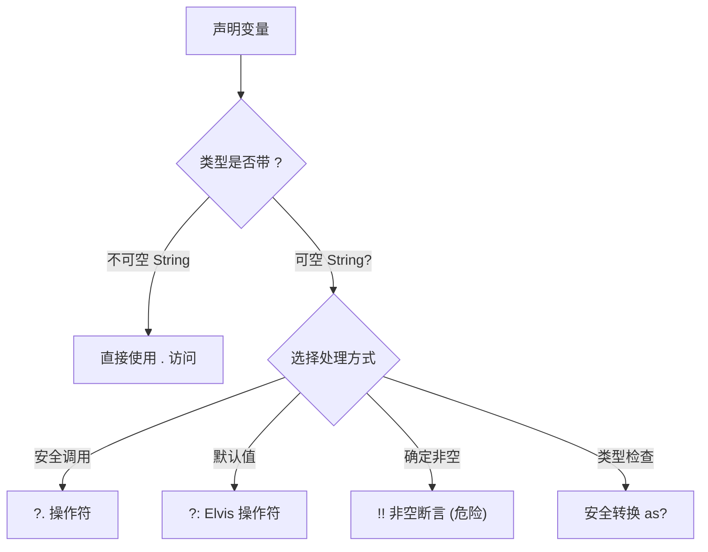
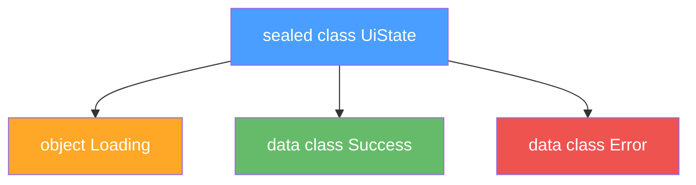
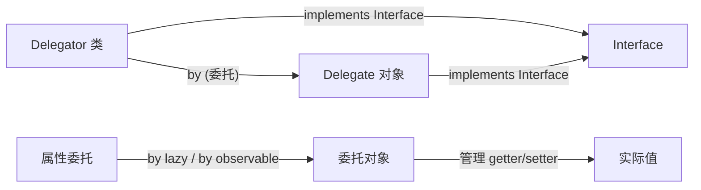

# 基础语法

Kotlin 是一门面向 JVM 的现代语言，同时也是 Android 的官方开发语言。对于有 Java/Spring 背景的后端开发者来说，Kotlin 的学习曲线较为平缓，但它在空安全、函数式编程和语法简洁性上做了大量改进。本文覆盖 Kotlin 最核心的语言特性。

## 变量声明

```kotlin
val name: String = "hello"  // 不可变引用 (类似 Java 的 final)
var count: Int = 0           // 可变引用

// 类型推断 -- 大多数场景可省略类型
val message = "Kotlin"       // 编译器推断为 String
val year = 2025              // 编译器推断为 Int
```

- `val` = read-only，`var` = mutable
- 优先使用 `val`，这与 Java 中推荐 `final` 的理念一致，有助于编写不可变代码

:::tip
在 Spring 项目中，依赖注入的字段可以用 `val` 声明为不可变属性，配合主构造函数注入，代码更简洁安全。
:::

## 函数

```kotlin
// 表达式函数体 -- 单行函数可省略花括号和 return
fun add(a: Int, b: Int): Int = a + b

// 块函数体
fun greet(name: String): String {
    return "Hello, $name"  // 字符串模板
}

// 默认参数 -- Java 不支持这个特性
fun connect(host: String, port: Int = 8080, timeout: Int = 5000): String {
    return "$host:$port (timeout=${timeout}ms)"
}

connect("localhost")              // localhost:8080 (timeout=5000ms)
connect("localhost", 3306)        // localhost:3306 (timeout=5000ms)
connect("localhost", 3306, 3000)  // localhost:3306 (timeout=3000ms)
```

默认参数极大地减少了方法重载的数量，在 Java 中往往需要定义多个重载方法来达到同样效果。

## 空安全 (Null Safety)

Kotlin 在类型系统层面区分可空与不可空类型，这是它相比 Java 最核心的改进之一。

```kotlin
var a: String = "hello"   // 不可为 null，编译器保证
var b: String? = null     // 可为 null，需要显式声明

// 安全调用操作符 ?.
val len: Int? = b?.length  // 如果 b 为 null，整个表达式返回 null

// Elvis 操作符 ?:
val len2: Int = b?.length ?: 0  // 如果左侧为 null，使用右侧默认值

// 非空断言 !! (慎用 -- 运行时可能抛 NPE)
val len3: Int = b!!.length

// 安全转换
val obj: Any = "hello"
val str: String? = obj as? String  // 转换失败返回 null 而非抛异常
```



:::warning
`!!` 非空断言本质上放弃了空安全保护。在代码审查中，`!!` 应该被视为代码异味 (code smell)，优先使用 `?.` 或 `?:` 处理。
:::

## 数据类 (data class)

```kotlin
data class User(val name: String, val age: Int)

// 自动生成的方法
val u1 = User("Alice", 25)
val u2 = User("Alice", 25)
u1 == u2         // true -- 自动生成的 equals()
u1.hashCode()    // 基于 name 和 age
u1.toString()    // "User(name=Alice, age=25)"

// copy() -- 创建副本并修改部分字段
val u3 = u1.copy(age = 26)

// 解构声明 -- 基于 componentN()
val (name, age) = u1
```

自动生成 `equals()`、`hashCode()`、`toString()`、`copy()`、`componentN()`。

:::info
data class 类似于 Java 14+ 的 record，但 Kotlin 早在 1.0 就已支持。在 Spring 中可以用 data class 来承载 DTO 和请求/响应对象。
:::

## 扩展函数

```kotlin
// 为 String 添加扩展函数
fun String.addHello(): String = "Hello, $this"

// 使用
"world".addHello()  // "Hello, world"

// 扩展属性
val String.hasContent: Boolean
    get() = this.isNotEmpty()
```

扩展函数是静态解析的 -- 它不会真正修改原始类，而是在编译时将调用转换为静态方法调用。这与 Java 中通过工具类 (`StringUtils.isEmpty()`) 实现的效果类似，但调用语法更加自然。

## Lambda 与高阶函数

```kotlin
val list = listOf(1, 2, 3, 4, 5)

// 常见集合操作
list.filter { it > 3 }         // [4, 5] -- 过滤
list.map { it * 2 }            // [2, 4, 6, 8, 10] -- 映射
list.forEach { println(it) }   // 遍历
list.groupBy { it % 2 }        // {1=[1, 3, 5], 0=[2, 4]} -- 分组
list.associate { it to it * it } // {1=1, 2=4, 3=9, 4=16, 5=25} -- 转Map

// 高阶函数 -- 以函数作为参数或返回值
fun <T> List<T>.customFilter(predicate: (T) -> Boolean): List<T> {
    val result = mutableListOf<T>()
    for (item in this) {
        if (predicate(item)) result.add(item)
    }
    return result
}

list.customFilter { it > 3 }  // [4, 5]
```

- `it` 是单参数 lambda 的隐式参数名
- 集合操作是日常高频使用的内容，类似于 Java Stream API，但语法更简洁

## Companion Object（伴生对象）

```kotlin
class MyClass {
    companion object {
        private const val TAG = "MyClass"  // 编译期常量
        fun create(): MyClass = MyClass()
    }
}

// 类似 Java 的 static 方法调用
val instance = MyClass.create()
```

Kotlin 没有 `static` 关键字。伴生对象是其替代方案，本质上是一个与类关联的单例对象。在 Android 中，伴生对象常用于定义 `TAG` 常量和工厂方法。

## 密封类 (sealed class)

密封类用于表示受限的类继承结构 -- 所有子类必须在同一文件（或同一模块的同一包路径下）中定义，编译器因此能掌握完整的子类信息。

```kotlin
// 定义 UI 状态的密封类
sealed class UiState {
    // object 表示单例子类，无状态
    object Loading : UiState()
    // data class 表示带数据的状态
    data class Success(val data: List<String>) : UiState()
    data class Error(val message: String) : UiState()
}

// when 表达式 -- 编译器强制检查所有分支是否穷尽
fun handleState(state: UiState): String = when (state) {
    is UiState.Loading -> "加载中..."
    is UiState.Success -> "数据: ${state.data}"
    is UiState.Error -> "错误: ${state.message}"
    // 不需要 else 分支 -- 编译器保证已覆盖所有情况
}
```



:::tip
密封类 + `when` 表达式是 Kotlin 中替代 enum + switch 的最佳实践。编译器会在新增子类时强制你更新所有 `when` 分支，从根本上杜绝遗漏分支的 bug。在 Android 中，密封类广泛应用于 MVI 架构的 State 和 Intent 定义。
:::

## 委托 (delegation)

委托是 Kotlin 提供的一等公民级别的设计模式支持，分为类委托和属性委托两种。

### 类委托

类委托让一个对象将接口的实现委托给另一个对象，类似于 Java 中的组合优于继承，但无需手写大量转发代码。

```kotlin
// 类委托 -- 自动将 List<T> 的方法调用转发给 inner
class DelegatingList<T>(private val inner: List<T>) : List<T> by inner {
    // 只需覆写关心的方法
    override fun toString(): String = "DelegatingList($inner)"
}

val dl = DelegatingList(listOf(1, 2, 3))
dl.size      // 3 -- 自动委托给 inner
dl[0]        // 1 -- 自动委托给 inner
```

### 属性委托

属性委托将属性的 getter/setter 逻辑委托给第三方对象处理。

```kotlin
// lazy -- 延迟初始化，线程安全（默认同步锁）
val heavyObject: String by lazy {
    println("执行耗初始化...")
    "Expensive Object"
}
// 首次访问时才执行 lambda
println(heavyObject)  // 打印 "执行耗初始化..." 后返回值

// observable -- 属性值变化时收到通知
import kotlin.properties.Delegates
var name: String by Delegates.observable("<初始值>") { _, old, new ->
    println("name 从 $old 变为 $new")
}
name = "Alice"  // 打印 "name 从 <初始值> 变为 Alice"

// vetoable -- 可否决属性赋值
var age: Int by Delegates.vetoable(0) { _, _, new ->
    new >= 0  // 只接受非负值
}
```



:::warning
委托属性是 Kotlin 最强大的特性之一，但也容易过度使用。在 Android 中常见的 `by viewModels()`、`by lazy` 都是委托的实际应用。自定义委托需要实现 `ReadOnlyProperty` 或 `ReadWriteProperty` 接口。
:::

## 泛型与型变 (generics & variance)

Kotlin 的泛型系统比 Java 更加严格和表达力更强。核心概念是型变 (variance)：控制泛型子类型关系。

### 声明处型变

```kotlin
// out (协变/covariant) -- T 只能作为返回值（生产者）
interface Source<out T> {
    fun next(): T  // T 出现在 out 位置
}

val strSource: Source<String> = ...
val anySource: Source<Any> = strSource  // 合法！String 是 Any 的子类型

// in (逆变/contravariant) -- T 只能作为参数（消费者）
interface Comparable<in T> {
    fun compare(other: T): Int  // T 出现在 in 位置
}

val anyComp: Comparable<Any> = ...
val strComp: Comparable<String> = anyComp  // 合法！
```

Java 的 `? extends T` 对应 Kotlin 的 `out T`，`? super T` 对应 `in T`。PECS 原则 (Producer Extends, Consumer Super) 在 Kotlin 中变成了：生产者用 `out`，消费者用 `in`。

:::info
Kotlin 的型变声明在接口定义处 (declaration-site)，而 Java 在使用处 (use-site)。这意味着 Kotlin 的泛型 API 使用起来更简洁 -- 型变约束只需声明一次。
:::

### 多重上界与 reified

```kotlin
// where 子句 -- 多重上界约束
fun <T> copyWhen(list: List<T>, threshold: T): List<T>
    where T : Comparable<T>, T : Number {
    return list.filter { it > threshold }
}

// reified 类型参数 -- 内联函数中保留泛型信息
inline fun <reified T> typeOf(): KClass<T> = T::class

// 在运行时获取泛型类型 (Java 做不到)
typeOf<String>()  // kotlin.String
```

## 内联函数 (inline)

Kotlin 的高阶函数会为每个 lambda 创建匿名内部类对象，带来运行时开销。`inline` 关键字让编译器将函数体直接展开到调用处，消除这层开销。

```kotlin
// 普通内联 -- lambda 被直接内联到调用处
inline fun <T> List<T>.fastForEach(action: (T) -> Unit) {
    for (item in this) action(item)
}

// noinline -- 阻止特定 lambda 被内联
inline fun process(
    a: () -> Unit,          // 被内联
    noinline b: () -> Unit  // 不内联，可作为对象传递
) {
    a()
    val stored = b  // noinline 参数才能被存储
}

// crossinline -- 允许内联但在嵌套上下文中禁止非局部返回
inline fun runInThread(crossinline block: () -> Unit) {
    Thread { block() }.start()  // lambda 在另一个线程执行
}

// reified -- 保留内联函数的泛型类型信息
inline fun <reified T> isInstanceOf(value: Any): Boolean {
    return value is T  // 普通函数中不允许 T 在 is 中使用
}
```

:::warning
不要内联大函数。内联会增加生成的字节码体积，适合简短的工具函数。标准库中 `let`、`apply`、`run` 等都是内联函数。如果一个内联函数包含大量代码或被多处调用，反而会适得其反。
:::

## 操作符重载与约定 (operator overloading)

Kotlin 允许通过 `operator` 关键字重载内置操作符，遵循固定命名约定。

```kotlin
data class Vector(val x: Int, val y: Int) {
    // 重载 + 操作符
    operator fun plus(other: Vector): Vector =
        Vector(x + other.x, y + other.y)

    // 重载 [] 操作符
    operator fun get(index: Int): Int = when (index) {
        0 -> x; 1 -> y
        else -> throw IndexOutOfBoundsException()
    }
}

val v1 = Vector(1, 2)
val v2 = Vector(3, 4)
val sum = v1 + v2       // Vector(4, 6) -- 调用 plus
sum[0]                  // 4 -- 调用 get

// 解构声明 -- 依赖 componentN() 方法
val (x, y) = sum        // x=4, y=6
// 等价于 sum.component1() 和 sum.component2()
```

data class 自动生成 `componentN()`，因此天然支持解构声明。在 `Map.Entry` 的 `for` 循环中尤其常用：`for ((key, value) in map)`。

## 与 Java 的主要区别

| 特性 | Java | Kotlin |
|------|------|--------|
| 空安全 | 无内置支持，依赖 `Optional` 或手动检查 | 类型系统层面支持 `?` |
| 扩展函数 | 不支持，需写工具类 | 原生支持 |
| 数据类 | 需手写 / Lombok / record (Java 14+) | `data class` 一行搞定 |
| Lambda | 有限支持 (Java 8+) | 一等公民 |
| 智能类型转换 | 需要强转 `(String) obj` | `if (obj is String)` 后自动转换 |
| 默认参数 | 不支持，需方法重载 | 原生支持 |
| 密封类 | `sealed interface` (Java 17+) | 早期支持，配合 `when` 更强大 |
| 委托 | 需手写委托模式 | `by` 关键字原生支持 |
| 操作符重载 | 不支持 | `operator fun` 约定 |
| 泛型型变 | 使用处通配符 `? extends T` | 声明处型变 `out T` |

## 在 Android 中的典型用法

```kotlin
// Activity / Fragment 中使用 lazy 初始化视图
val textView: TextView by lazy { findViewById(R.id.textView) }

// 使用密封类表示网络请求结果
sealed class NetworkResult<out T> {
    data class Success<T>(val data: T) : NetworkResult<T>()
    data class Error(val code: Int, val msg: String) : NetworkResult<Nothing>()
    object NetworkError : NetworkResult<Nothing>()
}

// 扩展函数简化 Toast
fun Context.showToast(msg: String) {
    Toast.makeText(this, msg, Toast.LENGTH_SHORT).show()
}

// 高阶函数封装 SharedPreferences 操作
fun SharedPreferences.edit(action: SharedPreferences.Editor.() -> Unit) {
    val editor = edit()
    editor.action()
    editor.apply()
}

// 使用
val sp = getSharedPreferences("config", Context.MODE_PRIVATE)
sp.edit {
    putString("name", "Alice")
    putBoolean("darkMode", true)
}
```

## 常见的坑

**1. 自动装箱 (autoboxing)**

Kotlin 的 `Int`、`Long` 等在 JVM 上可能被装箱为 `Integer`、`Long`。在性能敏感的代码中，优先使用基本类型数组 (`IntArray` 而非 `Array<Int>`)。

**2. 扩展函数是静态解析的**

```kotlin
open class Animal
class Dog : Animal()

fun Animal.name() = "Animal"
fun Dog.name() = "Dog"

val animal: Animal = Dog()
animal.name()  // 返回 "Animal" -- 调用取决于声明类型，不是运行时类型
```

扩展函数不支持多态，这是与成员方法的关键区别。

**3. Companion Object 不是真正的 static**

伴生对象是真实对象，可以实现接口、拥有状态。但这也意味着访问伴生对象成员有轻微的开销。使用 `@JvmStatic` 注解可以生成真正的静态方法供 Java 代码调用。

**4. lazy 的线程安全模式**

`lazy {}` 默认使用 `LazyThreadSafetyMode.SYNCHRONIZED`，在单线程场景下可以改用 `lazy(LazyThreadSafetyMode.NONE) { ... }` 避免同步锁开销。在 Android 的主线程中初始化视图时，`NONE` 模式是更优选择。

**5. data class 的 copy() 是浅拷贝**

`copy()` 只复制第一层属性。如果属性本身是可变对象（如 `MutableList`），修改副本会影响原始对象。对于包含可变状态的 data class，需要特别注意这一点。
