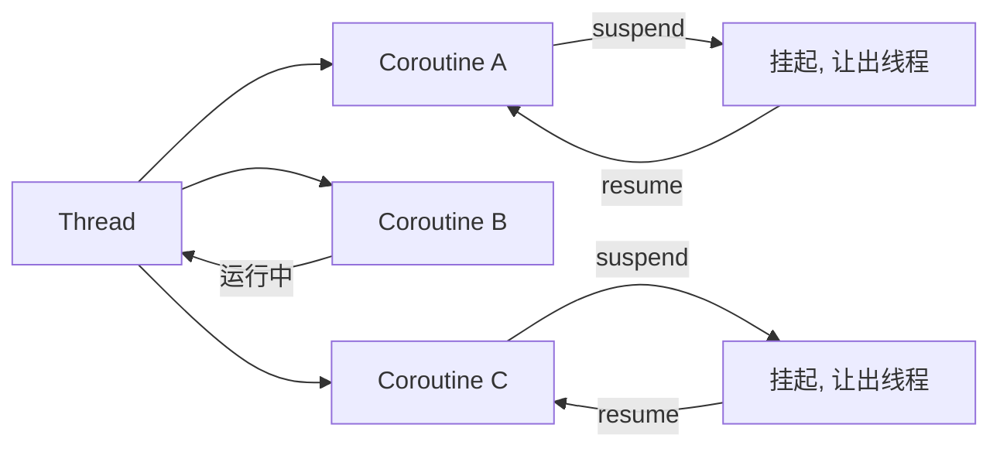
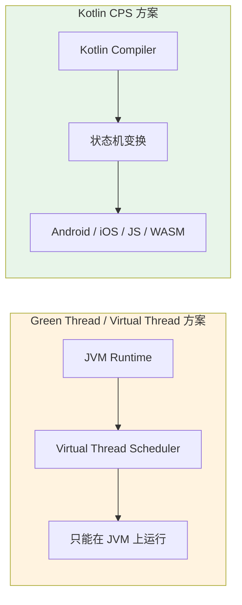
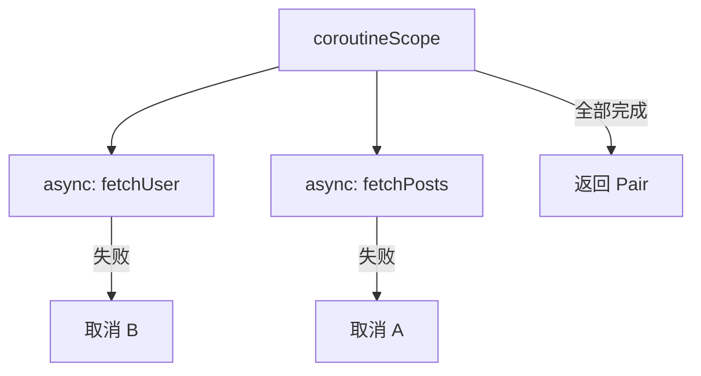
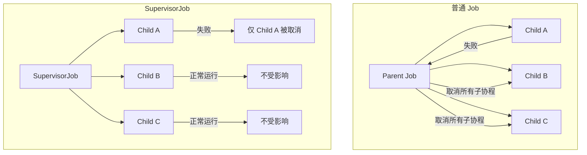
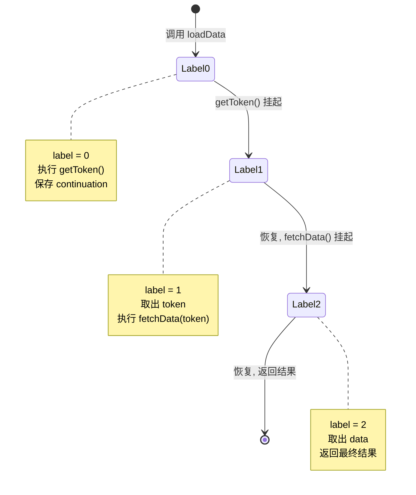
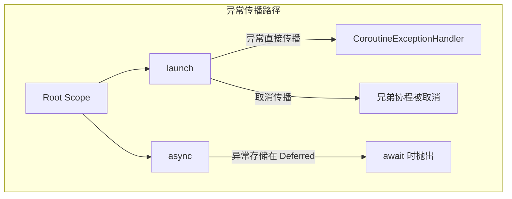

# 协程 Coroutines

## 什么是 Coroutines

协程是**轻量级线程**，可以在同一个线程上挂起（suspend）和恢复（resume），避免阻塞线程。一个线程可以同时运行数千个协程，因为挂起的协程几乎不消耗资源。

> 对后端开发者的类比：类似 Java 21 的 virtual threads 或 Go 的 goroutines —— 轻量、非阻塞、结构化并发。但 Kotlin 协程的 suspend/resume 机制是编译器级别的 CPS 变换，而非操作系统或运行时层面的调度。



## 设计哲学：为什么协程是这样设计的

### 为什么是 CPS 变换而不是 Green Thread？

Kotlin 协程是**库级方案**，而非 JVM 运行时层面的特性。这个设计选择是有深刻原因的：

- **跨平台**: CPS 变换不需要特殊的运行时支持，只要编译器支持就行。这让协程能在 Android、iOS (Kotlin/Native)、JS、WASM 上工作——这正是 KMP (Kotlin Multiplatform) 得以可能的前提
- **互操作性**: 不需要修改 JVM，可以在任何现有 JVM 版本上使用
- **轻量**: 不需要预分配大量栈空间，挂起的协程只是一个对象 + Continuation

对比 Java 21 的 Virtual Threads：Virtual Threads 是 JVM 级方案，只能在 JVM 上使用，无法在 Kotlin/Native 或 Kotlin/JS 中使用。



### 为什么是结构化并发？

对比 Go 的 goroutine 模式——goroutine 可以自由创建，没有父子关系，需要手动管理取消。但在 Android 中，**生命周期是不可预测的**：用户随时可能旋转屏幕、切到后台、系统回收内存。

如果协程是自由创建的，就会出现：
- Activity 销毁了，但网络请求还在跑，更新 UI 时崩溃
- 内存泄漏：协程持有了已销毁的 Activity 引用

结构化并发强制要求：
- 父协程取消时，所有子协程自动取消
- 子协程的生命周期不超过父协程
- `viewModelScope` 和 `lifecycleScope` 就是这个理念的具体实现

:::tip 后端开发者注意
结构化并发在服务端同样有价值——处理 HTTP 请求时，如果客户端断开连接，所有相关的数据库查询、缓存读取、RPC 调用都应该被取消，而不是继续浪费资源。Kotlin 的结构化并发天然支持这种模式。
:::

## 核心概念

### suspend 函数

```kotlin
// suspend 关键字标记可挂起函数
suspend fun fetchData(): String {
    delay(1000)  // 非阻塞等待, 不会占用线程
    return "data"
}

// 只能在协程或其他 suspend 函数中调用 suspend 函数
suspend fun loadProfile(): Profile {
    val data = fetchData()  // 合法: 在 suspend 函数中调用
    return parse(data)
}
```

- `suspend` 关键字标记可挂起函数，编译器会将其转换为状态机（详见后文）
- 只能在协程或其他 suspend 函数中调用
- suspend 函数应该是**非阻塞**的，如果必须调用阻塞代码，使用 `withContext(Dispatchers.IO) { ... }` 切换调度器

### CoroutineScope

CoroutineScope 定义了协程的生命周期范围。scope 取消时，其中所有子协程都会被取消。

```kotlin
// 自定义 Scope
val scope = CoroutineScope(Dispatchers.Main)

scope.launch {
    val data = fetchData()
    textView.text = data
}

// 使用 coroutineScope 构建器创建临时 scope
suspend fun loadAll() = coroutineScope {
    // 此 block 结束前, 内部所有协程都会完成
    launch { loadA() }
    launch { loadB() }
}
```

### Dispatchers -- 调度器

调度器决定协程在哪个线程或线程池上运行。

| Dispatcher | 用途 | 类比 |
|-----------|------|------|
| `Dispatchers.Main` | UI 线程 (Android/Swing/JavaFX) | 前端的主线程 |
| `Dispatchers.IO` | 网络/磁盘 IO (线程池, 默认 64 线程) | 类似 Java 的 CachedThreadPool |
| `Dispatchers.Default` | CPU 密集型 (线程数 = CPU 核心数) | 类似 ForkJoinPool |
| `Dispatchers.Unconfined` | 不指定线程, 在调用者线程启动, 恢复时在 resume 的线程 | 不推荐常规使用 |

:::tip
使用 `withContext(Dispatchers.IO)` 切换调度器比 `withContext(Dispatchers.Default)` 更适合 IO 操作。两者共享相同的底层线程池实现，但 IO 池有更高的并发上限。
:::

### launch vs async

```kotlin
scope.launch {
    // launch: 发射后不管 (fire-and-forget), 返回 Job
    delay(1000)
    println("done")
}

// async: 需要返回值, 返回 Deferred<T>
val deferred: Deferred<String> = scope.async {
    fetchData()
}
val result = deferred.await()  // suspend 等待结果
```

| 特性 | `launch` | `async` |
|------|----------|---------|
| 返回值 | `Job` | `Deferred<T>` |
| 异常处理 | 直接传播到父协程 | 在 `await()` 时抛出 |
| 使用场景 | 副作用操作 (日志、UI 更新) | 需要返回值的并发请求 |

## 结构化并发

结构化并发是 Kotlin 协程最重要的设计理念：**父协程取消时，所有子协程自动取消**。这与 Go 的 goroutines 形成对比 -- Go 缺乏语言层面的结构化并发支持，需要手动管理 `context.CancelFunc`。

```kotlin
suspend fun loadAll() = coroutineScope {
    val user = async { fetchUser() }
    val posts = async { fetchPosts() }
    // 两个并行请求, 任一出错都会取消另一个
    // coroutineScope 会等待所有子协程完成才返回
    Pair(user.await(), posts.await())
}
```



:::warning
不要使用 `GlobalScope`。`GlobalScope` 的生命周期等同于整个应用，无法控制取消，容易造成内存泄漏。始终使用 `coroutineScope`、`viewModelScope` 等有边界的 scope。
:::

## SupervisorJob vs Job

`Job` 在子协程失败时会**取消所有兄弟协程**并向上传播异常。`SupervisorJob` 则只取消失败的子协程，不影响其他子协程。



```kotlin
// 在 ViewModel 中使用 SupervisorJob
class MyViewModel : ViewModel() {
    // SupervisorJob + Dispatchers.Main 组合
    private val scope = CoroutineScope(SupervisorJob() + Dispatchers.Main)

    fun load() {
        scope.launch { fetchUser() }    // 即使失败...
        scope.launch { fetchPosts() }   // ...这个也会继续运行
    }
}
```

:::tip
`viewModelScope` 和 `lifecycleScope` 内部默认使用 `SupervisorJob`，所以一个子协程失败不会影响其他子协程。如果需要相同行为，手动创建 scope 时也要使用 `SupervisorJob()`。
:::

一句话总结：需要子协程之间互相隔离时用 `SupervisorJob`，需要 fail-fast 全部取消时用普通 `Job`。

## Channel

Channel 是协程之间传递数据的管道，类似于 Go 的 channel，支持多协程间的生产者-消费者模式。


**Channel 类型：**

| 类型 | 容量 | 行为 |
|------|------|------|
| `Channel<Int>()` | 0 (Rendezvous) | 发送者和接收者必须同时就绪，类似 Go 的无缓冲 channel |
| `Channel<Int>(10)` | 10 (Array/Buffered) | 缓冲区满之前 send 不挂起 |
| `Channel<Int>(Channel.CONFLATED)` | 1 (Conflated) | 只保留最新值，旧值被丢弃 |
| `Channel<Int>(Channel.UNLIMITED)` | 无限 | 缓冲区无上限 |

```kotlin
// 基本用法: 生产者-消费者模式
val channel = Channel<Int>()

// 生产者协程
scope.launch {
    for (i in 1..5) {
        channel.send(i)  // 缓冲区满时挂起
    }
    channel.close()  // 关闭 channel 表示发送完毕
}

// 消费者协程
scope.launch {
    for (value in channel) {  // 遍历 channel 直到关闭
        println("received: $value")
    }
}
```

```kotlin
// 使用 produce 构建器简化生产者
fun CoroutineScope.produceNumbers(): ReceiveChannel<Int> = produce {
    for (i in 1..5) {
        send(i)
    }
}

// 使用 consumeEach 简化消费者
scope.launch {
    produceNumbers().consumeEach { value ->
        println("received: $value")
    }
}
```

:::info
对于更复杂的数据流场景，建议使用 [Flow](./flow)。Channel 适合一次性事件传递（如导航事件、Snackbar 通知），Flow 适合连续的数据流（如 UI 状态更新）。
:::

## 取消与超时

协程的取消是**协作式**的：调用 `cancel()` 不会立即停止协程，而是设置取消标志，协程在下一个挂起点检查并退出。

```kotlin
// withTimeout: 超时抛出 TimeoutCancellationException
suspend fun fetchWithTimeout(): String {
    return withTimeout(3000) {
        apiCall()  // 超过 3 秒抛出异常
    }
}

// withTimeoutOrNull: 超时返回 null
suspend fun fetchOrNull(): String? {
    return withTimeoutOrNull(3000) {
        apiCall()  // 超过 3 秒返回 null
    }
}
```

**让协程响应取消：**

```kotlin
suspend fun cpuIntensiveWork() {
    for (i in 0..1_000_000) {
        // 方式 1: 检查 isActive
        if (!isActive) break

        // 方式 2: ensureActive() 抛出 CancellationException
        ensureActive()

        // 方式 3: yield() 让出执行权并检查取消
        if (i % 1000 == 0) yield()

        // 执行计算...
    }
}
```

**取消时的资源清理：**

```kotlin
suspend fun loadWithCleanup() {
    val resource = acquireResource()
    try {
        doWork()  // 可能被取消
    } finally {
        // finally 块在取消时仍会执行
        // 但 finally 中不能调用 suspend 函数 (除非使用 NonCancellable)
        resource.release()
    }
}

// 如果 finally 中必须调用 suspend 函数
suspend fun loadWithSuspendCleanup() {
    try {
        doWork()
    } finally {
        withContext(NonCancellable) {
            // 在不可取消的上下文中执行清理
            suspendCleanup()
        }
    }
}
```

:::warning
在 suspend 函数中使用 `try-finally`（而非 `try-catch`）来处理取消。`CancellationException` 是协程取消的正常机制，不应该被 `catch` 吞掉，否则协程无法正常退出。
:::

## 协程内部原理: CPS 与状态机

Kotlin 协程的核心原理是**编译器将 suspend 函数转换为 Continuation-Passing Style (CPS)**。每个 suspend 函数被编译成一个状态机，通过 `label` 字段跟踪当前执行位置。

### 编译器变换过程

原始 suspend 函数：

```kotlin
suspend fun loadData(): String {
    val token = getToken()        // 挂起点 1
    val data = fetchData(token)   // 挂起点 2
    return data
}
```

编译器将其变换为类似以下的状态机（简化后的伪代码）：

```kotlin
// 编译器生成的 ContinuationImpl 子类 (简化版)
fun loadData(cont: Continuation<Any?>): Any? {
    val sm = cont as LoadDataStateMachine  // 状态机对象

    when (sm.label) {
        0 -> {
            // 第一次进入: 调用 getToken
            sm.label = 1  // 设置下一个状态
            return getToken(sm)  // 传入 continuation, 挂起
        }
        1 -> {
            // getToken 返回后: 保存结果, 调用 fetchData
            val token = sm.result as String
            sm.token = token  // 保存局部变量
            sm.label = 2
            return fetchData(token, sm)
        }
        2 -> {
            // fetchData 返回后: 得到最终结果
            val data = sm.result as String
            return data  // 最终返回, 不再挂起
        }
    }
}
```

### 状态机流转



### 关键机制

- **Continuation**: 本质是一个回调对象，持有挂起点的上下文（局部变量、下一个 label）
- **状态机对象复用**: 同一个 `ContinuationImpl` 实例在每次 resume 时复用，避免分配新对象
- **不阻塞线程**: 挂起时，状态机直接 `return`，线程可以执行其他任务；恢复时从 `when(label)` 继续执行

:::info
理解状态机有助于理解为什么 suspend 函数不阻塞线程 -- 它只是保存当前状态（label + 局部变量）后直接从函数返回，线程可以继续做其他工作。当异步操作完成时，通过 Continuation 恢复到正确的 label 继续执行。这就是为什么一百万个协程只需要少量线程就能驱动。
:::

## 异常处理

协程的异常处理依赖于其**结构化并发**模型。异常会沿着协程树向上传播，直到被处理或导致整个 scope 失败。



### CoroutineExceptionHandler

```kotlin
// 全局异常处理器, 作为 scope 的上下文元素
val handler = CoroutineExceptionHandler { _, exception ->
    Log.e("Coroutine", "Caught: $exception")
}

// launch 的异常会传播到 handler
scope.launch(handler) {
    throw RuntimeException("something went wrong")
}

// 注意: async 的异常不会触发 handler!
// async 的异常只在 await() 时抛出
```

### try-catch 的正确用法

```kotlin
// launch 内部: try-catch 可以捕获, 但推荐用 CoroutineExceptionHandler
scope.launch {
    try {
        riskyOperation()
    } catch (e: IOException) {
        // 处理 IO 异常
    }
}

// async: 必须在 await() 处 try-catch
suspend fun load() = coroutineScope {
    val deferred = async { riskyOperation() }
    try {
        deferred.await()
    } catch (e: IOException) {
        // async 的异常在 await 时抛出
    }
}
```

:::warning
不要在 `launch` 外层包裹 `try-catch` 来捕获协程内部异常 -- 异常是通过协程机制传播的，不是通过常规异常栈。使用 `CoroutineExceptionHandler` 或在协程内部 `try-catch`。
:::

## 在 Android 中的典型用法

### ViewModel 中发起请求

```kotlin
class MyViewModel(private val repository: Repository) : ViewModel() {
    private val _uiState = MutableStateFlow<UiState>(UiState.Loading)
    val uiState: StateFlow<UiState> = _uiState.asStateFlow()

    fun load() {
        viewModelScope.launch {
            try {
                val data = repository.fetchData()
                _uiState.value = UiState.Success(data)
            } catch (e: Exception) {
                _uiState.value = UiState.Error(e)
            }
        }
    }
}
```

### 并行分解 (Parallel Decomposition)

```kotlin
// 多个请求并行执行, 全部完成后合并结果
suspend fun loadDashboard(): Dashboard = coroutineScope {
    val user   = async { userService.getProfile() }
    val posts  = async { postService.getFeed() }
    val config = async { configService.getConfig() }
    Dashboard(user.await(), posts.await(), config.await())
}
```

### 网络请求超时

```kotlin
suspend fun safeFetch(): Result<Data> {
    return withTimeoutOrNull(5000) {
        // 5 秒超时保护
        val response = api.getData()
        Result.success(response)
    } ?: Result.failure(TimeoutException("请求超时"))
}
```

### 自定义 Scope 使用 SupervisorJob

```kotlin
class DataSyncManager(private val scope: CoroutineScope) {
    // 使用注入的 scope, 便于测试
    constructor() : this(CoroutineScope(SupervisorJob() + Dispatchers.IO))

    fun syncAll() {
        scope.launch { syncUsers() }    // 失败不影响其他任务
        scope.launch { syncPosts() }
        scope.launch { syncComments() }
    }

    fun destroy() {
        scope.cancel()  // 取消所有子协程
    }
}
```

## 常见的坑

### 1. 不要使用 GlobalScope

`GlobalScope` 的生命周期等同于整个应用进程，无法控制取消，极易造成内存泄漏。始终使用有边界的 scope。

```kotlin
// 错误
GlobalScope.launch { fetchUser() }

// 正确
viewModelScope.launch { fetchUser() }
```

### 2. suspend 函数不应该阻塞线程

suspend 函数内部如果调用了阻塞 API（如 `Thread.sleep`、`java.io.File` 读取），需要用 `withContext` 切换到合适的调度器。

```kotlin
// 错误: 在 Default 调度器上阻塞 IO
suspend fun readFile(): String {
    return File("data.txt").readText()  // 阻塞调用!
}

// 正确: 切换到 IO 调度器
suspend fun readFile(): String = withContext(Dispatchers.IO) {
    File("data.txt").readText()
}
```

### 3. 异常传播: launch vs async

- `launch` 的异常会**立即传播**到父协程，可能取消整个 scope
- `async` 的异常会**存储**在 `Deferred` 中，只在调用 `await()` 时抛出

### 4. supervisorScope vs CoroutineScope(SupervisorJob())

- `supervisorScope { }` 是一个**挂起函数**，会等待所有子协程完成才返回
- `CoroutineScope(SupervisorJob())` 创建一个独立的 scope，不会挂起调用者
- 在 suspend 函数中使用 `supervisorScope`；在类级别管理生命周期时使用 `CoroutineScope(SupervisorJob())`

### 5. async 吞掉异常

```kotlin
// 危险: 如果没人 await 这个 Deferred, 异常会丢失!
scope.async {
    throw RuntimeException("不会被发现")
}
// 正确做法: 始终 await async 的结果, 或使用 launch + CoroutineExceptionHandler
```

### 6. finally 块中调用 suspend 函数

```kotlin
// 错误: finally 中调用 suspend 函数不会生效 (协程已被取消)
try {
    doWork()
} finally {
    cleanupResource()  // 如果这是 suspend 函数, 不会执行!
}

// 正确: 使用 NonCancellable
try {
    doWork()
} finally {
    withContext(NonCancellable) {
        cleanupResource()  // 保证执行
    }
}
```

## 进一步阅读

- [Flow -- 冷流与热通道](./flow)
- [Kotlin 官方协程指南](https://kotlinlang.org/docs/coroutines-guide.html)
- [Android 上的 Kotlin 协程](https://developer.android.com/kotlin/coroutines)
