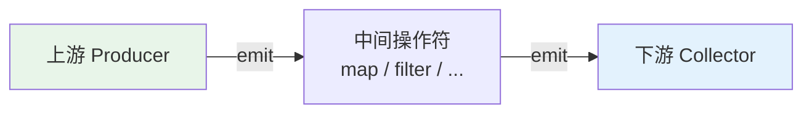
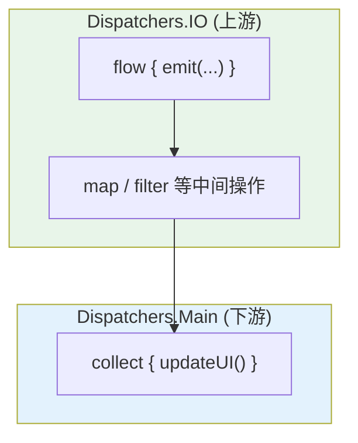
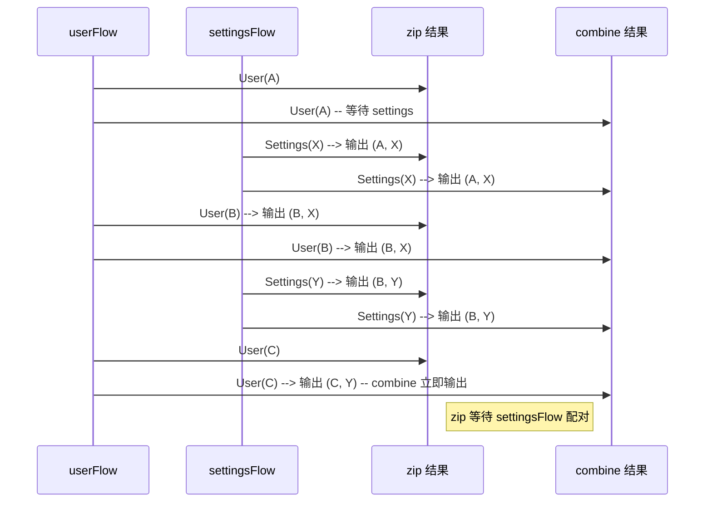
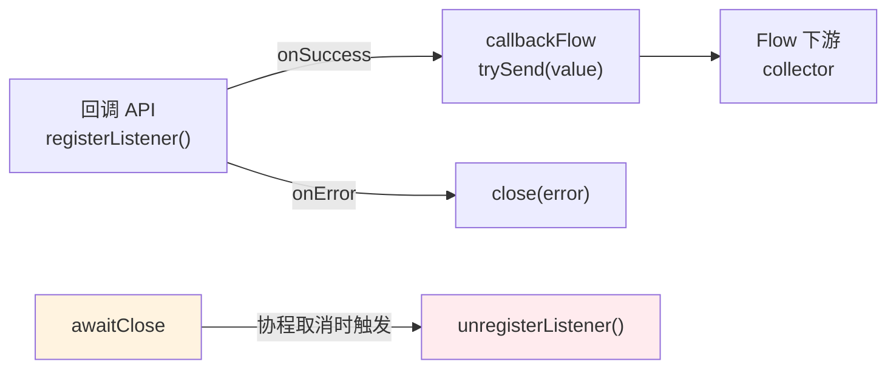

# Flow

## 什么是 Flow

Kotlin 协程的响应式流，类似 RxJava 但基于协程，更简洁。Flow 是一种 **冷流 (Cold Stream)**：每个 collector 都会触发一次完整的发射流程，没有 collector 就不会执行任何逻辑。

> 对后端开发者的类比：类似 Reactor 的 `Flux` 或 RxJava 的 `Observable`，但用 `suspend` 函数替代回调，天然支持结构化并发和协程取消。



:::tip
Flow 与 Sequence 的核心区别在于：Flow 的每个操作都可以是 `suspend` 函数，支持异步计算；Sequence 只支持同步。
:::

## 基本用法

Flow 的三要素：**构建 (Builder)** -> **发射 (emit)** -> **收集 (collect)**。

```kotlin
// 创建 Flow
fun numbers(): Flow<Int> = flow {
    for (i in 1..3) {
        emit(i) // 发射值到下游
    }
}

// 在协程中收集
scope.launch {
    numbers().collect { value ->
        println(value) // 输出: 1, 2, 3
    }
}
```

除了 `flow { ... }` 构建器，还有几个快捷构建方式：

```kotlin
flowOf(1, 2, 3)           // 固定值列表
listOf(1, 2, 3).asFlow()  // 从集合转换
```

> **一句话要点**：`collect` 是终端操作 (Terminal Operator)，调用它才会真正触发上游执行。

## 常用操作符

```kotlin
flowOf(1, 2, 3, 4, 5)
    .map { it * 2 }           // 转换：每个值乘以 2
    .filter { it > 4 }        // 过滤：只保留大于 4 的值
    .take(2)                   // 截取：只取前 2 个
    .collect { println(it) }   // 终端操作：输出 6, 8
```

其他常用操作符速览：

| 操作符 | 作用 | 类比 |
|--------|------|------|
| `transform` | 同时 map + filter，更灵活 | `Flux.transform` |
| `takeWhile` | 持续取值直到条件不满足 | `takeWhile` |
| `drop` | 丢弃前 N 个值 | `skip` |
| `onEach` | 对每个值执行副作用，不改变值 | `doOnNext` |
| `onStart` / `onCompletion` | 流开始/结束时触发 | `doOnSubscribe` / `doOnComplete` |

## StateFlow & SharedFlow

两者都是 **热流 (Hot Flow)**：无论有没有 collector，都会持续发射值。

```kotlin
// StateFlow -- 持有单一状态，始终有值，新订阅者立即收到最新值
// 类比 RxJava 的 BehaviorSubject
private val _count = MutableStateFlow(0)
val count: StateFlow<Int> = _count.asStateFlow()

// 更新方式
_count.value = 1                     // 直接设置
_count.update { it + 1 }             // 原子更新
_count.updateAndGet { it + 1 }       // 原子更新并返回新值
```

> **StateFlow 是 Android 中替代 LiveData 的标准方案。** 在 ViewModel 中暴露 UI 状态。

```kotlin
// SharedFlow -- 事件广播，可以有多个订阅者
// 类比 RxJava 的 PublishSubject
private val _events = MutableSharedFlow<String>()
val events: SharedFlow<String> = _events.asSharedFlow()

// 发射（suspend 函数，需要协程环境）
scope.launch {
    _events.emit("something happened")
}
```

:::info
**什么时候用哪个？** StateFlow 适合持续的状态 (State)，SharedFlow 适合一次性的事件 (Event)，如导航、Snackbar 等。
:::

## 在 Android 中的典型用法

```kotlin
class MyViewModel : ViewModel() {
    private val _uiState = MutableStateFlow<UiState>(Loading)
    val uiState: StateFlow<UiState> = _uiState.asStateFlow()

    init {
        viewModelScope.launch {
            repository.getData()
                .catch { _uiState.value = Error(it) }
                .collect { _uiState.value = Success(it) }
        }
    }
}
```

也可以使用 `stateIn` 将普通 Flow 转换为 StateFlow：

```kotlin
val uiState: StateFlow<UiState> = repository.getData()
    .map { Success(it) }
    .catch { emit(Error(it)) }
    .stateIn(
        scope = viewModelScope,
        started = SharingStarted.WhileSubscribed(5_000), // 停止上游的延迟
        initialValue = Loading
    )
```

## flowOn -- 调度器切换

`flowOn` 用于切换上游的执行调度器。关键规则：**flowOn 只影响其上游，collect 始终运行在调用者的调度器上**。

```kotlin
flow {
    // 这段代码在 Dispatchers.IO 上执行
    val data = api.fetchData() // 网络请求
    emit(data)
}
    .flowOn(Dispatchers.IO) // 上游切换到 IO 线程
    .collect { data ->
        // 这段代码在调用者的调度器上执行（如 Dispatchers.Main）
        updateUI(data)
    }
```



> **一句话要点**：`flowOn` 类似 RxJava 的 `subscribeOn()`，但作用范围更明确 -- 仅影响其上游操作。

## 组合操作: combine / zip

当需要将多个 Flow 的值组合在一起时，使用 `zip` 或 `combine`。

### zip -- 成对组合

`zip` 会等待两个 Flow 各发射一个值，然后将它们配对。**一对一配对，慢的决定节奏**。

```kotlin
val users: Flow<User> = userRepository.getUsers()
val settings: Flow<Settings> = settingsRepository.getSettings()

users.zip(settings) { user, setting ->
    UserProfile(user, setting)
}.collect { profile ->
    println(profile)
}
```

### combine -- 最新值组合

`combine` 在任一 Flow 发射新值时，使用所有 Flow 的最新值重新计算。**任一变化即触发**。

```kotlin
val userFlow: Flow<User> = userRepo.watchUser()
val settingsFlow: Flow<Settings> = settingsRepo.watchSettings()

combine(userFlow, settingsFlow) { user, settings ->
    UserProfile(user, settings)
}.collect { profile ->
    updateUI(profile)
}
```



> **一句话要点**：`zip` 是"成对等待"，`combine` 是"任何变化立即用最新值"。类比为 Reactor 的 `Zip` 和 `Combine`。

## flatMap 变体

当上游每个值需要映射成一个新的 Flow 并展平时，使用 flatMap 系列操作符。

| 操作符 | 行为 | 类比 RxJava |
|--------|------|-------------|
| `flatMapConcat` | 顺序执行，上一个 Flow 完成后才开始下一个 | `concatMap` |
| `flatMapMerge` | 并发执行，多个 Flow 同时运行 | `flatMap` |
| `flatMapLatest` | 新值到来时取消上一个 Flow | `switchMap` |

### flatMapLatest -- 搜索联想场景

```kotlin
fun searchResults(query: String): Flow<List<Result>> = flow {
    val results = api.search(query)
    emit(results)
}

searchQuery
    .debounce(300)                  // 300ms 防抖
    .flatMapLatest { query ->       // 新查询到来，取消上一次请求
        searchResults(query)
    }
    .collect { results ->
        updateResults(results)
    }
```

### flatMapMerge -- 并发请求

```kotlin
flowOf(1, 2, 3, 4, 5)
    .flatMapMerge(concurrency = 3) { id -> // 最多 3 个并发请求
        fetchDetail(id)
    }
    .collect { detail ->
        println(detail)
    }
```

### flatMapConcat -- 顺序执行

```kotlin
flowOf("a", "b", "c")
    .flatMapConcat { id -> // 上一个完成后才处理下一个
        loadData(id)
    }
    .collect { data ->
        println(data)
    }
```

:::tip
搜索联想场景用 `flatMapLatest`，并发请求用 `flatMapMerge`，需要严格顺序时用 `flatMapConcat`。
:::

> **一句话要点**：选择 flatMap 变体的关键在于是否需要并发、是否需要取消旧请求。

## retry / retryWhen

Flow 提供 `retry` 和 `retryWhen` 操作符来处理上游异常时的重试逻辑。

```kotlin
// 简单重试：最多重试 3 次
api.fetchData()
    .retry(3)
    .collect { data -> processData(data) }

// 条件重试：仅对 IOException 重试
api.fetchData()
    .retry(3) { cause ->
        cause is IOException // 只有网络异常才重试
    }
    .collect { data -> processData(data) }

// 指数退避重试
api.fetchData()
    .retryWhen { cause, attempt ->
        if (cause is IOException && attempt < 3) {
            delay(1000L * (1 shl attempt.toInt())) // 1s, 2s, 4s
            true // 继续重试
        } else {
            false // 停止重试，抛出异常
        }
    }
    .collect { data -> processData(data) }
```

> **一句话要点**：`retry(n)` 适合简单场景，`retryWhen` 适合需要自定义条件（如指数退避）的复杂场景。类比 Reactor 的 `retry()` 和 `retryWhen()`。

## channelFlow / callbackFlow

普通 `flow { ... }` 构建器不支持从不同协程发射值，也不适合桥接回调式 API。这时需要 `channelFlow` 和 `callbackFlow`。

### channelFlow -- 多协程并发发射

```kotlin
fun mergedData(): Flow<Data> = channelFlow {
    // 可以在不同协程中并发地 send
    launch {
        send(fetchFromSourceA())
    }
    launch {
        send(fetchFromSourceB())
    }
    // channelFlow 内部使用 Channel，线程安全
}
```

### callbackFlow -- 桥接回调式 API

将传统的回调模式转换为 Flow，常用于包装第三方 SDK 或 Android 系统回调。

```kotlin
fun locationUpdates(): Flow<Location> = callbackFlow {
    val listener = object : LocationListener {
        override fun onLocationUpdated(location: Location) {
            trySend(location) // 非挂起的发送，成功返回 Result.success
        }

        override fun onError(error: Throwable) {
            close(error) // 发生错误时关闭 Flow
        }
    }

    locationManager.registerListener(listener)

    // 必须在此处注销回调，否则内存泄漏
    awaitClose {
        locationManager.unregisterListener(listener)
    }
}
```



:::warning
callbackFlow 中必须在 `awaitClose` 中注销回调，否则当 collector 被取消后，回调仍然持有外部引用，导致内存泄漏。
:::

> **一句话要点**：`channelFlow` 用于多协程并发发送，`callbackFlow` 用于桥接回调式 API。两者底层都基于 Channel，保证线程安全。

## 生产环境踩坑

教程里的 Flow 都很优雅，但真实项目中会有一些不太明显的坑。以下是生产环境中高频遇到的问题。

### StateFlow 用于导航事件的陷阱

```kotlin
// 错误：用 StateFlow 发送一次性事件（如导航）
private val _navigation = MutableStateFlow<Screen?>(null)
val navigation: StateFlow<Screen?> = _navigation

// 触发导航
_navigation.value = Screen.Detail(userId)
```

问题：屏幕旋转后，新的 collector 立即收到 `Screen.Detail`，导致重复导航。StateFlow 的新订阅者会收到最新值，对于"导航"、"显示 Toast"这类一次性事件，这是灾难性的。

解决方案：使用 SharedFlow（replay=0）或 Channel：

```kotlin
private val _navigation = MutableSharedFlow<Screen>()
val navigation: SharedFlow<Screen> = _navigation

// 触发（suspend 函数）
_navigation.emit(Screen.Detail(userId))
```

### WhileSubscribed(5000) 的隐藏代价

```kotlin
val data: StateFlow<List<Item>> = repository.getItems()
    .stateIn(viewModelScope, SharingStarted.WhileSubscribed(5000), emptyList())
```

`WhileSubscribed(5000)` 的含义是：最后一个订阅者离开后，**再等 5 秒才停止上游 Flow**。在 Fragment 快速切换的场景（如底部导航）中：

1. Fragment A 订阅 → 上游开始网络请求
2. 用户切换到 Fragment B → A 的 view 被销毁，取消订阅
3. 5 秒内用户切回 Fragment A → 订阅恢复，上游继续（节省了一次请求）
4. 但如果用户不再切回 → 上游白白多运行 5 秒，消耗电量和流量

:::warning
选择 `WhileSubscribed` 的超时时间需要根据场景权衡。底部导航切换频繁的场景用 5000ms 合理；深度页面用 `SharingStarted.Lazily` 或 `Eagerly` 可能更合适。
:::

### StateFlow.value 的竞态条件

```kotlin
// 错误：非原子操作
val current = _count.value
_count.value = current + 1  // 两行之间如果有其他协程修改了 value，就会丢数据

// 正确：使用 update { } 保证原子性
_count.update { it + 1 }
```

`MutableStateFlow.update {}` 内部使用 CAS (Compare-And-Swap) 循环，在多协程并发修改时保证数据不丢失。

### collect vs collectLatest

`collect` 会等待 lambda 执行完毕才处理下一个值；`collectLatest` 在新值到来时自动取消上一个 lambda 的执行。在搜索联想场景中，`collectLatest` 是正确选择——用户输入速度很快，不需要为每个中间结果做完整处理。

```kotlin
searchQuery
    .debounce(300)
    .flatMapLatest { query -> searchApi.search(query) }
    .collectLatest { results -> updateUI(results) }
```

## Flow vs RxJava 对比

| 概念 | Flow | RxJava |
|------|------|--------|
| 冷流 | `Flow` | `Observable` |
| 热流 | `SharedFlow` | `Subject` / `ConnectableObservable` |
| 状态持有 | `StateFlow` | `BehaviorSubject` |
| 线程切换 | `flowOn(Dispatchers.IO)` | `subscribeOn()` / `observeOn()` |
| 背压 | 协程自带 (suspend) | 需要策略 (onBackpressureBuffer 等) |
| 错误处理 | `catch` / `retry` / `retryWhen` | `onErrorResumeNext` / `retry` |
| 组合操作 | `combine` / `zip` | `combineLatest` / `zip` |
| 展平操作 | `flatMapConcat` / `flatMapMerge` / `flatMapLatest` | `concatMap` / `flatMap` / `switchMap` |
| 调度器 | `Dispatchers.Default` / `IO` / `Main` | `Schedulers.io()` / `computation()` / `mainThread()` |
| 生命周期感知 | `repeatOnLifecycle` / `LifecycleScope` | `CompositeDisposable` / `AutoDispose` |
| 取消 | 协程取消自动传播 | `dispose()` 手动管理 |
| 学习曲线 | 低 (协程基础即可) | 高 (大量操作符和概念) |

:::info
如果你的项目已经在使用 Kotlin 协程，Flow 是天然的选择。RxJava 更适合 Java 项目或需要更丰富操作符的复杂场景。两者并非互斥，可以在同一项目中混合使用。
:::
