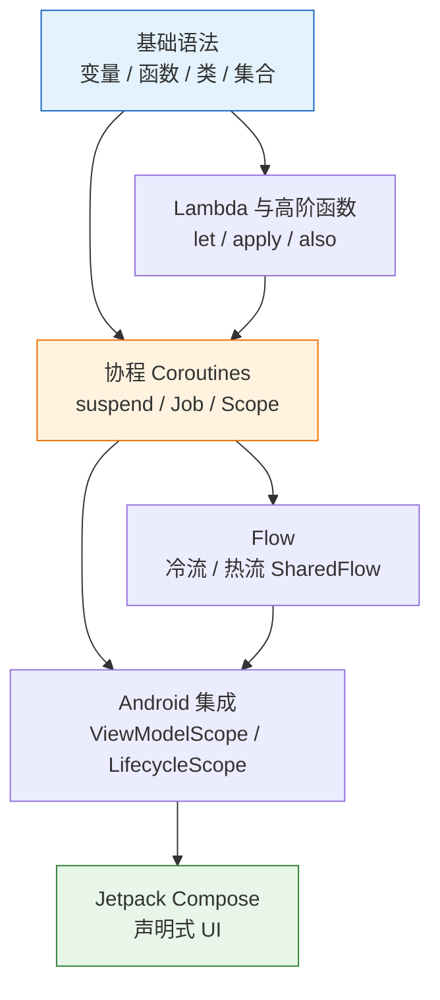

# Kotlin 学习路径

## Kotlin 在 Android 生态中的地位

2019 年 Google I/O 大会上, Google 正式宣布 Kotlin 成为 Android 开发的首选语言。截至 2025 年, Google 官方统计显示超过 95% 的排名前 1000 的 Android 应用已在生产环境中使用 Kotlin。从 Android Studio 的模板代码到 Jetpack Compose 的声明式 UI, Kotlin 已经渗透到 Android 开发的每个环节。对于求职者而言, Kotlin 已经从"加分项"变成了 Android 岗位的硬性门槛。

:::tip 为什么选择 Kotlin
Android 官方首选语言, 岗位 JD 明确要求; 语法简洁, 有 Java 或后端经验可快速上手; 协程 (Coroutine) 和 Flow 是 Android 异步编程的核心基础设施。
:::

## 从 Java 到 Kotlin 的思维转换

从 Java 迁移到 Kotlin 不仅是语法替换, 更是编程范式的升级。以下是四个核心维度的对比:

| 维度 | Java | Kotlin |
|------|------|--------|
| 空安全 | 可选 `Optional`, 运行时 NPE 频发 | `Type?` 编译期强制检查, 空值是类型系统的一部分 |
| 扩展函数 | 需要工具类或继承 | `fun String.isEmail()` 直接扩展, 遵循开闭原则 |
| 异步模型 | `Thread` / `ExecutorService` / `Future` | 协程 + Structured Concurrency, 轻量且可取消 |
| 数据模型 | 手写 getter / setter / equals / hashCode | `data class` 一行搞定, 编译器自动生成 |

:::info 关于空安全设计
Kotlin 的可空类型 (`Type?`) 不是语法糖, 而是类型系统级别的约束。这意味着编译器会在构建阶段拦截绝大多数空指针异常, 而不是等到运行时崩溃。这要求开发者在设计 API 时就明确区分"可能为空"和"绝不为空"的语义。
:::

## 学习路线图

下图展示了各主题之间的先后依赖关系, 以及每个 Kotlin 知识点对应哪些 Android 开发场景:

:::details 各阶段对应文档
- 基础语法与 Lambda → [basics.md](./basics)
- 协程 Coroutines → [coroutines.md](./coroutines)
- Flow → [flow.md](./flow)
:::

:::warning 学习建议
不要跳过基础语法直接学协程。协程的 `suspend` 函数、高阶函数 (`apply`, `let`) 等概念都建立在基础语法之上。建议按路线图从上到下依次学习, 每个阶段配合动手练习巩固。
:::

## 环境搭建速查

| 工具 | 说明 | 一行搞定 |
|------|------|----------|
| Android Studio | 官方 IDE, 内置 Kotlin 插件 | 下载地址: [developer.android.com/studio](https://developer.android.com/studio) |
| IntelliJ IDEA | 后端 / 通用 Kotlin 开发 | JetBrains Toolbox 一键安装 |
| Kotlin Playground | 浏览器内即写即运行 | [play.kotlinlang.org](https://play.kotlinlang.org) |
| kotlinc CLI | 命令行编译器 | `sdk install kotlin` 或 `brew install kotlin` |

:::tip 快速验证安装
在终端运行 `kotlinc -version`, 输出类似 `Kotlin 2.1.0` 即表示安装成功。在 Android Studio 中新建项目时, 默认模板已使用 Kotlin, 无需额外配置。
:::

## 推荐资源

- [Kotlin 官方文档](https://kotlinlang.org/docs/home.html) -- 最权威的参考手册
- [Kotlin 中文站](https://book.kotlincn.net) -- 社区维护的中文翻译, 适合快速查阅
- [Kotlin Koans](https://play.kotlinlang.org/koans/overview) -- 交互式练习, 边写边学
- [Kotlin by Example](https://play.kotlinlang.org/byExample/overview) -- 通过示例代码理解核心特性
- [Android Developers -- Kotlin 指南](https://developer.android.com/kotlin) -- Google 官方针对 Android 场景的 Kotlin 教程

:::tip 下一步
完成 Kotlin 学习后，继续 [Android 基础](/android/) → 学习四大组件、UI 体系和 Gradle 构建。
:::
