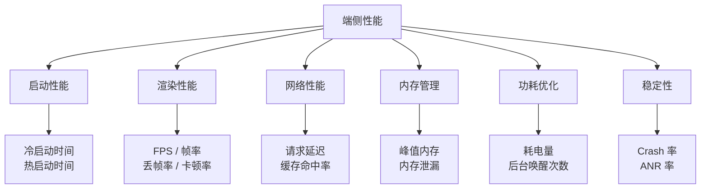
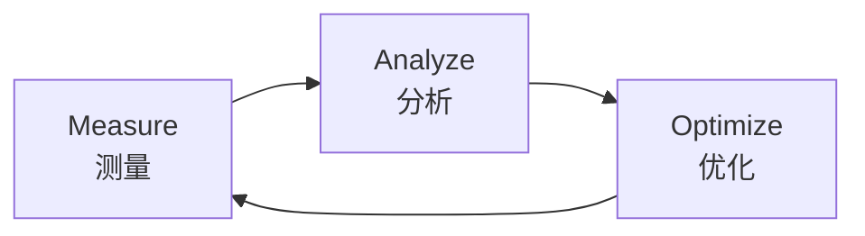

# 性能优化学习路径

## 为什么端侧性能重要

性能不是锦上添花，而是产品的生命线。多项研究数据反复证明这一点：

- **延迟与转化率**：Google 研究表明，页面加载时间每增加 100ms，转化率下降约 7%。在电商和内容消费场景下，这意味着直接的收入损失。
- **稳定性与评分**：应用商店评分与 Crash 率高度相关。ANR（Application Not Responding）发生率排名前 10% 的应用，平均评分比排名后 10% 的应用低 1.2 分以上。
- **用户留存**：大型短视频应用的数据显示，冷启动时间超过 2 秒后，用户流失率呈指数级增长。每减少 500ms 启动时间，次日留存可提升 0.5%-1%。

:::warning
性能问题具有"温水煮青蛙"效应——单次劣化往往不被察觉，但累积到阈值后会引发断崖式下跌。因此性能优化必须常态化、数据化。
:::

## 性能全景图

端侧性能是一个多维度工程问题，涵盖以下核心领域：

每个领域都有对应的指标体系和优化手段，后续章节将逐一展开。

## 性能优化方法论

所有性能优化都应遵循同一个闭环流程：

:::tip
先测量，再分析，最后优化——永远不要凭感觉优化。
:::

三步详解：

1. **Measure（测量）**：通过工具采集真实数据，建立性能基线。没有数据支撑的"慢"只是主观感受。
2. **Analyze（分析）**：定位瓶颈根因。常见方法包括 Systrace 时序分析、Heap Dump 内存分析、Flame Chart 火焰图等。
3. **Optimize（优化）**：针对根因实施优化，验证效果后回归测量，形成闭环。

:::info
一个常见的误区是跳过分析直接优化。例如发现列表卡顿就直接上 RecyclerView 缓存，但实际瓶颈可能在主线程 I/O。缺少分析环节的优化往往南辕北辙。
:::

## 学习顺序

以下顺序遵循"认知先行，实践跟进"的原则：

1. **性能指标体系** → [metrics.md](./metrics)
   为什么排第一？因为无法量化就无法优化。先建立统一的度量标准，后续所有优化才有据可依。

2. **播放器 & 渲染常识** → [player-basics.md](./player-basics)
   为什么第二？短剧业务的核心场景是视频播放。理解渲染管线和播放器工作原理，是做好专项优化的前提。

3. **优化手段** → [optimization.md](./optimization)
   为什么最后？有了指标和原理储备后，才能正确选择和组合优化策略，避免盲目套用。

## 与岗位的关系

端侧性能优化是本岗位的副线，重点关注以下三个方向：

### 服务端 vs 端侧性能的思维转换

| 维度 | 服务端性能 | 端侧性能 | 说明 |
|------|-----------|---------|------|
| 优化目标 | 吞吐量 (QPS)、P99 延迟 | FPS、冷启动时间、内存峰值 | 服务端关注并发处理能力，端侧关注单用户感知 |
| 扩展方式 | 水平扩展加机器 | 无法扩展，受设备硬件约束 | 端侧只能做减法——减少开销、减少内存占用 |
| 内存管理 | GC / 对象池，OOM 可重启进程 | 严格内存上限，OOM = Crash | Android 对后台进程有严格限制，内存压力下系统会杀进程 |
| 功耗 | 不关注 | 核心指标 | 视频播放场景下功耗直接决定用户体验 |
| 监控 | APM、日志、Metrics | 自建 APM + 系统工具 (Systrace/Perfetto) | 端侧监控受限于用户设备，采样率不能太高 |
| 用户感知 | 抽象（延迟数字） | 直接（卡顿、发烫、闪退） | 端侧性能劣化用户肉眼可感知，投诉成本更高 |

:::tip
服务端性能优化是「让一台机器服务更多人」，端侧性能优化是「让一台设备服务一个人更好」。两者的度量体系和方法论完全不同，但「Measure → Analyze → Optimize」的闭环是共通的。
:::

- **功耗** — 视频播放是最耗电的场景之一，需关注 Codec 硬件加速、屏幕刷新率策略、后台任务调度
- **流畅度** — 滑动列表 + 视频播放的流畅体验，涉及 UI 线程调度、预加载策略、帧率稳定性
- **稳定性** — ANR/Crash 率，影响应用商店评分和用户信任

## 工具速查表

| 问题领域 | 推荐工具 | 用途说明 |
| --- | --- | --- |
| 启动耗时 | Systrace / Perfetto | 分析启动阶段各环节耗时分布 |
| 帧率 & 卡顿 | Choreographer 回调 / PerfDog | 实时监控 FPS 和丢帧情况 |
| 内存泄漏 | LeakCanary / Android Studio Profiler | 自动检测 Activity/Fragment 泄漏 |
| 内存分配 | Android Studio Memory Profiler | 查看 Heap Dump，定位大对象和频繁 GC |
| CPU 热点 | Simpleperf / Flame Chart | 采样分析 CPU 时间消耗分布 |
| 网络延迟 | Network Profiler / Charles | 抓包分析请求链路和耗时 |
| 功耗分析 | Battery Historian | 查看电量消耗明细和 WakeLock 持有情况 |
| 线上监控 | 自建 APM / Firebase Performance | 生产环境性能数据采集与告警 |

## 推荐资源

- [Android Performance Patterns](https://developer.android.com/topic/performance) — Google 官方性能优化指南，覆盖渲染、内存、电量等核心主题
- [Perfetto 官方文档](https://perfetto.dev/docs/) — 现代化的 trace 分析平台，Systrace 的继任者
- [androidperformance.com](https://androidperformance.com/) — 深度性能优化博客，包含大量实战案例和源码分析
- [Baseline Profiles Codelab](https://developer.android.com/codelabs/baselineprofiles) — 通过 AOT 编译优化启动速度和运行时性能的官方实践教程
- [大型短视频应用技术博客 - 性能优化系列](https://juejin.cn/user/4030559862855545) — 业界顶尖的性能优化实践分享

:::tip 下一步
完成性能优化学习后，继续 [AI Coding](/ai-coding/) → 这是岗位主线方向，掌握 Prompt 工程与 Code Agent。
:::
