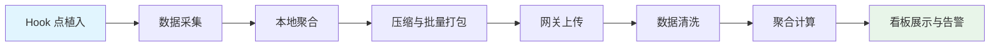
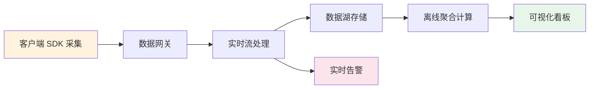

# 性能指标体系

性能指标是衡量应用质量的量化基准。一套完整的指标体系需要覆盖流畅度、响应速度、资源占用、稳定性与功耗五个维度，同时具备线上采集与离线分析能力。

## 核心指标

### FPS (Frames Per Second)

- 目标：60fps（每帧 16.6ms），高刷新率设备 120fps（8.3ms）
- 低于 55fps 用户可感知卡顿
- 测量方式：`adb shell dumpsys gfxinfo <pkg>` 或 GPU 呈现模式分析

帧时间分布比平均 FPS 更有诊断价值。偶发的长帧（jank）即使不影响平均 FPS，也会被用户明显感知。因此监控时应重点关注 P95 和 P99 帧时间。

### 启动时间

| 类型 | 说明 | 目标 |
|------|------|------|
| 冷启动 | 进程不存在，从头创建 | < 5s |
| 热启动 | Activity 在后台，恢复即可 | < 1.5s |
| 温启动 | 进程在但 Activity 需重建 | < 2s |

启动时间直接影响用户的第一印象。冷启动阶段需要经历 Application 创建、ContentProvider 初始化、Activity 生命周期等环节，每个环节都应设置耗时埋点以便定位瓶颈。

### 内存

- 关注：PSS (Proportional Set Size)、Java Heap、Native Heap
- 内存泄漏 → OOM Crash
- 工具：Memory Profiler、`dumpsys meminfo`

内存指标的监控不仅看峰值，还需要关注增长趋势。持续增长的内存曲线往往暗示存在泄漏，即使短期内未触发 OOM，长期运行也会导致问题。

### ANR (Application Not Responding)

- 主线程阻塞超过 5 秒（Activity/Service）
- BroadcastReceiver 超过 10 秒
- 排查：`adb pull /data/anr/traces.txt`

ANR 是用户体验的硬伤，因为系统会直接弹出无响应弹窗。主线程上的任何同步 I/O、数据库查询、网络请求都可能触发 ANR。

### Crash 率

- Java Crash：未捕获异常 → `Thread.setDefaultUncaughtExceptionHandler`
- Native Crash：C/C++ 层崩溃 → Tombstone 文件
- 目标：Crash 率 < 0.1%

Crash 率是稳定性的一票否决指标。计算公式为：Crash 率 = 发生 Crash 的用户数 / DAU。注意区分 Java Crash 和 Native Crash，两者的排查链路完全不同。

### 功耗

- 重点关注：CPU 唤醒次数、GPS 使用、网络请求频率
- 短剧场景：视频解码 + 屏幕常亮是最主要耗电源
- 工具：Battery Historian、Energy Profiler

功耗问题通常难以在开发阶段暴露，需要通过线上监控累计数据才能发现异常。后台持续运行的 wake lock 和高频网络请求是功耗恶化的常见原因。

## 性能指标分级（参考业界标准）

| 级别 | FPS | 冷启动 | 内存 | Crash 率 |
|------|-----|--------|------|----------|
| 优 | > 58fps | < 2s | < 200MB | < 0.05% |
| 良 | > 55fps | < 3s | < 300MB | < 0.1% |
| 差 | < 55fps | > 5s | > 400MB | > 0.5% |

## 指标采集方法详解

各指标的采集方式决定了数据的准确性和可靠性。以下是核心指标的推荐采集方案。

### FPS 采集

- **Choreographer.FrameCallback**：在应用内注册帧回调，计算相邻帧间隔，可精确到单帧级别
- **dumpsys gfxinfo**：通过 adb 命令获取最近 120 帧的渲染耗时分布
- **SurfaceFlinger stats**：系统底层统计，适用于跨应用对比场景

```java
// 使用 Choreographer 监测帧率
Choreographer.getInstance().postFrameCallback(new Choreographer.FrameCallback() {
    long lastFrameTimeNanos = 0;

    @Override
    public void doFrame(long frameTimeNanos) {
        if (lastFrameTimeNanos > 0) {
            // 计算帧间隔，单位转换为毫秒
            long intervalMs = (frameTimeNanos - lastFrameTimeNanos) / 1_000_000;
            if (intervalMs > 16) {
                // 记录一次卡顿
                recordJank(intervalMs);
            }
        }
        lastFrameTimeNanos = frameTimeNanos;
        // 持续注册下一帧回调
        Choreographer.getInstance().postFrameCallback(this);
    }
});
```

### 启动时间采集

- **adb shell am start -W**：输出 WaitTime、TotalTime 等标准指标，适合自动化测试
- **reportFullyDrawn()**：在 Activity 完成首屏数据加载后手动调用，记录用户可交互时刻
- **Activity.onCreate 时间戳**：在代码中埋点，记录各阶段耗时

```kotlin
// 启动耗时埋点示例
class StartupTracker {
    companion object {
        private val startTime = System.currentTimeMillis()

        fun onApplicationCreate() {
            // 记录 Application 创建耗时
            logDuration("application_create", System.currentTimeMillis() - startTime)
        }

        fun onFirstFrameDrawn() {
            // 记录首帧绘制耗时
            logDuration("first_frame", System.currentTimeMillis() - startTime)
        }
    }
}
```

### 内存采集

- **Debug.getMemoryInfo()**：获取 PSS、Java Heap、Native Heap 等详细内存指标
- **Runtime.getRuntime().totalMemory()**：快速获取 JVM 堆内存使用量
- **dumpsys meminfo**：获取进程级完整内存分布

```kotlin
// 内存信息采集
fun collectMemoryStats(): MemorySnapshot {
    val memoryInfo = Debug.MemoryInfo()
    Debug.getMemoryInfo(memoryInfo)
    return MemorySnapshot(
        pss = memoryInfo.totalPss / 1024,          // 转换为 KB
        javaHeap = memoryInfo.dalvikPss / 1024,
        nativeHeap = memoryInfo.nativePss / 1024
    )
}
```

:::tip
指标采集本身不能影响被测量的性能，采集代码必须轻量。建议将采集操作放在子线程，并控制采集频率（如每秒不超过 1 次），避免高频采样带来额外开销。
:::

## 自定义性能监控 SDK 设计

一个完整的性能监控 SDK 需要覆盖从数据采集到可视化展示的全链路。核心架构遵循 hook 点植入 → 数据聚合 → 批量上报 → 看板展示的流水线模式。



### 关键设计决策

**采样率控制**：线上全量采集会带来显著的性能和流量开销。推荐策略是对核心指标（Crash、ANR）全量采集，对高频指标（FPS、内存）按比例采样，采样率应支持远程动态下发。

**数据压缩**：单次上报的数据包应控制在 10KB 以内，采用批量聚合策略（如每 30 秒或累计 50 条触发一次上报），使用 gzip 压缩减少网络传输量。

**电量影响**：监控 SDK 自身的耗电需要纳入测试范围。关键措施包括：采集逻辑运行在低优先级线程、避免频繁唤醒 CPU、网络上报绑定业务请求而非独立触发。

**Hook 点选择**：SDK 通过在关键生命周期节点植入探针来采集数据，包括 Application.onCreate、Activity 生命周期回调、Choreographer 帧回调、网络请求拦截器等。

:::warning
监控 SDK 本身不能成为性能问题的来源，采样率需要可配置。上线前必须通过严格的性能回归测试，确保 SDK 引入后的各项指标劣化不超过 2%。
:::

## 业界实践：Rhea 监控方案

大型互联网应用的性能监控通常采用编译期字节码插桩（Bytecode Instrumentation）技术实现，代表性方案是 Rhea 监控体系。

### 编译期插桩

通过 ASM 等字节码操作框架，在编译阶段自动向目标方法注入耗时采集代码。相比手动埋点，字节码插桩具有零侵入、覆盖率可控、可精确到方法粒度的优势。插桩规则通过配置文件定义，支持按包名、类名、方法名进行过滤。

### 自动化性能回归检测

将性能测试集成到 CI/CD 流水线中（Shift-Left 策略），每次代码提交自动运行基准性能测试，对比历史数据发现回归。关键指标包括方法级耗时、内存分配量、启动阶段关键路径耗时等。

:::info
大型互联网公司的性能监控通常通过字节码插桩实现，在编译期注入采集代码。这种方式无需修改业务代码，且覆盖率和采集精度远高于手动埋点。
:::

## 线上性能数据采集

线上数据采集关注的是真实用户环境下的性能表现，与实验室数据互为补充。完整的数据链路如下：



### 聚合指标：关注分布而非均值

线上性能数据必须使用分位值（Percentile）进行度量。平均值会掩盖尾部延迟问题：100 次请求中 95 次耗时 100ms、5 次耗时 5000ms，平均值仅 340ms 看似正常，但 5% 的用户体验极差。

关键分位值含义：

| 分位值 | 含义 | 用途 |
|--------|------|------|
| P50 | 50% 用户的体验水平 | 反映整体水平 |
| P90 | 90% 用户的体验水平 | 发现常见问题 |
| P99 | 99% 用户的体验水平 | 捕捉极端劣化 |

:::tip
永远看 P90/P99 而非平均值，平均值会掩盖尾部延迟问题。设置告警时应以 P90 作为主要阈值，P99 作为严重等级阈值。
:::
