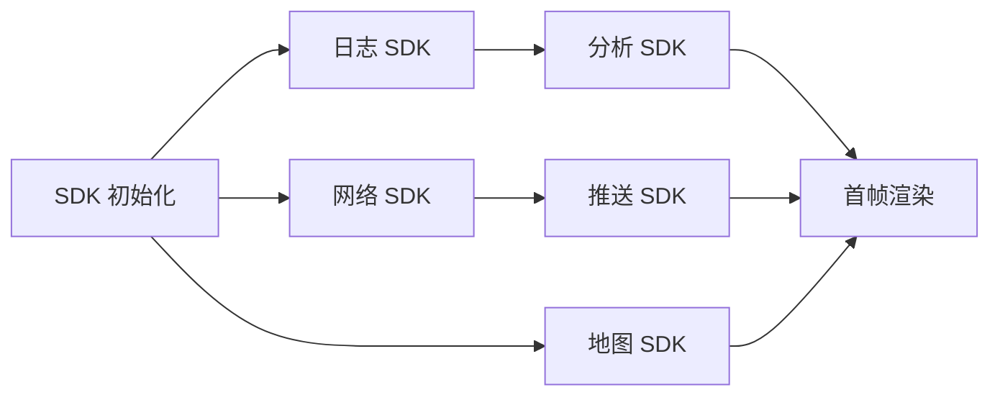
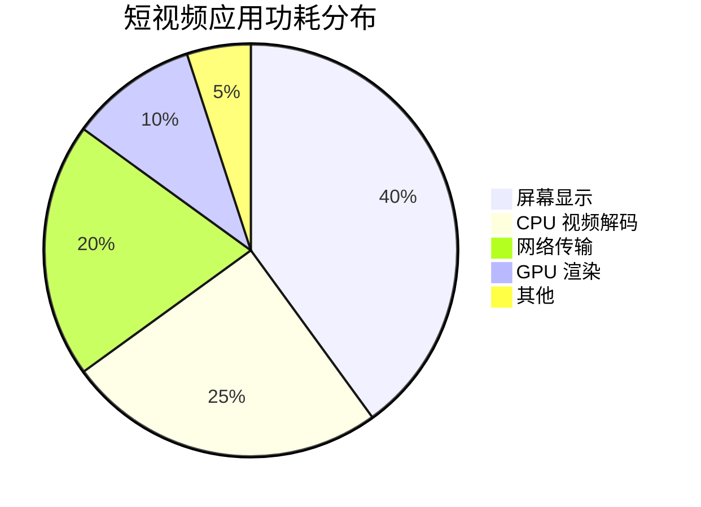
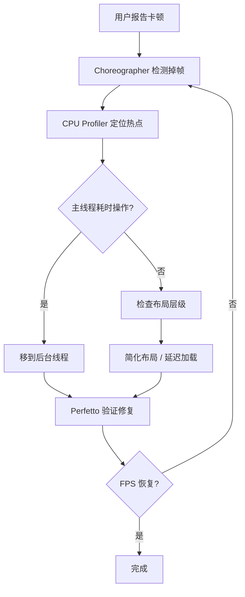

# 常见优化手段

## 启动优化

### 检测方法

```bash
# 冷启动耗时
adb shell am start -W -n <pkg>/<activity>
# 查看 Systrace
python $ANDROID_HOME/platform-tools/systrace/systrace.py --time=10 -o trace.html gfx view wm
```

### 基础手段

- **延迟初始化** — 非关键 SDK 在首帧渲染后初始化
- **异步初始化** — 多个 SDK 并行初始化（注意线程安全）
- **减少 Application.onCreate 耗时**
- **布局优化** — 减少布局层级，使用 ViewStub 延迟加载
- **启动框架** — 有向无环图 (DAG) 管理初始化依赖

### App Startup 库

Jetpack App Startup 提供了标准化的延迟初始化方案，通过 `Initializer<T>` 接口声明依赖关系：

```kotlin
// 自定义初始化器
class FirebaseInitializer : Initializer<FirebaseApp> {
    override fun create(context: Context): FirebaseApp {
        FirebaseApp.initializeApp(context)
        return FirebaseApp.getInstance()
    }
    // 声明依赖，SDK 会按拓扑排序依次初始化
    override fun dependencies(): List<Class<out Initializer<*>>> {
        return emptyList()
    }
}
```

### DAG 启动框架设计

对于中大型项目，SDK 数量往往超过 20 个，需要自行实现 DAG 启动框架。核心思路是将每个初始化任务抽象为节点，通过有向无环图管理依赖和并发：



:::tip
DAG 框架的关键在于拓扑排序 + 并发调度：无依赖的任务并行执行，有依赖的任务串行等待，最终收敛到首帧渲染节点。
:::

### Baseline Profiles

AGP 7.0+ 支持 Baseline Profiles，可以在安装时预编译 (AOT) 关键代码路径，避免运行时 JIT 编译带来的卡顿：

```groovy
// build.gradle 配置
android {
    baselineProfile {
        baselineProfileOutputDir = file("src/main/generated/baselineProfile")
    }
}
dependencies {
    implementation "androidx.profileinstaller:profileinstaller:1.3.1"
}
```

通过 `Macrobenchmark` 库生成 Profile 规则文件，覆盖启动链路和关键交互路径。

## 卡顿优化

### 原因

- 主线程做了耗时操作（IO、计算、数据库）
- 布局过于复杂，measure/layout 耗时
- 频繁 GC 导致线程暂停

### 手段

```kotlin
// 耗时操作移到后台线程
scope.launch(Dispatchers.IO) {
    val data = heavyOperation()
    withContext(Dispatchers.Main) {
        updateUI(data)
    }
}
```

- 使用 `StrictMode` 检测主线程 IO 和网络操作
- RecyclerView 优化：`setHasFixedSize(true)`、复用 ViewHolder、`DiffUtil` 增量更新
- 减少过度绘制（开发者选项 -> 显示过度绘制）
- 使用 `Choreographer` 监测帧率，定位掉帧发生的时间窗口

```kotlin
// StrictMode 配置示例
StrictMode.setThreadPolicy(
    StrictMode.ThreadPolicy.Builder()
        .detectDiskReads()
        .detectDiskWrites()
        .detectNetwork()
        .penaltyLog()
        .build()
)
```

## 内存优化

### 常见泄漏场景

```kotlin
// 错误：匿名内部类持有 Activity 引用
class MyActivity : Activity() {
    private val handler = object : Handler(Looper.getMainLooper()) {
        override fun handleMessage(msg: Message) {
            // this 引用了外部 MyActivity，消息队列未处理完则 Activity 无法回收
        }
    }
}
```

### 更多泄漏模式

除了 Handler 之外，以下场景同样常见：

- **匿名 Runnable** — `postDelayed` 的 Runnable 持有外部类引用，Activity 销毁时未移除回调
- **静态引用链** — `companion object` 持有 View 或 Activity 引用，生命周期与进程相同
- **Singleton 持有 Context** — 单例类接收 Activity Context 而非 ApplicationContext
- **未注销监听器** — EventBus、BroadcastReceiver 注册后未在 `onDestroy` 注销

```kotlin
// 正确：使用 WeakReference 打断引用链
class SafeCallback(activity: Activity) {
    private val ref = WeakReference(activity)

    fun onDataLoaded(data: Result) {
        ref.get()?.run {
            // 仅当 Activity 仍存活时才更新
            updateUI(data)
        }
    }
}

// 正确：单例只持有 ApplicationContext
object DataCenter {
    private lateinit var context: Context

    fun init(ctx: Context) {
        // 使用 applicationContext 避免持有 Activity 引用
        context = ctx.applicationContext
    }
}
```

### applicationContext vs activityContext 决策

:::warning
单例、静态对象、长生命周期组件必须使用 `applicationContext`。仅在需要 Activity 级别主题或 Window 管理时才使用 `activityContext`。
:::

### 检测工具

- **LeakCanary** — Debug 构建自动检测内存泄漏，通过引用链 (Reference Chain) 直观展示泄漏路径
- **MAT (Memory Analyzer Tool)** — 分析 Heap Dump，通过 Dominator Tree 找到内存占用最大的对象
- **Android Studio Profiler** — 实时监控内存分配，捕捉 GC 频率和内存增长趋势

```kotlin
// LeakCanary 集成
dependencies {
    debugImplementation "com.squareup.leakcanary:leakcanary-android:2.12"
}
```

### 图片加载优化

- 使用 Glide / Coil 自动管理 Bitmap 生命周期
- 根据 ImageView 尺寸设置合适的 `override(width, height)` 避免加载过大的图片
- Bitmap 及时回收，使用 `inSampleSize` 采样率压缩

:::warning
视频应用特别注意 Bitmap 缓存策略——预加载多个视频缩略图时容易 OOM。建议限制缩略图缓存数量，并使用 `Bitmap.Config.RGB_565` 替代默认的 `ARGB_8888` 以减少 50% 内存占用。
:::

## 功耗优化

### 基础手段

- 优先使用硬件解码播放视频
- 网络请求合并，减少频繁唤醒
- 使用 WorkManager 替代后台 Service
- GPS 使用后及时注销监听
- JobScheduler 批量处理后台任务

### WakeLock 管理

WakeLock 是控制设备休眠状态的关键机制，但必须严格配对使用：

```kotlin
// 正确的 WakeLock 使用模式
val wakeLock = (getSystemService(Context.POWER_SERVICE) as PowerManager)
    .newWakeLock(PowerManager.PARTIAL_WAKE_LOCK, "myapp:tag")

wakeLock.acquire(10_000L) // 设置超时兜底，防止忘记 release
try {
    doBackgroundWork()
} finally {
    wakeLock.release()
}
```

:::tip
视频播放时功耗主要来自：屏幕 > CPU 解码 > 网络传输，优化优先级也按此顺序。
:::

### 网络请求批量调度

使用 WorkManager 设置约束条件，将网络请求集中在设备充电或连接 Wi-Fi 时批量执行：

```kotlin
// WorkManager 约束调度
val constraints = Constraints.Builder()
    .setRequiredNetworkType(NetworkType.CONNECTED)
    .setRequiresBatteryNotLow(true)
    .setRequiresCharging(true)
    .build()

val workRequest = PeriodicWorkRequestBuilder<SyncWorker>(1, TimeUnit.HOURS)
    .setConstraints(constraints)
    .build()

WorkManager.getInstance(context).enqueue(workRequest)
```

### 视频应用功耗专项

短视频应用的功耗来源分布：



优化要点：

- **硬件解码选择** — 优先使用 `MediaCodec` 硬件编码器，通过 `CODEC_TYPE_HW` 过滤
- **屏幕亮度控制** — 视频播放时避免自动亮度频繁调整，可锁定为用户设定值
- **后台播放** — 切到后台时降低分辨率、暂停不必要的渲染管线

## 包体积优化

- **代码混淆** — R8 / ProGuard 移除未使用代码并混淆类名
- **资源压缩** — `shrinkResources true` 自动移除未引用资源
- **语言资源裁剪** — `resConfigs "zh"` 只保留中文资源
- **图片格式优化** — 使用 WebP 替代 PNG，同等质量体积减少 25%-35%
- **动态下发** — 插件化框架或按需下载资源包 (Dynamic Feature)

```groovy
// build.gradle 体积优化配置
android {
    buildTypes {
        release {
            minifyEnabled true          // 启用 R8
            shrinkResources true        // 移除无用资源
            crunchPngs false            // 关闭 PNG 压缩，改用 WebP
        }
    }
    defaultConfig {
        resConfigs "zh"                 // 只保留中英文
    }
}
```

## 稳定性：ANR 与 Crash

### ANR 触发规则

| 类型                 | 超时阈值 | 触发条件               |
| -------------------- | -------- | ---------------------- |
| Activity             | 5 秒     | 输入事件未在窗口期内处理 |
| BroadcastReceiver    | 10 秒    | `onReceive` 未按时返回  |
| Service (前台)       | 5 秒     | `onCreate/onStartCommand` 超时 |
| ContentProvider      | 10 秒    | `onCreate` 超时         |

### 常见 ANR 原因

- **主线程 IO** — 文件读写、数据库查询、SharedPreferences `commit()`
- **Binder 调用阻塞** — 跨进程通信等待对端响应
- **锁竞争** — 主线程等待子线程持有的锁

```bash
# 导出 ANR traces 文件
adb pull /data/anr/traces.txt
# 关注主线程堆栈中 "BLOCKED" 或 "WAITING" 状态
```

:::info
分析 traces.txt 时，搜索 `DALVIK THREADS` 下的主线程堆栈，定位阻塞点。如果看到 `android.os.BinderProxy` 相关调用，说明是跨进程阻塞。
:::

### Crash 率分级

| 等级   | Crash 率 | 评价     |
| ------ | -------- | -------- |
| 优秀   | < 0.05%  | 行业标杆 |
| 良好   | < 0.1%   | 可接受   |
| 需改进 | > 0.5%   | 严重影响用户体验 |

### Native Crash 处理

对于包含 C/C++ 代码的项目（如视频编解码库），Java 层的 `Thread.UncaughtExceptionHandler` 无法捕获 Native 崩溃。需要使用：

- **Breakpad** — Google 推荐的跨平台崩溃采集库，生成 minidump 文件
- **Crashpad** — Breakpad 的继任者，支持更完善的异常处理

采集到 minidump 后，需要通过 `minidump_stackwalker` 工具结合符号表 (`.so` 文件的 debug symbols) 还原堆栈信息。

## Compose 性能优化

### Compiler Metrics

Compose 编译器提供了稳定性报告，用于识别哪些 Composable 会被跳过 (skip) 或重组 (recompose)：

```groovy
// gradle.properties 开启报告
kotlinOptions {
    freeCompilerArgs += [
        "-P", "plugin:androidx.compose.compiler.plugins.kotlin:reportsDestination=" +
               project.buildDir.absolutePath + "/compose_metrics"
    ]
}
```

### 稳定性分析

Compose 通过推断参数的稳定性决定是否跳过重组：

- **Stable 类型** — `Int`、`String`、`Boolean`、标记了 `@Stable` 的类，参数未变时跳过重组
- **Unstable 类型** — `List<T>`、`MutableList<T>` 等无法推断稳定性的类型，每次都重组

```kotlin
// 标记不可变数据类为 Stable
@Stable
data class VideoItem(
    val id: String,
    val title: String,
    val coverUrl: String
)

@Composable
fun VideoCard(item: VideoItem) {
    // VideoItem 是 Stable 的，参数不变时不会重组
}
```

### derivedStateOf vs remember

```kotlin
@Composable
fun VideoList(videos: List<VideoItem>) {
    // 错误：每次 videos 变化都会触发重组
    val topVideos = videos.filter { it.likes > 1000 }

    // 正确：只在筛选结果变化时才触发重组
    val topVideos by remember {
        derivedStateOf { videos.filter { it.likes > 1000 } }
    }
}
```

:::tip
Compose 的性能问题 90% 来自不必要的重组，用 compiler reports 定位。关注报告中标记为 `unstable` 的参数，逐一修复。
:::

## 端到端性能排查案例

上面讲了各种优化手段，这里用一个完整的排查故事把它们串起来——从用户反馈到最终修复，展示真实的性能优化工作流。

### 场景：短视频列表滑动卡顿

**用户反馈**: 滑动视频列表时偶尔出现卡顿，尤其在快速滑动时明显。

**Step 1: 定位问题** — 用 Choreographer 检测掉帧

```kotlin
Choreographer.getInstance().postFrameCallback { frameTimeNanos ->
    // 监控帧间隔，超过 16ms 就是掉帧
}
```

发现滑动期间有频繁的 32ms-48ms 帧间隔（掉帧 2-3 帧）。

**Step 2: 找到热点** — CPU Profiler + Perfetto

用 Android Studio CPU Profiler 录制滑动操作，发现主线程有大量 JSON 解析耗时：

```kotlin
// 罪魁祸首：在主线程解析视频元数据 JSON
viewModelScope.launch { // 默认 Dispatchers.Main
    val videos = repository.fetchVideoList()
    // fetchVideoList() 内部做了 JSON 解析 → 在 Main 线程！
    _uiState.value = Success(videos)
}
```

:::warning 关键认知
`Dispatchers.Main` 和 `Choreographer.doFrame()` 共享同一个 Looper。在 Main 线程上做任何耗时操作（包括 JSON 解析），都在**抢占 Choreographer 的 16ms 预算**。这就是为什么"不要阻塞主线程"不是建议而是硬性约束。
:::

**Step 3: 修复** — 切换调度器

```kotlin
viewModelScope.launch {
    val videos = withContext(Dispatchers.Default) {
        repository.fetchVideoList() // JSON 解析在 Default 线程池
    }
    _uiState.value = Success(videos) // 回到 Main 更新 UI
}
```

**Step 4: 验证** — Perfetto trace 确认

用 `adb shell perfetto` 抓取修复后的 trace，确认：
- Main 线程的帧处理时间回到 8-12ms
- JSON 解析在 worker 线程执行
- FPS 稳定在 58-60fps



:::tip
性能优化的标准流程：**复现 → 测量 → 分析 → 修复 → 验证**。跳过测量直接优化是最常见的浪费时间的方式。
:::
