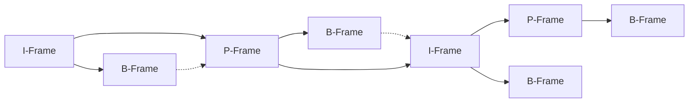
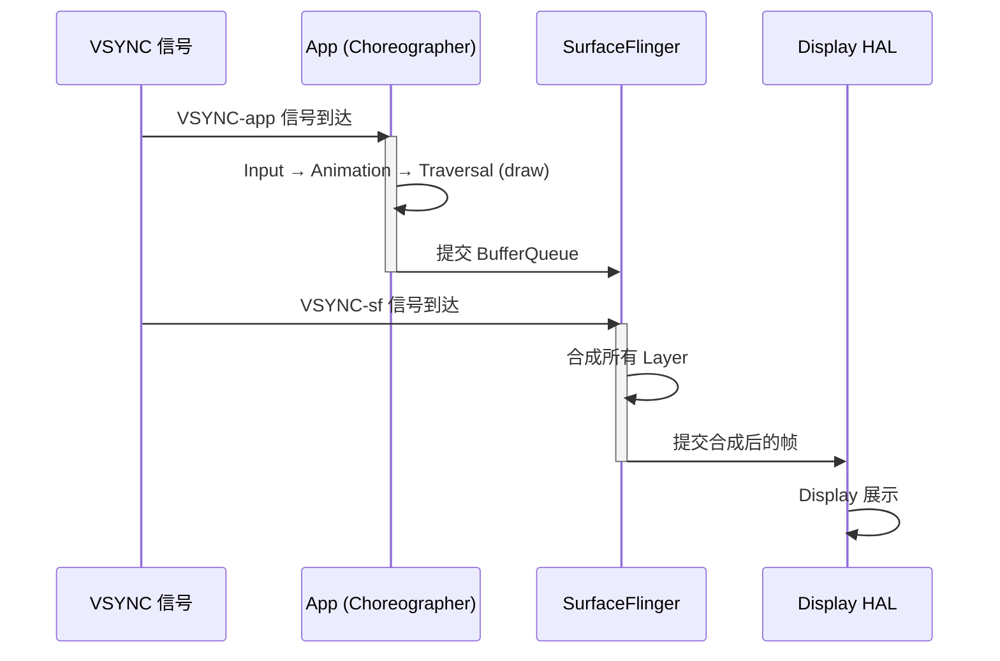

# 播放器 & 渲染常识

## 视频播放流程

```
网络/本地文件 → 解封装 (Demux) → 解码 (Decode) → 渲染 (Render) → 显示
                    ↓                  ↓
              音频流 + 视频流      YUV → RGB
```

完整的视频播放管线可以拆解为四个核心阶段：

1. **解封装 (Demux)** — 从容器文件中分离音频轨道和视频轨道
2. **解码 (Decode)** — 将压缩的编码数据还原为原始像素 / 音频 PCM
3. **渲染 (Render)** — 将解码后的帧绘制到 Surface 上
4. **显示 (Display)** — 由屏幕硬件呈现给用户

每个阶段的延迟叠加后构成端到端播放延迟，任何一个阶段出现瓶颈都会导致卡顿或音画不同步。

## 关键概念

### 解封装 (Demux)

- 将容器格式（MP4/MKV/TS）拆分为音频流和视频流
- 常见格式：MP4（最通用）、HLS（流媒体）、DASH

### 解码 (Decode)

| 类型 | 说明 |
|------|------|
| 硬解码 | MediaCodec（Android 系统级），GPU 处理，功耗低 |
| 软解码 | FFmpeg 等 CPU 解码，兼容性好但功耗高 |

:::tip 短剧场景优先使用硬解码
硬解码利用 GPU 完成计算密集的解码工作，CPU 占用可降低 50% 以上，功耗和发热表现显著优于软解码。仅在遇到硬解码不支持的编码格式时才回退到软解码。
:::

### I-Frame / P-Frame / B-Frame

视频编码通过帧间压缩大幅降低码率，理解帧类型对排查 seek 性能和码率选择至关重要。

| 帧类型 | 全称 | 说明 | 大小占比 |
|--------|------|------|----------|
| I-Frame | Intra-coded Frame | 完整的关键帧，包含整幅图像数据，可独立解码 | 最大 (~30%) |
| P-Frame | Predictive Frame | 前向预测帧，参考前一帧的 I/P 帧进行差分编码 | 中等 (~20%) |
| B-Frame | Bi-directional Frame | 双向预测帧，同时参考前后的 I/P 帧进行编码 | 最小 (~10%) |

帧依赖关系如下：



:::warning Seek 性能与 I-Frame 的关系
执行 seek 操作时，播放器必须定位到最近的 I-Frame 才能开始解码。如果 GOP（Group of Pictures）间隔过大，seek 延迟会明显增加。短视频场景建议 GOP 控制在 1-2 秒，以保证快速定位。
:::

### 码率 / 帧率 / 分辨率对性能的影响

| 配置 | 典型码率 | 解码 CPU 负载 | GPU 负载 | 内存占用 | 功耗影响 |
|------|----------|---------------|----------|----------|----------|
| 720p @ 30fps | 2-4 Mbps | 低 | 低 | ~8 MB/帧 | 低 |
| 1080p @ 30fps | 5-8 Mbps | 中 | 中 | ~12 MB/帧 | 中 |
| 1080p @ 60fps | 8-12 Mbps | 中高 | 中高 | ~12 MB/帧 | 较高 |
| 4K @ 30fps | 20-40 Mbps | 高 | 高 | ~48 MB/帧 | 高 |

:::info 短视频场景的分辨率选择
短视频场景通常用 720p-1080p 就够了，过度追求分辨率反而增加功耗。典型视频 App 的编码配置为：720p-1080p 分辨率、25-30fps 帧率、H.264/H.265 编码。4K 在手机屏幕上的视觉收益有限，但功耗和解码负载显著增加。
:::

### 渲染

- **SurfaceView**：独立窗口，适合视频/相机，渲染效率高
- **TextureView**：可变换（缩放/旋转），但比 SurfaceView 多一次 GPU 拷贝
- ExoPlayer 默认使用 SurfaceView，在需要 View 变换时切换到 TextureView

## VSYNC 渲染管线详解

:::tip 理解 VSYNC 是理解所有 UI 卡顿问题的前提
VSYNC（垂直同步信号）是显示系统向 CPU/GPU 发出的节拍器。每隔约 16.6ms（60Hz 屏幕）产生一次 VSYNC 信号，触发一帧的绘制和提交。如果某个阶段的处理时间超过一个 VSYNC 周期，就会发生掉帧。
:::

整个 VSYNC 渲染管线涉及三个核心组件的协作：



**三重缓冲 (Triple Buffering)** 机制：当 App 的绘制耗时超过一个 VSYNC 周期时，系统允许 App 在第三块 Buffer 上继续绘制，避免 GPU 空闲等待。这减少了连续掉帧的概率，但会增加最多一帧的输入延迟。

关键时间线：

1. **VSYNC 信号到达** — Choreographer 收到回调，开始调度当前帧工作
2. **App 绘制阶段** — 执行 Input 事件分发、Animation 更新、View 树遍历（measure / layout / draw）
3. **SurfaceFlinger 合成** — 将所有 Layer（状态栏、App 内容、导航栏等）合成一帧
4. **Display HAL 展示** — 最终帧输出到屏幕硬件

## Choreographer 机制详解

Choreographer 是 Android 渲染调度的核心类，它在每个 VSYNC 信号到来时按顺序执行三个阶段：

| 阶段 | 回调类型 | 典型工作 |
|------|----------|----------|
| 1. Input | CALLBACK_INPUT | 触摸事件分发、键盘事件处理 |
| 2. Animation | CALLBACK_ANIMATION | 属性动画计算、Interpolator 插值 |
| 3. Traversal | CALLBACK_TRAVERSAL | View 树 measure → layout → draw |

每个 VSYNC 周期（60Hz 下约 16.6ms）内，三个阶段必须全部完成。如果某一帧的总耗时超过 16.6ms，则该帧会被丢弃（掉帧）。掉帧数量的计算方式：

**掉帧数 = floor(帧耗时 / VSYNC 周期) - 1**

例如帧耗时为 50ms，VSYNC 周期 16.6ms，则 `floor(50 / 16.6) - 1 = 2`，即掉了 2 帧。

通过 Choreographer 的 FrameCallback 可以监控掉帧情况：

```kotlin
// 注册帧回调，监控每次 VSYNC 的帧耗时
Choreographer.getInstance().postFrameCallback(object : Choreographer.FrameCallback {
    override fun doFrame(frameTimeNanos: Long) {
        // 计算两帧之间的间隔
        val intervalMs = (frameTimeNanos - lastFrameTimeNanos) / 1_000_000
        val droppedFrames = (intervalMs / 16.6f).toInt() - 1
        if (droppedFrames > 0) {
            // 记录掉帧信息，上报监控平台
            reportFrameDrop(droppedFrames, intervalMs)
        }
        lastFrameTimeNanos = frameTimeNanos
        // 继续注册下一帧回调
        Choreographer.getInstance().postFrameCallback(this)
    }
})
```

:::warning 注意监控开销
FrameCallback 本身也会消耗少量 CPU 时间。在生产环境中建议采样监控（例如每 10 秒监控 3 秒），而不是持续全量监控，避免引入额外的性能损耗。
:::

## ExoPlayer（Google 官方播放器）

```kotlin
// 基本使用：创建播放器并加载视频
val player = ExoPlayer.Builder(context).build()
player.setMediaItem(MediaItem.fromUri("https://example.com/video.mp4"))
player.prepare()
player.playWhenReady = true
```

ExoPlayer 是 Android 上最广泛使用的播放器，支持 DASH、HLS、SmoothStreaming 等主流协议，并具备可扩展的渲染器架构。

### ExoPlayer 自定义扩展

ExoPlayer 的模块化设计允许开发者自定义 MediaSource 和 Renderer，以实现预缓存、错误重试、视频特效等高级功能。

**自定义 MediaSource** — 控制数据加载策略：

```kotlin
// 自定义 DataSource.Factory 实现缓存策略
val cache = SimpleCache(
    File(context.cacheDir, "video_cache"),
    LeastRecentlyUsedCacheEvictor(512 * 1024 * 1024) // 最大缓存 512MB
)

val cacheDataSourceFactory = CacheDataSource.Factory()
    .setCache(cache)
    .setUpstreamDataSourceFactory(
        DefaultHttpDataSource.Factory()
            .setConnectTimeoutMs(5000)
            .setReadTimeoutMs(10000)
    )
    .setFlags(CacheDataSource.FLAG_IGNORE_CACHE_ON_ERROR)

// 使用自定义 DataSource 创建 ProgressiveMediaSource
val mediaSourceFactory = ProgressiveMediaSource.Factory(cacheDataSourceFactory)
val player = ExoPlayer.Builder(context)
    .setMediaSourceFactory(mediaSourceFactory)
    .build()
```

**自定义 Renderer** — 实现视频特效管线：

```kotlin
// 通过 ExoPlayer 的 VideoEffect 应用自定义特效
val effects = listOf(
    // 亮度调节、滤镜等通过 VertexShader/PixelShader 实现
    BrightnessEffect(0.2f),
    ContrastEffect(1.1f)
)

val transformer = Transformer.Builder(context)
    .setVideoEffects(effects)
    .build()
```

:::info 预加载策略
短视频场景中，建议在当前视频播放到 70%-80% 时开始预加载下一个视频的前 500KB 数据。这样在用户滑动切换时可以做到近乎无缝播放，同时避免预加载过多数据浪费带宽。
:::

### ExoPlayer 生命周期管理

ExoPlayer 是视频应用中最常见的内存泄漏来源之一。理解它的生命周期管理是避免生产事故的关键。

#### 泄漏链路

```
ExoPlayer → Surface/SurfaceView → Activity Window → Activity
```

如果 ExoPlayer 没有正确 release，它会持有 Surface 引用，Surface 持有 Activity 的 Window，导致 Activity 无法被 GC 回收。

#### 正确的释放时机

```kotlin
class VideoActivity : AppCompatActivity() {
    private var player: ExoPlayer? = null

    override fun onCreate(savedInstanceState: Bundle?) {
        super.onCreate(savedInstanceState)
        player = ExoPlayer.Builder(this).build()
        player?.setMediaItem(MediaItem.fromUri(videoUrl))
        player?.prepare()
    }

    override fun onStart() {
        super.onStart()
        // 绑定 SurfaceView
        playerView.player = player
    }

    override fun onStop() {
        super.onStop()
        // 解绑 SurfaceView（分屏/多窗口场景下 onStop 比 onPause 更合适）
        playerView.player = null
    }

    override fun onDestroy() {
        super.onDestroy()
        // 释放 ExoPlayer 资源
        player?.release()
        player = null
    }
}
```

:::warning
不要在 `onPause()` 中释放 ExoPlayer。在分屏和多窗口模式下，Activity 可能处于 paused 但仍然可见的状态。应该在 `onStop()` 中解绑视图，在 `onDestroy()` 中释放播放器。
:::

#### 预加载的坑

使用 `SimpleCache` 做视频预加载时要注意：

- **容量上限**: 超过最大容量时，CacheDataSource 会做磁盘 IO 来淘汰旧数据，如果发生在主线程就会卡顿
- **预加载时机**: 通常在当前视频播放到 70-80% 时开始预加载下一条，但需要根据网络状况动态调整
- **seek 卡顿**: 预加载的数据被淘汰后，用户 seek 到未缓存的位置会导致额外的网络请求

```kotlin
// 预加载策略示例
val cache = SimpleCache(cacheDir, LeastRecentlyUsedCacheEvictor(100 * 1024 * 1024)) // 100MB
val cacheDataSource = CacheDataSource.Factory()
    .setCache(cache)
    .setUpstreamDataSourceFactory(DefaultHttpDataSource.Factory())
```

## 常见性能问题

| 问题 | 原因 | 影响 | 排查方向 |
|------|------|------|----------|
| 播放卡顿 | 解码慢 / 网络缓冲 / GPU 过载 | FPS 下降 | Systrace 检查 decode/render 耗时 |
| 音画不同步 | PTS 处理异常 / 音频优先级不当 | 体验差 | 检查 AudioTrack 与视频帧时间戳对齐 |
| 功耗高 | 软解码 / 屏幕亮度高 / CPU 未休眠 | 电池快速消耗 | Battery Historian 分析 WakeLock |
| 内存上涨 | 帧 buffer 未释放 / Bitmap 泄漏 | OOM | Android Profiler 检查 Bitmap 分配 |
| 首帧慢 | 网络建连 + DNS + 首包耗时 | 用户感知等待 | 网络监控 + 预加载策略优化 |

## 短剧场景的特殊关注点

- **竖屏全屏播放** — 高占比屏幕区域渲染，功耗敏感，建议锁定硬解码
- **上下滑动切换** — 列表滑动时预加载 + 缓存策略，预加载下一个视频的元数据和部分数据
- **列表内自动播放** — 可见区域才播放，不可见时暂停并释放解码器资源
- **预加载** — 下一个视频的网络预加载策略，控制预加载量以节省带宽
- **快速 seek** — 利用 I-Frame 间隔优化 seek 速度，GOP 建议控制在 1-2 秒
